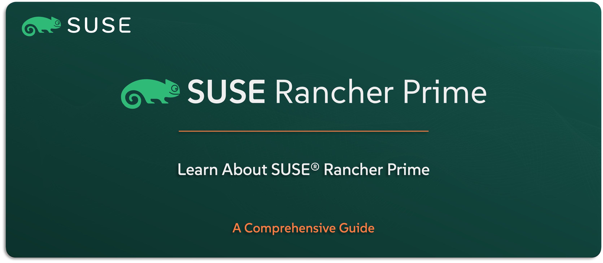

# Learn About SUSE Rancher Prime (Manager)

Welcome to the `SUSE® Rancher Prime Manager` section — the place to get familiar with the brain of the entire `SUSE Rancher Prime` Suite. This is the management layer that brings it all together, giving you full control over your Kubernetes clusters no matter where they’re running — on-prem, in the cloud, or out at the edge.

In this guide, you’ll get a solid feel for what `SUSE Rancher Prime Manager` does, why it’s such a powerful part of the stack, and how it fits into the bigger picture. We’ll walk through its main features, typical use cases, how it integrates with other `SUSE` solutions (if applicable), and give you a high-level view of how it all works under the hood.

---

    

---

> **Note:** Throughout this guide, we’ll refer to it simply as SUSE Rancher Prime — just to keep things short and easy. But to be clear, we’re talking about the management component of the suite (also known as SUSE Rancher Prime Manager).

> ⚠️ Disclaimer:
> 
> This is not an official `SUSE` document. While it is based on practical experience and best practices, it is strongly recommended to refer to the official `SUSE` documentation for the most accurate and up-to-date guidance: https://documentation.suse.com

---

## About This Repo

This repo is all about helping you understand what `SUSE Rancher Prime` is — not from a deployment or configuration point of view, but from a high-level, capability, features, use cases, architectural, and strategic perspective.

You’ll get a clear view of what this solution does, why it exists, and how it simplifies multi-cluster Kubernetes operations. Whether you’re trying to position it in a conversation, build your knowledge, or simply see how it fits within the full `SUSE Rancher Prime` Suite — this is where you start.

We’ll cover its core features, typical use cases, integration points with other `SUSE` components, and the overall architecture — giving you the full picture before diving into anything technical.

This isn’t a deployment guide — it’s the “what you need to understand before you start” guide.

---

> _________________________     
>     
> 🚀 **Let's Get Started** 
>     
> _________________________

---

**TBC**

---

## Official References:

- [SUSE Official Documentation](https://documentation.suse.com)
- [SUSE® Rancher Prime Official Documentation](https://documentation.suse.com/cloudnative/rancher-manager/latest/en/about-rancher/what-is-rancher.html)

---

**Enjoy** :blush: