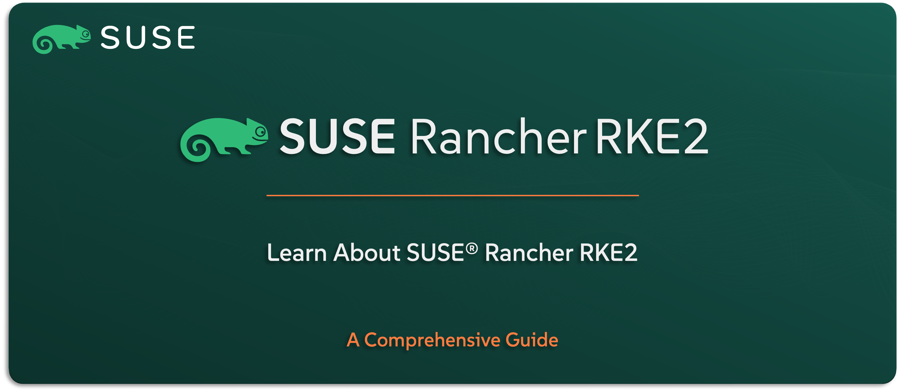

# Learn About SUSE Rancher RKE2

Welcome to the `SUSE® Rancher Prime Kubernetes Engine – RKE2` section — your place to get familiar with `SUSE’s` hardened, enterprise-grade Kubernetes distribution. `SUSE® Rancher Prime Kubernetes Engine – RKE2` is built for secure, compliant, and production-ready environments, offering a simple and consistent way to deploy Kubernetes clusters — whether on-prem or in the cloud.

In this guide, you’ll get a clear understanding of what `SUSE® Rancher Prime Kubernetes Engine – RKE2` is, why it’s a critical part of the `SUSE Rancher Prime` Suite, and how it enables secure Kubernetes operations at scale. We’ll walk through its key features, typical use cases, how it integrates with other `SUSE` solutions (if applicable), and provide a high-level view of its architecture and design.

---

    

---

> **Note:** In this guide, we’ll refer to the solution as `RKE2` — short for `SUSE Rancher Kubernetes Engine - RKE2` — which is the supported Kubernetes distribution included in `SUSE Rancher Prime`.

---

> ⚠️ Disclaimer:
> 
> This is not an official `SUSE` document. While it is based on practical experience and best practices, it is strongly recommended to refer to the official `SUSE` documentation for the most accurate and up-to-date guidance: https://documentation.suse.com

---

## About This Repo

This repo is here to help you understand what `RKE2` is and how it works, without jumping straight into installation or hands-on configuration. It focuses on the bigger picture — what makes `RKE2` different, where it fits in your Kubernetes strategy, and how it supports secure, stable infrastructure.

You’ll learn about the distribution’s key features, the kinds of environments it’s best suited for, and how it plays nicely with the rest of the `SUSE Rancher Prime` Suite. We’ll also take a look at the architecture behind `RKE2` and highlight the core design choices that make it a strong choice for regulated and enterprise settings.

This isn’t a deployment guide — it’s your go-to reference to get comfortable with `RKE2` before you build anything.

---

> _________________________     
>     
> 🚀 **Let's Get Started** 
>     
> _________________________

---

**TBC**

---

## Official References:

- [SUSE Official Documentation](https://documentation.suse.com)
- [SUSE® Rancher Prime RKE2 Official Documentation](https://documentation.suse.com/cloudnative/rke2/latest/en/introduction.html)

---

**Enjoy** :blush: