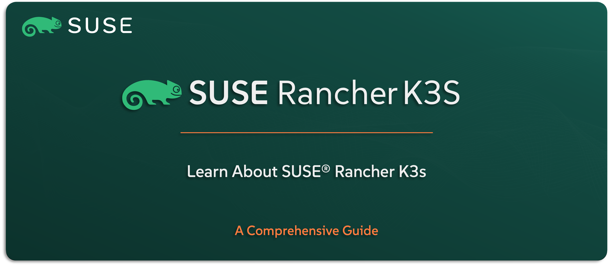

# Learn About SUSE Rancher K3S

Welcome to the `SUSE® Rancher Kubernetes Engine – K3S` section — your guide to understanding `SUSE’s` ultra-lightweight Kubernetes distribution, purpose-built for edge, IoT, and resource-constrained environments. K3s brings the full power of Kubernetes in a simplified, smaller footprint — without compromising functionality.

In this guide, you’ll get a solid understanding of what `SUSE® Rancher Kubernetes Engine – K3S` is, why it exists, and how it fits into the broader `SUSE Rancher Prime` Suite. We’ll walk through its key features, common use cases, how it integrates with the rest of the stack, and provide a high-level view of how it’s architected.

---

    

---

> **Note:** Throughout this repo, we’ll refer to the solution as `K3S` — the lightweight Kubernetes distribution designed for simplicity, speed, and low-resource deployments.

---

> ⚠️ Disclaimer:
> 
> This is not an official `SUSE` document. While it is based on practical experience and best practices, it is strongly recommended to refer to the official `SUSE` documentation for the most accurate and up-to-date guidance: https://documentation.suse.com

---

## About This Repo

This repo is all about helping you understand what `K3S` is, what it’s built for, and why it’s a valuable part of the `SUSE Rancher Prime` Suite — especially when it comes to edge computing and distributed environments.

Inside, you’ll find a friendly, high-level breakdown of its core features, popular use cases, and architectural design. You’ll also see how it works alongside other `SUSE` solutions, and why it’s often the go-to choice for lean, fast, and scalable Kubernetes deployments.

This isn’t a setup or deployment guide — it’s the place to start if you want to get comfortable with `K3S` before diving into the technical work.

---

> _________________________     
>     
> 🚀 **Let's Get Started** 
>     
> _________________________

---

**TBC**

---

## Official References:

- [SUSE Official Documentation](https://documentation.suse.com)
- [SUSE® Rancher Prime K3S Official Documentation](https://documentation.suse.com/cloudnative/k3s/latest/en/introduction.html)

---

**Enjoy** :blush: