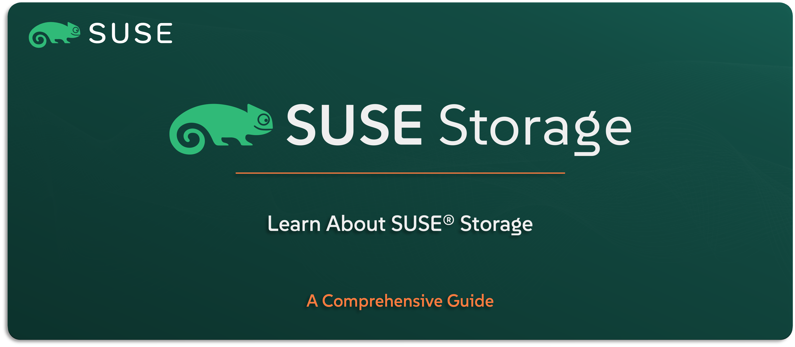

# Learn About SUSE Storage

Welcome to the `SUSE® Storage` section — your guide to understanding the cloud-native storage solution included in the `SUSE Rancher Prime` Suite. Formerly known as Longhorn, this solution brings highly available, persistent block storage to your Kubernetes environment, designed specifically for containers and stateful workloads.

In this guide, you’ll get to know what `SUSE Storage` is, where it fits within the stack, and how it solves the challenge of reliable, scalable storage in Kubernetes. We’ll walk through its key features, core use cases, architectural model, and how it integrates with other `SUSE` solutions.

---

    

---

> **Note:** SUSE Storage is the enterprise edition of the open-source Longhorn project. Throughout this guide, we’ll refer to it as SUSE Storage to align with the naming used in the SUSE Rancher Prime Suite. The underlying technology remains the same — the difference is in enterprise support, testing, and integration.

---

> ⚠️ Disclaimer:
> 
> This is not an official `SUSE` document. While it is based on practical experience and best practices, it is strongly recommended to refer to the official `SUSE` documentation for the most accurate and up-to-date guidance: https://documentation.suse.com

---

## About This Repo

This repo is focused on helping you understand what `SUSE Storage` is, how it works, and why it matters when building modern, stateful applications in Kubernetes. You’ll learn what makes it different from traditional storage solutions and how it’s built for container-native environments.

We’ll walk through the key features that make `SUSE Storage` a strong fit for cloud-native workloads, the typical use cases it supports, how it integrates with SUSE Rancher-managed clusters, and a high-level look at its architecture.

This isn’t a deployment or setup guide — it’s your foundation for understanding persistent storage in the `SUSE Rancher Prime` world.

---

> _________________________     
>     
> 🚀 **Let's Get Started** 
>     
> _________________________

---

**TBC**

---

## Official References:

- [SUSE Official Documentation](https://documentation.suse.com)
- [SUSE® Storage Official Documentation](https://documentation.suse.com/cloudnative/storage/1.8.0/en/longhorn-documentation.html)

---

**Enjoy** :blush: