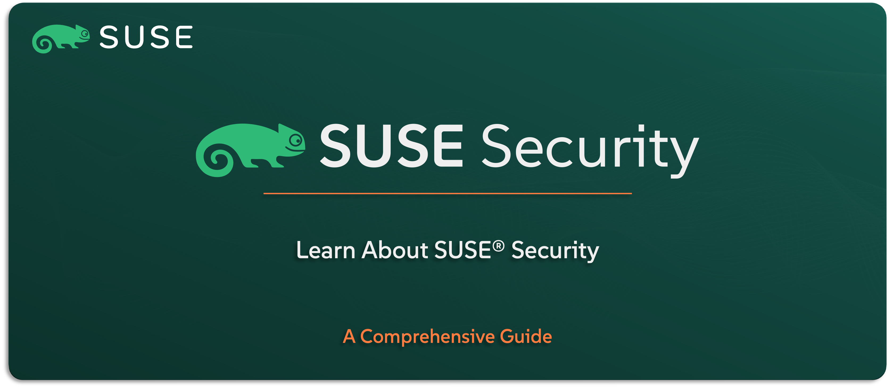

# Learn About SUSE Security

Welcome to the `SUSE® Security` section — your guide to understanding the container security platform included in the `SUSE Rancher Prime` Suite. Previously known as NeuVector, this solution delivers full-lifecycle Kubernetes security, built specifically for containerized workloads and zero-trust environments.

In this guide, you’ll get a clear view of what `SUSE Security` is, what problems it solves, and how it strengthens your Kubernetes infrastructure. We’ll explore its key features, use cases, architecture, and how it integrates with other `SUSE` solutions to deliver comprehensive DevSecOps capabilities.

---

    

---

> **Note:** `SUSE Security` is the enterprise-grade version of the open-source NeuVector project. In this guide, we’ll refer to it as `SUSE Security` to align with the naming convention used across the `SUSE Rancher Prime` Suite. The features remain largely the same, with added enterprise support, integrations, and validations.

---

> ⚠️ Disclaimer:
> 
> This is not an official `SUSE` document. While it is based on practical experience and best practices, it is strongly recommended to refer to the official `SUSE` documentation for the most accurate and up-to-date guidance: https://documentation.suse.com

---

## About This Repo

This repo is here to help you understand what `SUSE Security` is all about, how it fits into the Kubernetes security landscape, and why it’s a valuable component of the `SUSE Rancher Prime` stack. You’ll learn how it enables zero-trust container security through runtime protection, vulnerability scanning, network visibility, and policy enforcement. We’ll also walk through where `SUSE Security` fits in the architecture, how it integrates with Kubernetes and Rancher, and the types of environments it’s best suited for.

This isn’t a how-to guide — it’s where you build the foundational knowledge needed to position and understand container security with `SUSE`.

---

> _________________________     
>     
> 🚀 **Let's Get Started** 
>     
> _________________________

---

**TBC**

---

## Official References:

- [SUSE Official Documentation](https://documentation.suse.com)
- [SUSE® Security Official Documentation](https://documentation.suse.com/cloudnative/security/5.4/en/overview.html)

---

**Enjoy** :blush: