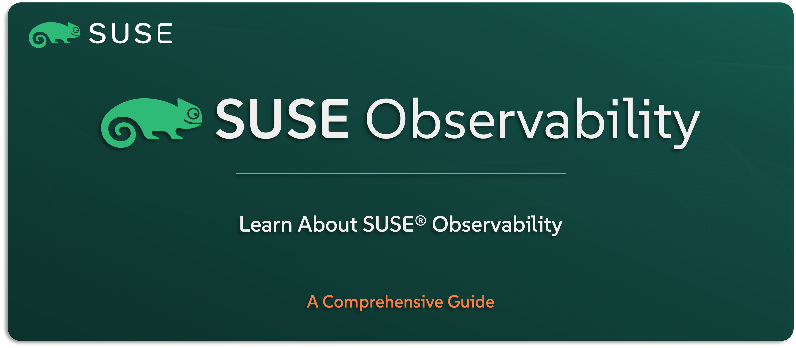

# Learn About SUSE Observability

Welcome to the `SUSE® Observability` section — your starting point to understand the observability platform included in the `SUSE Rancher Prime` Suite. Previously known as StackState, this solution goes far beyond basic monitoring — it’s built to help you see, understand, and respond to what’s happening across your modern Kubernetes environment.

In this guide, you’ll get a solid overview of what `SUSE Observability` does, how it brings context to your monitoring data, and why it’s such a valuable tool for maintaining performance and stability at scale. We’ll cover its key features, use cases, how it integrates with your stack, and give you a high-level look at how it’s architected.

---

    

---

> **Note:** `SUSE Observability` is the new name for StackState, following its acquisition by `SUSE` in 2024. In this guide, we’ll refer to it as `SUSE Observability` to align with its official branding as part of the `SUSE Rancher Prime` Suite.

---

> ⚠️ Disclaimer:
> 
> This is not an official `SUSE` document. While it is based on practical experience and best practices, it is strongly recommended to refer to the official `SUSE` documentation for the most accurate and up-to-date guidance: https://documentation.suse.com

---

## About This Repo

This repo is here to help you understand what `SUSE Observability` is and how it redefines what’s possible in a cloud-native monitoring stack. It’s not just about dashboards — it’s about visibility with context: correlating metrics, traces, logs, and topology into a single, actionable view.

You’ll learn what sets `SUSE Observability` apart from traditional monitoring tools, where it fits within the `SUSE Rancher Prime` architecture, and how it integrates with Kubernetes and other observability components.

This isn’t a configuration or deployment manual — it’s the foundation you need to see how observability with `SUSE` is done right.

---

> _________________________     
>     
> 🚀 **Let's Get Started** 
>     
> _________________________

---

**TBC**

---

## Official References:

- [SUSE Official Documentation](https://documentation.suse.com)
- [SUSE® Observability Official Documentation](https://docs.stackstate.com/)

---

**Enjoy** :blush: