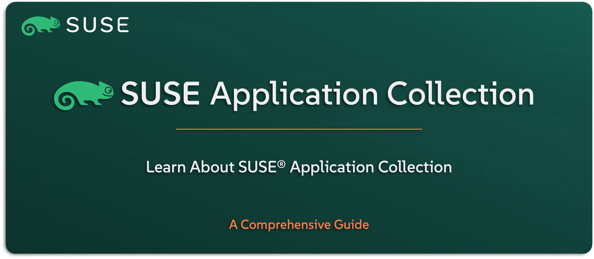

# Learn About SUSE Observability

Welcome to the `SUSE® Application Collection` section — your guide to understanding the curated set of applications included in the `SUSE Rancher Prime` Suite. This solution is designed to accelerate Kubernetes adoption by providing a collection of pre-packaged, validated, and production-ready applications — all deployable directly through Rancher.

In this guide, you’ll get familiar with what the `SUSE Application Collection` is, how it simplifies day-one Kubernetes workloads, and how it helps teams move faster with less complexity. We’ll walk through key features, common use cases, available app categories, and how the collection integrates into your Rancher-managed environments.

---

    

---

> ⚠️ Disclaimer:
> 
> This is not an official `SUSE` document. While it is based on practical experience and best practices, it is strongly recommended to refer to the official `SUSE` documentation for the most accurate and up-to-date guidance: https://documentation.suse.com

---

## About This Repo

This repo is here to help you understand what the `SUSE Application Collection` is, why it exists, and how it adds value to the overall `SUSE Rancher Prime` experience. The goal is to give you a clear view of what this curated collection offers, how it supports Kubernetes adoption, and how it integrates with your Rancher-managed environment.

We’ll walk through the key benefits, where it fits in the broader solution stack, how it’s delivered to users, and how it helps simplify the deployment of common workloads in enterprise environments.

This isn’t a how-to-use-the-marketplace guide — it’s your foundation for understanding the role and value of `SUSE’s` pre-integrated, production-ready app library.

---

> _________________________     
>     
> 🚀 **Let's Get Started** 
>     
> _________________________

---

**TBC**

---

## Official References:

- [SUSE Official Documentation](https://documentation.suse.com)
- [SUSE® Application Collection Official Documentation](https://docs.apps.rancher.io/)

---

**Enjoy** :blush: