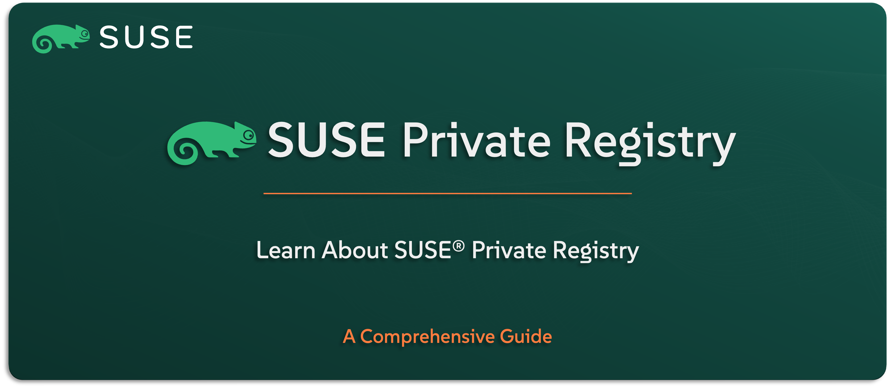

# Learn About SUSE Private Registry

Welcome to the `SUSE® Private Registry` section — your guide to understanding `SUSE’s` secure, enterprise-grade container image registry, included in the `SUSE Rancher Prime` Suite. Based on the open-source Harbor project, `SUSE Private Registry` is built to help you manage container images with confidence — whether you’re running in connected environments or fully air-gapped setups.

In this guide, you’ll get a clear understanding of what `SUSE Private Registry` offers, how it enhances security and control over your container lifecycle, and where it fits within the larger `SUSE Rancher Prime` stack. We’ll explore its key features, typical use cases, architecture, and integration points.

---

    

---

> **Note:** SUSE Private Registry is the enterprise-supported edition of the open-source Harbor project, officially packaged and maintained by SUSE. In this guide, we’ll refer to it by its commercial name — SUSE Private Registry — as part of the SUSE Rancher Prime Suite.

---

> ⚠️ Disclaimer:
> 
> This is not an official `SUSE` document. While it is based on practical experience and best practices, it is strongly recommended to refer to the official `SUSE` documentation for the most accurate and up-to-date guidance: https://documentation.suse.com

---

## About This Repo

This repo is focused on helping you understand what `SUSE Private Registry` is, what problems it solves, and how it helps you securely store, manage, and distribute container images across your environments.

You’ll get a high-level look at its core capabilities — like role-based access control, vulnerability scanning, image replication, and integration with Rancher-managed clusters — along with its role in enabling secure supply chains and air-gapped deployments.

This isn’t a setup or admin guide — it’s here to give you the background you need to see how `SUSE Private Registry` fits into a secure, enterprise-ready Kubernetes stack.

---

> _________________________     
>     
> 🚀 **Let's Get Started** 
>     
> _________________________

---

**TBC**

---

## Official References:

- [SUSE Official Documentation](https://documentation.suse.com)
- [SUSE® Private Registry Official Documentation](https://documentation.suse.com/cloudnative/suse-private-registry/html/private-registry/)

---

**Enjoy** :blush: