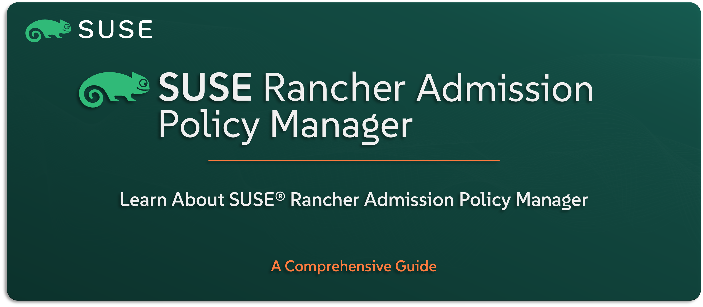

# Learn About SUSE Rancher Admission Policy Manager

Welcome to the `SUSE® Rancher Prime – Admission Policy Manager` section — your guide to understanding `SUSE’s` flexible and powerful policy engine for Kubernetes, included as part of the `SUSE Rancher Prime` Suite. Based on the open-source Kubewarden project, this solution enables you to enforce governance, compliance, and security policies across your clusters — all through policy-as-code.

In this guide, you’ll get familiar with what the Admission Policy Manager is, how it helps you take control of what runs in your Kubernetes environments, and how it fits into a secure, enterprise-ready GitOps workflow. We’ll explore its core concepts, use cases, high-level architecture, and how it integrates with Rancher.

---

    

---

> **Note:** `SUSE Rancher Prime – Admission Policy Manager` is the enterprise edition of the Kubewarden project. In this repo, we’ll refer to it by its full commercial name to reflect its place within the `SUSE Rancher Prime` Suite.

---

> ⚠️ Disclaimer:
> 
> This is not an official `SUSE` document. While it is based on practical experience and best practices, it is strongly recommended to refer to the official `SUSE` documentation for the most accurate and up-to-date guidance: https://documentation.suse.com

---

## About This Repo

This repo is designed to help you understand what the `SUSE Rancher Prime Admission Policy Manager` is and how it brings policy-as-code to Kubernetes environments in a secure, manageable way.

You’ll learn how this solution helps define and enforce rules around what workloads can run, how policies are created and applied, and how it supports GitOps and DevSecOps practices. We’ll also take a look at its architecture and how it integrates with `SUSE Rancher Prime` to deliver centralized policy control across multiple clusters.

This isn’t a deployment guide — it’s your foundation for understanding how `SUSE` handles governance and compliance through modern, Kubernetes-native tooling.

---

> _________________________     
>     
> 🚀 **Let's Get Started** 
>     
> _________________________

---

**TBC**

---

## Official References:

- [SUSE Official Documentation](https://documentation.suse.com)
- [SUSE® Rancher Prime: Admission Policy Manager Official Documentation](https://documentation.suse.com/cloudnative/policy-manager/1.16/en/introduction.html)

---

**Enjoy** :blush: