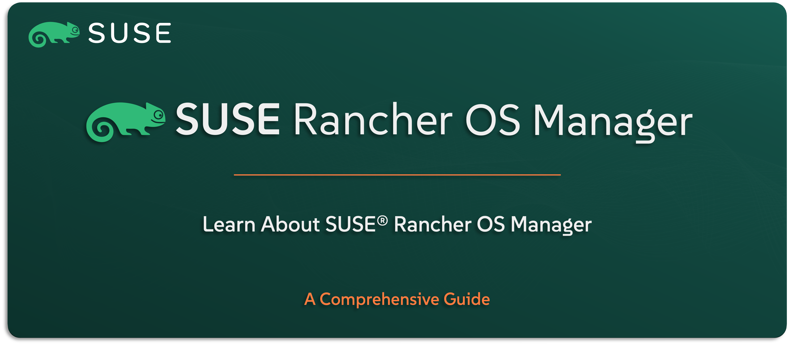

# Learn About SUSE Rancher Prime OS Manager

Welcome to the `SUSE® Rancher Prime – OS Manager` section — your guide to understanding the lightweight, Kubernetes-native operating system management solution included in the `SUSE Rancher Prime` Suite. Previously known as Elemental, OS Manager helps you automate the configuration and lifecycle management of the operating system layer on Kubernetes nodes.

In this guide, you’ll get a clear understanding of what OS Manager does, how it fits into the `SUSE Rancher Prime` ecosystem, and why it matters when managing infrastructure at scale. We’ll explore its use cases, core features, architecture, and integration with `SUSE Rancher Prime`.

---

    

---

> **Note:** `SUSE Rancher Prime – OS Manager` is the commercial edition of the open-source Elemental project. In this guide, we refer to it by its enterprise name as part of the `SUSE Rancher Prime` Suite. The focus is specifically on managing the operating system layer, not full Kubernetes nodes. Throughout this guide, we’ll refer to it simply as `OS Manager` for clarity and simplicity.

---

> ⚠️ Disclaimer:
> 
> This is not an official `SUSE` document. While it is based on practical experience and best practices, it is strongly recommended to refer to the official `SUSE` documentation for the most accurate and up-to-date guidance: https://documentation.suse.com

---

## About This Repo

This repo is here to help you understand what `OS Manager` is, what it’s designed to do, and how it fits into the overall `SUSE Rancher Prime` Suite. `OS Manager` focuses on managing the operating system layer of Kubernetes nodes in a cloud-native, scalable way — especially in environments where automation, consistency, and control matter.

You’ll get a high-level look at its purpose, main capabilities, and how it works alongside `SUSE Rancher Prime` to simplify OS configuration and lifecycle management across distributed infrastructure.

This isn’t a deployment guide — it’s where you start when you want to understand the role of `OS Manager` in your Kubernetes ecosystem.

---

> _________________________     
>     
> 🚀 **Let's Get Started** 
>     
> _________________________

---

**TBC**

---

## Official References:

- [SUSE Official Documentation](https://documentation.suse.com)
- [SUSE® Rancher Prime OS Manager Official Documentation](https://documentation.suse.com/cloudnative/os-manager/1.6/en/index.html)

---

**Enjoy** :blush: