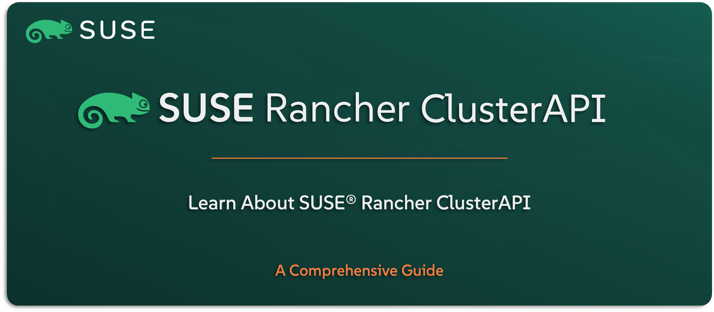

# Learn About SUSE Rancher ClusterAPI

Welcome to the `SUSE® Rancher Prime – ClusterAPI` section — your guide to understanding how `SUSE` integrates ClusterAPI (CAPI) into the `SUSE Rancher Prime` Suite. Also known as Turtles project, this solution brings powerful, declarative Kubernetes cluster lifecycle management into `SUSE Rancher Prime` — helping you provision, scale, and manage clusters across different infrastructures using consistent, GitOps-style workflows.

In this guide, you’ll get a clear overview of what `SUSE Rancher Prime ClusterAPI` is, why it matters, and how it extends the capabilities of `SUSE Rancher Prime` with infrastructure automation. We’ll walk through the core concepts, use cases, high-level architecture, and how it fits with the rest of the suite.

---

    

---

> **Note:** `SUSE Rancher Prime – ClusterAPI` (codenamed Turtles) is `SUSE’s` enterprise integration of the CNCF Cluster API project. In this guide, we’ll refer to it as `Rancher ClusterAPI` to keep things simple, but know that we’re referring specifically to the Rancher-native implementation within the `SUSE Rancher Prime` Suite.

---

> ⚠️ Disclaimer:
> 
> This is not an official `SUSE` document. While it is based on practical experience and best practices, it is strongly recommended to refer to the official `SUSE` documentation for the most accurate and up-to-date guidance: https://documentation.suse.com

---

## About This Repo

This repo is here to help you understand what ClusterAPI is within `SUSE Rancher Prime`, how it works, and why it’s an important tool for modernizing Kubernetes operations.

You’ll get a high-level view of its role in enabling declarative cluster management, its benefits for infrastructure automation, and how it integrates into the `SUSE Rancher Prime` control plane. Whether you’re looking to improve consistency, adopt GitOps workflows, or streamline provisioning across hybrid or multi-cloud environments — this is where you start.

This isn’t a deployment manual — it’s a foundational guide to understanding how `SUSE Rancher Prime` brings ClusterAPI to life.

---

> _________________________     
>     
> 🚀 **Let's Get Started** 
>     
> _________________________

---

**TBC**

---

## Official References:

- [SUSE Official Documentation](https://documentation.suse.com)
- [SUSE® Rancher Prime ClusterAIP Official Documentation](https://documentation.suse.com/cloudnative/cluster-api/v0.17/en/index.html)

---

**Enjoy** :blush: