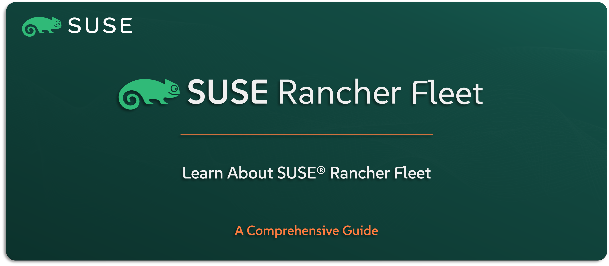

# Learn About SUSE Rancher Prime Fleet

Welcome to the `SUSE® Rancher Prime Fleet` section — your guide to understanding the continuous delivery and GitOps engine included in the `SUSE Rancher Prime` Suite. `SUSE® Rancher Prime Fleet` is built to help you manage Kubernetes at scale — giving you the ability to deploy applications and configurations across dozens, hundreds, or even thousands of clusters in a consistent, version-controlled, and automated way.

In this guide, you’ll get a clear understanding of what `SUSE® Rancher Prime Fleet` is, what it’s designed to do, and how it fits into GitOps workflows within `SUSE® Rancher Prime`. We’ll walk through the core use cases, key features, high-level architecture, and how it integrates with the rest of the suite to simplify lifecycle management.

---

    

---

> **Note:** Fleet is SUSE’s enterprise-grade GitOps engine for Kubernetes, integrated directly into the SUSE Rancher Prime Suite. In this guide, we’ll refer to it as Fleet throughout.

---

> ⚠️ Disclaimer:
> 
> This is not an official `SUSE` document. While it is based on practical experience and best practices, it is strongly recommended to refer to the official `SUSE` documentation for the most accurate and up-to-date guidance: https://documentation.suse.com

---

## About This Repo

This repo is here to help you understand what `Fleet` is, how it supports GitOps-based delivery at scale, and why it plays a critical role in the `SUSE Rancher Prime` stack.

You’ll get a high-level overview of its capabilities, such as managing workloads across multiple clusters, using Git as the source of truth, and simplifying complex deployment pipelines. We’ll also highlight how `Fleet` integrates with `SUSE Rancher Prime` to give you full visibility and control over your cluster application landscape.

This isn’t a step-by-step implementation guide — it’s your introduction to continuous delivery with `Fleet`, and how it helps you bring stability and automation to large-scale Kubernetes environments.

---

> _________________________     
>     
> 🚀 **Let's Get Started** 
>     
> _________________________

---

**TBC**

---

## Official References:

- [SUSE Official Documentation](https://documentation.suse.com)
- [SUSE® Rancher Prime Fleet - Continuous Delivery | GitOps Official Documentation](https://documentation.suse.com/cloudnative/continuous-delivery/v0.10/en/index.html)

---

**Enjoy** :blush: