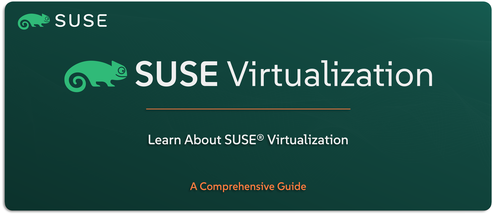

# Learn About SUSE Virtualization

Welcome to the `SUSE® Virtualization` section — your guide to understanding `SUSE’s` hyperconverged infrastructure (HCI) solution, included in the `SUSE Rancher Prime` Suite. Previously known as Harvester, `SUSE Virtualization` brings together virtual machines and Kubernetes workloads on a single platform — fully integrated with `SUSE Rancher Prime` to unify VM and container operations.

In this guide, you’ll get a clear understanding of what `SUSE Virtualization` is, how it works, and why it’s ideal for modernizing virtualization environments. We’ll explore the key features, use cases, high-level architecture, and how it fits with the rest of the `SUSE Rancher Prime` Suite.

---

    

---

> **Note:** `SUSE Virtualization` is the enterprise-grade edition of the open-source Harvester project. Throughout this guide, we’ll refer to it as `SUSE Virtualization`, as it appears within the commercial `SUSE Rancher Prime` Suite.

---

> ⚠️ Disclaimer:
> 
> This is not an official `SUSE` document. While it is based on practical experience and best practices, it is strongly recommended to refer to the official `SUSE` documentation for the most accurate and up-to-date guidance: https://documentation.suse.com

---

## About This Repo

This repo is here to help you understand what `SUSE Virtualization` is, what it offers, and how it enables you to run both virtual machines and containers on one unified infrastructure — all managed through `SUSE Rancher Prime`.

You’ll learn about its role in modernizing legacy virtualization platforms, its unique features for HCI environments, and how it integrates tightly with the Kubernetes ecosystem. From edge deployments to data center consolidation, this repo sets the stage for exploring the business and technical value of `SUSE’s` virtualization approach.

This isn’t a technical deployment guide — it’s a starting point to understand where `SUSE Virtualization` fits and why it’s a strategic part of the Rancher Prime story.

---

> _________________________     
>     
> 🚀 **Let's Get Started** 
>     
> _________________________

---

**TBC**

---

## Official References:

- [SUSE Official Documentation](https://documentation.suse.com)
- [SUSE® Virtualization Official Documentation](https://documentation.suse.com/cloudnative/virtualization/v1.3/en/introduction/overview.html)

---

**Enjoy** :blush:
