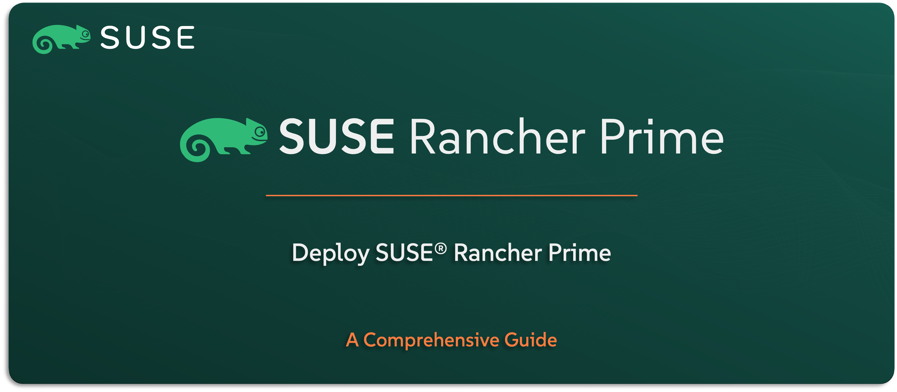

# Installing SUSE Rancher Prime

This repository is your step-by-step guide to deploying `SUSE Rancher Prime` — whether you’re working in a connected environment or setting things up in a fully air-gapped infrastructure. It’s built to make the installation process simple, reliable, and repeatable across different deployment scenarios. While this guide is primarily crafted for `SUSE` Solution Architects, it’s equally valuable for Infrastructure, DevOps, and Cloud-Native teams who need to install and operate `SUSE Rancher Prime` in real-world environments.

---

    

---

> ⚠️ Disclaimer:
> 
> This is not an official `SUSE` document. While it is based on practical experience and best practices, it is strongly recommended to refer to the official `SUSE` documentation for the most accurate and up-to-date guidance: https://documentation.suse.com

---

## About This Repo

This repo is created to help you install `SUSE Rancher Prime` in a structured, simplified, and professional way, with clear instructions for both connected and air-gapped environments.

It walks you through the end-to-end installation process using practical steps and scripts (if applicable) that are based on `SUSE` best practices. It’s designed to give you everything you need — from understanding the installation flow to implementing it step-by-step. Whether you’re getting familiar with how `SUSE Rancher Prime` is deployed, testing the setup, validating it internally, or getting ready to perform the installation, this repo provides a solid reference to get `SUSE Rancher Prime` up and running the right way.

You’ll find:
- A clean, step-by-step installation flow tailored for real-world environments
- Practical scripts and templates (if applicable) to automate key parts of the process
- Guidance for both online and offline installation scenarios
- Air-gapped setup instructions, including how to manage container images and Helm charts

This repo is particularly useful for `SUSE` pre-sales and delivery engineers, but it’s equally practical for any user looking to install Rancher in a reliable, supportable way.

It doesn’t just tell you what to do — it shows you how to do it properly, with flexibility for different setups and environments.

> ⚠️ **Important:** This repo is not intended to replace official documentation or support channels. Before deploying Rancher Prime in a production environment, it is strongly recommended to consult with your `SUSE` account team or refer to the official documentation to ensure alignment with supported architectures and best practices.

---

## What You’ll Find in This Repo

This repo is designed to give you everything you need to plan and perform a clean, reliable installation of SUSE Rancher Prime. It covers multiple deployment paths to match different real-world scenarios — whether your environment is connected to the internet or fully air-gapped.

No matter your setup, you’ll find a clear route forward here.

**Content overview:**

- [Deploy SUSE Rancher In A Connected Environment (Online)](/02-Deploy-SUSE-Solutions/01-SUSE-Rancher-Prime/01-Deploy-SUSE-Rancher-Prime-Connected/README.md)
- [Deploy SUSE Rancher Prime In An AirGapped Environment (No Internet Access)](/02-Deploy-SUSE-Solutions/01-SUSE-Rancher-Prime/02-Deploy-SUSE-Rancher-Prime-AirGapp/README.md)

---

## Official References:

- [SUSE Official Documentation](https://documentation.suse.com)
- [SUSE® Rancher Prime Official Documentation](https://documentation.suse.com/cloudnative/rancher-manager/latest/en/about-rancher/what-is-rancher.html)

---

**Enjoy** :blush:
