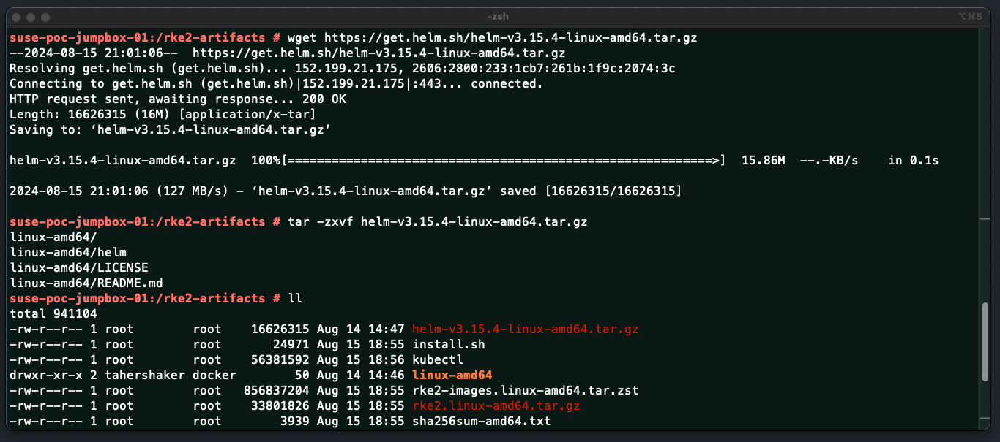
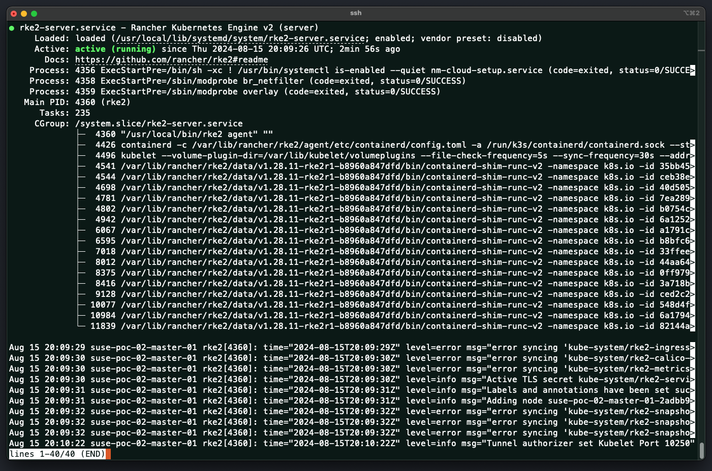

# Installing SUSE Rancher RKE2 In An Air-Gapped

This repo is created to provide the reader all the required information on install `SUSE Rancher RKE2` using the Air-Gapped Manual method. This repo provide a high-level explanation along with install and configure step-by-step guides and scripts.

---

<p align="center">
    
</p>

---

## About This Repo

RKE2 can be installed to a system in a number of ways - Quick-Start Script, Tarball, RPM, Manual Air-Gapped, two of which are the preferred and supported methods. Those methods are tarball and RPM. The install script referenced as the Quick-Start is a wrapper around these two methods. Air-Gapped method is also based on the Quick-Start script, tarball, and RPM, however, all the required files must be downloaded first to the node before the installation.

For the Tarball installation, please refer to this [link](https://docs.rke2.io/install/methods#tarball). For the RPM installation, please refer to this [link](https://docs.rke2.io/install/methods#rpm).

This repo is designed and created to provide a documented step-by-step guide and scripts for installing `SUSE Rancher RKE2` using Manual Air-Gapped method. Using this method, Internet access is not required for the nodes, however, it is required for the JumpBox or Laptop that will be used to download the required files.

`SUSE Rancher RKE2` has officially provided a script to be used to quickly install RKE2 kubernetes distribution. This script also accept arguments to be able to direct the script to install RKE2 on a master node, worker node, specific version and much more. In the Manual Air-Gapped method, we will also be using the script, however, we will be downloading it along with all required files and will use them locally on the cluster nodes

This script is available at https://get.rke2.io/. Please refer to the __Environment variables__ section in the script to have a full list of available configuration options.

---

## Step-By-Step Guide

This section is a ste-by-step guide for installing the `SUSE Rancher RKE2` using the manual Air-Gapped method.

---

### Prerequisites For Installing RKE2

---

Before installing RKE2, you must confirm that all requirements are in place to avoid any issues during or after the installation.

> Ensure Using A Supported OS

Check if you are using a supported Operating System distribution and version. Please refer to the RKE2 support matrix - [Link Here](https://www.suse.com/suse-rke2/support-matrix/all-supported-versions/rke2-v1-30/)

> Ensure Sufficient Hardware Resources

Make sure you have enough Hardware - CPU, Memory, Disk - on your servers before the installation. Please refer to the Hardware requirement - [Link Here](https://docs.rke2.io/install/requirements#hardware)

> Ensure Require Network Ports Are Opened On Firewall (If Any Exists) For Node To Node Communication

If there are any Firewall services impacting the communication between the nodes you will use to deploy RKE2 on, make sure you allow the required ports. Please refer to the required ports list - [Link Here](https://docs.rke2.io/install/requirements#networking)

> Ensure Unique Hostname On All Nodes 

Two rke2 nodes cannot have the same node name. By default, the node name is taken from the machine's hostname. If two or more of your machines have the same hostname, you must do one of the following:
- Update the hostname to a unique value (*Recommended*)
- Set the `node-name` parameter in the config file to a unique value
- Set the `with-node-id` parameter in the config file to true to append a randomly generated ID number to the hostname.
  - Please Note: Configuration file will be explained later in this section, please go through all the guide to be able to understand how to you the config file

> Ensure Having A Default Route Configured

If your nodes do not have an interface with a default route, a default route must be configured; even a black-hole route via a dummy interface will suffice. RKE2 requires a default route in order to auto-detect the node's primary IP, and for kube-proxy ClusterIP routing to function properly. 

If your nodes are all deployed in the same IP subnet and no need to communicated outside through a default route, and thus, you have not configured a default route, please do configure one. If for any reason you are not able to configure a default route, then add a dummy default route. To add a dummy default route, do the following:

```bash
ip link add dummy0 type dummy
ip link set dummy0 up
ip addr add 203.0.113.254/31 dev dummy0
ip route add default via 203.0.113.255 dev dummy0 metric 1000
```

> Disable Firewalld Services

Firewalld conflicts with RKE2's default Canal (Calico + Flannel) networking stack. To avoid unexpected behavior, firewalld should be disabled on systems running RKE2. to do so, please use the following command:

```bash
sudo systemctl stop firewalld
sudo systemctl disable firewalld
```

> Configure NetworkManager to ignore calico/flannel related network interfaces

NetworkManager manipulates the routing table for interfaces in the default network namespace where many CNIs, including RKE2's default, create veth pairs for connections to containers. This can interfere with the CNI’s ability to route correctly. As such, if installing RKE2 on a NetworkManager enabled system, it is highly recommended to configure NetworkManager to ignore calico/flannel related network interfaces. 

In order to do this, create a configuration file called rke2-canal.conf in /etc/NetworkManager/conf.d with the contents provided below and reload the service:

```bash
mkdir -p /etc/NetworkManager/conf.d
sudo cat << EOF >> /etc/NetworkManager/conf.d/rke2-canal.conf
[keyfile]
unmanaged-devices=interface-name:cali*;interface-name:flannel*
EOF
sudo systemctl reload NetworkManager
```

> Disable Some NetworkManager Services (If Required)

In some operating systems like RHEL 8.4, NetworkManager includes two extra services called `nm-cloud-setup.service` and `nm-cloud-setup.timer`. These services add a routing table that interfere with the CNI plugin's configuration. Unfortunately, there is no config that can avoid that. Therefore, if those services exist, they should be disabled. Please note: the node may require a reboot after disabling these services.

```bash
sudo systemctl stop nm-cloud-setup.service
sudo systemctl disable nm-cloud-setup.service
sudo systemctl stop nm-cloud-setup.timer
sudo systemctl disable nm-cloud-setup.timer
```

> Ensure AppArmor is enabled (If Required)

For RKE2 versions 1.21 and higher, if the host kernel supports AppArmor, the AppArmor tools (usually available via the `apparmor-parser` package) must also be present prior to installing RKE2.

---

### Create RKE2 Configuration File

---

The primary way to configure RKE2 is through its config file. Command line arguments and environment variables are also available, but RKE2 is installed as a systemd service and thus these are not as easy to leverage. By default, RKE2 will launch with the values present in the YAML file located at `/etc/rancher/rke2/config.yaml`.

The RKE2 config file needs to be created manually. You can do that by running `vi /etc/rancher/rke2/config.yaml` as a privileged user and then add the required configuration. If the configuration is changed after starting RKE2, the service must be restarted to apply the new configuration.

The main required configurations for the RKE2 server (meaning the master node) are:
- `write-kubeconfig-mode` - The permissions required for the kubeconfig file - example 0644
- `cni` - The CNI to be used - example calico
- `token` - Token used for authentication between the worker and master nodes. This can be any random characters - example: Suse!sTh3BestSince@1992

Below is an example of creating the configuration file for an RKE2 server:
```bash
mkdir -p /etc/rancher/rke2/
cat << EOF >> /etc/rancher/rke2/config.yaml
write-kubeconfig-mode: "0644"
cni: "calico"
token: “Suse!sTh3BestSince@1992”
EOF
```

The main required configurations for the RKE2 server (meaning the master node) are: 
- `server` - RKE2 server IP or FQDN for the Worker node to use for joining the cluster. Port has to be 9345 - example 10.10.10.10 - master-01.example.com
- `token` - Token used for authentication between the worker and master nodes. This can be any random characters - example: Suse!sTh3BestSince@1992

Below is an example of creating the configuration file for an RKE2 server:
```bash
mkdir -p /etc/rancher/rke2/
cat << EOF >> /etc/rancher/rke2/config.yaml
server: https://10.10.10.10:9345
token: “Suse!sTh3BestSince@1992”
EOF
```

For the list of all supported configuration, please refer to this [link](https://docs.rke2.io/reference/server_config) for the RKE2 server (master node) and this [link](https://docs.rke2.io/reference/linux_agent_config) for the RKE2 agent (worker node)

---

### Installing RKE2 Kubernetes Cluster In An Air-Gapped Environment  - Step-By-Step Guide

---

In this guide, we will be deploying an RKE2 cluster with one master node and two worker nodes. For a high-available RKE2 cluster, please refer to [this link](https://docs.rke2.io/install/ha)

**Please Note:** The RKE2 installation process must be run as the `root user` or through `sudo`.

1. Ensure you have performed and satisfied all prerequisites mentioned [here](#prerequisites-for-installing-rke2)
2. SSH to the JumpBox (Or use your laptop), create a folder called `rke2-artifacts` and download the required files in it (if you are using an arm hardware architecture, replace amd with arm). In this example we are downloading RKE2 version 1.28.11
```bash
mkdir rke2-artifacts && cd rke2-artifacts
export RKE2_VERSION="v1.28.11%2Brke2r1"
curl -OLs https://github.com/rancher/rke2/releases/download/$RKE2_VERSION/rke2-images.linux-amd64.tar.zst
curl -OLs https://github.com/rancher/rke2/releases/download/$RKE2_VERSION/rke2.linux-amd64.tar.gz
curl -OLs https://github.com/rancher/rke2/releases/download/$RKE2_VERSION/sha256sum-amd64.txt
curl -sfL https://get.rke2.io --output install.sh
```

<p align="center">
    
</p>

3. Download the kubectl tool to the same folder
```bash
sudo curl -LO "https://dl.k8s.io/release/$(curl -L -s https://dl.k8s.io/release/stable.txt)/bin/linux/amd64/kubectl"
```

<p align="center">
    
</p>

4. Download the Helm binary tool to the same folder and unzip the tar file. Please note, this link is download the latest Helm version at the time.
```bash
sudo wget https://get.helm.sh/helm-v3.15.4-linux-amd64.tar.gz
sudo tar -zxvf helm-v3.15.4-linux-amd64.tar.gz
```

<p align="center">
    
</p>

5. create a folder called `rke2-artifacts` and copy the downloaded files to all nodes in the cluster (master & worker). In this example we are using scp to copy the files from the JumpBpx to the Nodes and all machines are hosted on Google Cloud. Thus using Google Cloud SSH Key in the scp command
```bash
sudo scp -i google_compute_engine -r rke2-artifacts/* root@34.76.81.211:/rke2-artifacts/
```

<p align="center">
    
</p>

6. SSH to all nodes and ensure that the files are transferred properly

<p align="center">
    
</p>

7. Create the Configuration file on master node
```bash
sudo mkdir -p /etc/rancher/rke2/
sudo cat << EOF >> /etc/rancher/rke2/config.yaml
write-kubeconfig-mode: "0644"
token: “Suse!sTh3BestSince@1992”
EOF
```

<p align="center">
    
</p>

8. Create the configuration file on worker node(s) - Here the master node IP is 10.10.10.140
```bash
sudo mkdir -p /etc/rancher/rke2/
sudo cat << EOF >> /etc/rancher/rke2/config.yaml
server: https://10.10.10.140:9345
token: “Suse!sTh3BestSince@1992”
EOF
```

<p align="center">
    
</p>

9. Install RKE2 on master node using the downloaded. The files we downloaded for this example is RKE2 version 1.28.11. Here we are using the `INSTALL_RKE2_ARTIFACT_PATH` variable to instruct the script to retrieve all required files from the specified path. Please note: the `INSTALL_RKE2_ARTIFACT_PATH` variable has to be defined before the execution of the script
```bash
cd rke2-artifacts
chmod +x install.sh # Make Script Executable
sudo INSTALL_RKE2_ARTIFACT_PATH=/rke2-artifacts sh install.sh
```

<p align="center">
    
</p>

10. Enable and start the RKE2 server services on master node
```bash
sudo systemctl enable rke2-server.service
sudo systemctl start rke2-server.service
```

<p align="center">
    
</p>

You can check the statue of the service using the command `sudo systemctl status rke2-server.service`

<p align="center">
    
</p>

11. Install RKE2 on master node using the downloaded. The files we downloaded for this example is RKE2 version 1.28.11. Here we are using the `INSTALL_RKE2_ARTIFACT_PATH` variable to instruct the script to retrieve all required files from the specified path. Also the `INSTALL_RKE2_TYPE` variable is used and is set to `agent` to let the script know that this installation is for an worker node. Please note: the `INSTALL_RKE2_ARTIFACT_PATH` variable has to be defined before the execution of the script
```bash
cd rke2-artifacts
chmod +x install.sh # Make Script Executable
sudo INSTALL_RKE2_ARTIFACT_PATH=/rke2-artifacts INSTALL_RKE2_TYPE="agent" sh install.sh
```

<p align="center">
    
</p>

12. Enable and start the RKE2 agent services on worker node
```bash
sudo systemctl enable rke2-agent.service
sudo systemctl start rke2-agent.service
```

<p align="center">
    
</p>

You can check the statue of the service using the command `sudo systemctl status rke2-server.service`

<p align="center">
    
</p>

13. Install and configure kubectl on master node (Using the file you have download and copied to the master nodes in step 5)
```bash
cd /rke2-artifacts
# install kubectl
sudo install -o root -g root -m 0755 kubectl /usr/local/bin/kubectl
# bring the kubecofig file created by RKE2 and add it to the proper location
mkdir -p ~/.kube
cp /etc/rancher/rke2/rke2.yaml ~/.kube/config
# assign required privilege to the file
chown $(whoami):$(whoami) ~/.kube/config
```

<p align="center">
    
</p>

14. Ensure cluster is working as expected using the kubectl command below. Check the nodes are ready and Pods are running
```bash
kubectl get nodes
kubectl get pod -A
```

<p align="center">
    
</p>

15. Install Helm on the master node (Using the file you have download and copied to the master nodes in step 5). In this step we have already downloaded the binary file. You just need to move it on the master node to the `/usr/local/bin/helm`
```bash
sudo cd rke2-artifacts/
sudo mv linux-amd64/helm /usr/local/bin/helm
```

<p align="center">
    
</p>

---

## References

- [RKE2 Quick-Start](https://docs.rke2.io/install/quickstart)
- [RKE2 Quick-Start Script](https://get.rke2.io/)
- [RKE2 Support Matrix](https://www.suse.com/suse-rke2/support-matrix/all-supported-versions/rke2-v1-30/)
- [RK2 Hardware Requirements](https://docs.rke2.io/install/requirements#hardware)
- [RKE2 Networking Ports Requirement](https://docs.rke2.io/install/requirements#networking)
- [RKE2 Installation Prerequisites](https://docs.rke2.io/install/requirements)
- [RKE2 Installation - Known Issues](https://docs.rke2.io/known_issues)
- [RKE2 Server Configuration File Reference](https://docs.rke2.io/reference/server_config)
- [RKE2 Agent Configuration File Reference](https://docs.rke2.io/reference/linux_agent_config)
- [RKE2 HA Cluster Installation](https://docs.rke2.io/install/ha)

---

**Enjoy** :blush:
