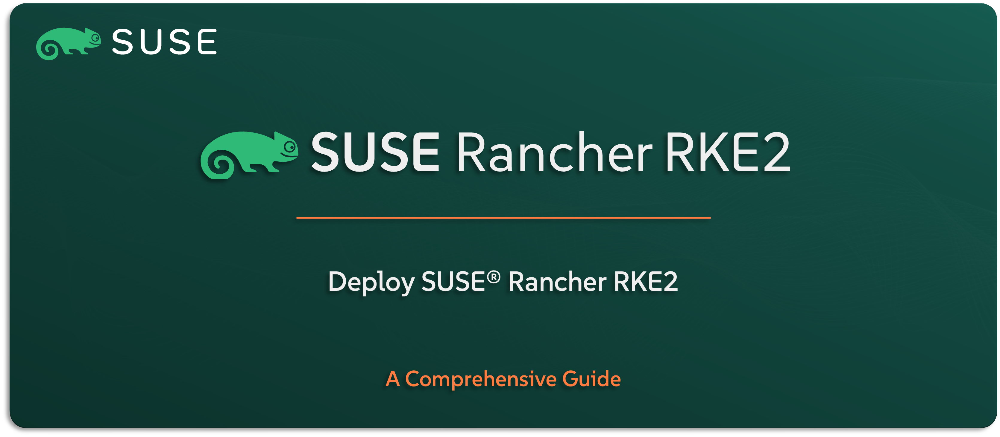

# Deploying SUSE Rancher RKE2

This repository is your step-by-step guide to deploying SUSE Rancher Kubernetes Engine – RKE2 — whether you’re setting it up in a connected environment or preparing for an air-gapped infrastructure. It’s built to make the deployment process simple, reliable, and repeatable across different scenarios, including both standalone and high availability (HA) setups. While this guide is primarily crafted for SUSE Solution Architects, it’s equally valuable for Infrastructure, DevOps, and Cloud-Native teams who need to install and operate RKE2 in real-world environments.

---

    

---

> **Note:** In this guide, we’ll refer to the solution as RKE2 — short for SUSE Rancher Kubernetes Engine - RKE2 — which is the supported Kubernetes distribution included in SUSE Rancher Prime.

---

> ⚠️ Disclaimer:
> 
> This is not an official `SUSE` document. While it is based on practical experience and best practices, it is strongly recommended to refer to the official `SUSE` documentation for the most accurate and up-to-date guidance: https://documentation.suse.com

---

## About This Repo

This repo is created to help you deploy RKE2 — the CNCF-certified Kubernetes distribution from SUSE — in a structured, simplified, and professional way. It includes clear instructions for both online and offline environments, and provides support for different infrastructure types, use cases, and deployment patterns.

It walks you through the deployment flow using field-tested steps and scripts (if applicable), following SUSE’s recommended practices. Whether you’re learning how RKE2 is deployed, testing your environment, validating installation steps, or preparing for a larger rollout — this repo gives you a dependable reference to get started the right way.

It also covers deployment options for both standalone and high availability (HA) clusters, so you can choose the path that best fits your environment.

You’ll find:
- A clean, repeatable deployment flow designed for real-world use cases
- Optional scripts and tools (when available) to support automation
- Online and offline deployment instructions
- Air-gapped setup support, including image management and registration tips

This repo is especially helpful for SUSE architects and partners, but it’s just as useful for any team deploying RKE2 as part of a secure, enterprise-ready Kubernetes platform.

> ⚠️ **Important:** This guide is not intended to replace official documentation or support processes. Before moving to production, it’s recommended to consult your SUSE account team or refer to the official documentation for the latest supported configurations and practices.

---

## What You’ll Find in This Repo

This repo gives you everything you need to plan and carry out a clean deployment of SUSE Rancher Kubernetes Engine – RKE2. It includes support for a variety of common scenarios — whether you’re connected to the internet, working offline, running standalone setups, or deploying in a fully HA architecture.

No matter your environment, this repo helps you get started with confidence.

Content overview:
- [Deploy RKE2 in a Connected Environment (Online)](/02-Deploy-SUSE-Solutions/02-SUSE-Rancher-RKE2/01-Deploy-SUSE-Rancher-RKE2-Connected/README.md)
- [Deploy RKE2 in an Air-Gapped Environment (Offline)](/02-Deploy-SUSE-Solutions/02-SUSE-Rancher-RKE2/02-Deploy-SUSE-Rancher-RKE2-AirGapp/README.md)
- [Deploy RKE2 in an HA Environment](/02-Deploy-SUSE-Solutions/02-SUSE-Rancher-RKE2/03-Deploy-SUSE-Rancher-RKE2-HA/README.md)

---

## Official References:

- [SUSE Official Documentation](https://documentation.suse.com)
- [SUSE® Rancher Prime RKE2 Official Documentation](https://documentation.suse.com/cloudnative/rke2/latest/en/introduction.html)

---

**Enjoy** :blush:
