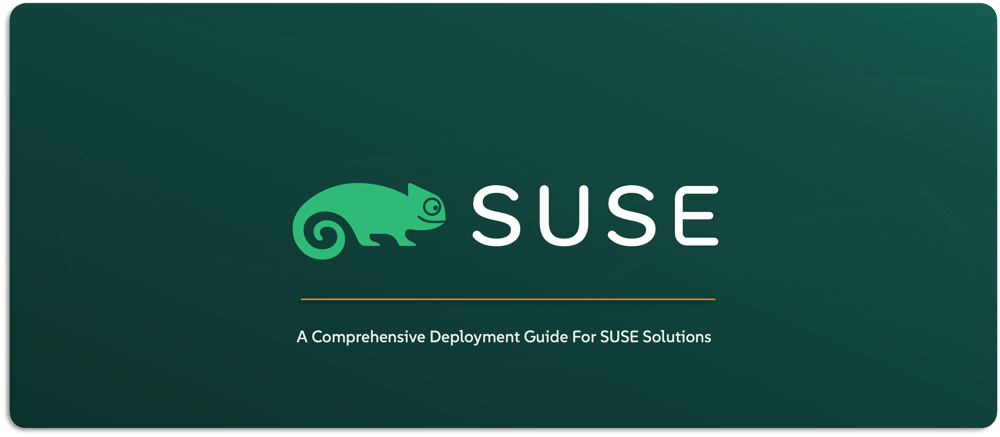

# Deploying SUSE Rancher Prime Suite Solutions Stack

Welcome to the Deploy `SUSE® Rancher Prime` Suite Solutions repository — your go-to deployment guide for rolling out every component of the `SUSE Rancher Prime` stack. This repo acts as a central hub, with each sub-repository dedicated to deploying one solution within the suite — from Kubernetes engines like `RKE2` and `K3S` to storage, security, observability, and more. If you’re looking to understand how each solution is deployed, test out different deployment scenarios, or validate your setup in a clean, structured way — this is the place to start. Every guide is built to be practical, repeatable, and aligned with `SUSE’s` best practices. While this repo is primarily crafted for `SUSE` Solution Architects, it’s equally valuable for Infrastructure, DevOps, and Cloud-Native teams who need to deploy and operate the `SUSE Rancher Prime` Suite Solution Stack with confidence.

---

    

---

> ⚠️ Disclaimer:
> 
> This is not an official `SUSE` document. While it is based on practical experience and best practices, it is strongly recommended to refer to the official `SUSE` documentation for the most accurate and up-to-date guidance: https://documentation.suse.com

---

## About This Repo

This repository is built to guide you through the practical deployment of every solution included in the `SUSE Rancher Prime` Suite Solution Stack. It assumes you already understand the purpose of each component and are now ready to take the next step: actually deploying them. If you don’t yet have the required background or would like to learn more about the solutions before deploying them, please refer to the [Learn About SUSE Solutions repository](/01-Learn-About-SUSE-Solutions/README.md) for a clear, high-level understanding.

Each section here is focused on one solution at a time, giving you clean, well-structured instructions for real-world environments — with support for both connected and air-gapped setups. Where applicable, you’ll also find automation scripts (if applicable), helpful notes, and deployment patterns that reflect `SUSE` best practices.

This repo is meant to be your go-to reference when you want to roll up your sleeves and get each part of the Rancher Prime stack up and running the right way.

**What Is Covered**

This repo covers every solution included in the `SUSE Rancher Prime` Suite, from core Kubernetes management to observability, security, and virtualization. Below is a quick overview of what each solution does and why it matters:
- **SUSE Rancher Prime**: The heart of the Prime Suite — a centralized platform for managing multiple Kubernetes clusters across on-prem, cloud, and edge environments. It simplifies operations, governance, access control, and application delivery.
- **SUSE Kubernetes Engines (RKE2 & K3s)**: Two lightweight, production-grade Kubernetes distributions. RKE2 is fully CNCF-compliant and secure by default, while K3s is ideal for edge and resource-constrained environments.
- **SUSE Storage** (formerly Longhorn): A cloud-native, distributed block storage solution for Kubernetes. It enables persistent volumes with built-in snapshotting, backup, replication, and disaster recovery — all designed for containerized workloads.
- **SUSE Security** (formerly NeuVector): A full-lifecycle Kubernetes security platform offering runtime protection, vulnerability scanning, zero-trust policies, and deep network visibility — built for highly regulated or security-conscious environments.
- **SUSE Observability** (formerly StackState): A modern observability platform that correlates metrics, logs, traces, and topology into a unified view — helping teams detect, understand, and resolve issues faster.
- **SUSE Application Collection**: A curated catalog of Helm charts and pre-validated apps that simplify Kubernetes adoption. It accelerates time-to-value by offering ready-to-deploy software tailored for enterprise environments.
- **SUSE Private Registry** (based on Harbor): A secure, self-hosted container image registry for enterprise use. It supports air-gapped deployments, vulnerability scanning, and fine-grained access control for managing trusted container images.
- **SUSE Rancher Prime Admission Policy Manager** (based on Kubewarden): A Kubernetes policy engine that enforces governance through policy-as-code. It enables you to secure your workloads by controlling what’s allowed to run in your clusters — with flexibility and transparency.
- **SUSE Rancher Prime OS Manager** (formerly Elemental): A cloud-native operating system management stack built to manage the OS layer of Kubernetes nodes. It provisions and updates lightweight OS images (like SLE Micro) across bare-metal and edge environments.
- **SUSE Rancher Prime ClusterAPI** (Turtles): A Rancher-native integration with the Cluster API (CAPI) project. It allows declarative lifecycle management of Kubernetes clusters across different infrastructures using GitOps-style workflows.
- **SUSE Rancher Prime Fleet**: A GitOps-based continuous delivery and lifecycle management tool for Kubernetes. It helps manage applications and configurations across large fleets of clusters, with version control and automation built-in.
- **SUSE Virtualization** (formerly Harvester): A hyperconverged infrastructure (HCI) solution that combines virtual machines and containers in a single platform — fully integrated with Rancher and ideal for modernizing legacy VM environments.

---

## What You’ll Find in This Repo

This repo is structured around the solutions in the `SUSE Rancher Prime` Suite Solution Stack. Each section focuses on deploying a specific solution, with step-by-step instructions adapted to various environments.

**Content overview:**

- [1- SUSE Rancher Prime](/01-Learn-About-SUSE-Solutions/01-SUSE-Rancher-Prime/)
- [2- SUSE Rancher Kubernetes Engine - RKE2](/01-Learn-About-SUSE-Solutions/02-SUSE-Rancher-RKE2/)
- [3- SUSE Rancher Kubernetes Engine - K3s](/01-Learn-About-SUSE-Solutions/03-SUSE-Rancher-K3S/)
- [4- SUSE Storage](/01-Learn-About-SUSE-Solutions/04-SUSE-Storage/)
- [5- SUSE Security](/01-Learn-About-SUSE-Solutions/05-SUSE-Security/)
- [6- SUSE Observability](/01-Learn-About-SUSE-Solutions/06-SUSE-Observability/)
- [7- SUSE Application Collection](/01-Learn-About-SUSE-Solutions/07-SUSE-Application-Collection/)
- [8- SUSE Private Registry](/01-Learn-About-SUSE-Solutions/08-SUSE-Private-Registry/)
- [9- SUSE Rancher Prime - Admission Policy Manager](/01-Learn-About-SUSE-Solutions/09-SUSE-Rancher-Prime-Admission-Policy-Manager/)
- [10- SUSE Rancher Prime OS Manager](/01-Learn-About-SUSE-Solutions/10-SUSE-Rancher-Prime-OS-Manager/)
- [11- SUSE Rancher Prime ClusterAPI](/01-Learn-About-SUSE-Solutions/11-SUSE-Rancher-Prime-ClusterAPI/)
- [12- SUSE Rancher Prime Fleet](/01-Learn-About-SUSE-Solutions/12-SUSE-Rancher-Prime-Fleet/)
- [13- SUSE Virtualization](/01-Learn-About-SUSE-Solutions/13-SUSE-Virtualization/)

---

## Official References:

- [SUSE Official Documentation](https://documentation.suse.com)
- [SUSE® Rancher Prime Official Documentation](https://documentation.suse.com/cloudnative/rancher-manager/latest/en/about-rancher/what-is-rancher.html)
- [SUSE® Rancher Prime RKE2 Official Documentation](https://documentation.suse.com/cloudnative/rke2/latest/en/introduction.html)
- [SUSE® Rancher Prime K3S Official Documentation](https://documentation.suse.com/cloudnative/k3s/latest/en/introduction.html)
- [SUSE® Storage Official Documentation](https://documentation.suse.com/cloudnative/storage/1.8.0/en/longhorn-documentation.html)
- [SUSE® Security Official Documentation](https://documentation.suse.com/cloudnative/security/5.4/en/overview.html)
- [SUSE® Observability Official Documentation](https://docs.stackstate.com/)
- [SUSE® Application Collection Official Documentation](https://docs.apps.rancher.io/)
- [SUSE® Private Registry Official Documentation](https://documentation.suse.com/cloudnative/suse-private-registry/html/private-registry/)
- [SUSE® Rancher Prime - Continuous Delivery | GitOps Official Documentation](https://documentation.suse.com/cloudnative/continuous-delivery/v0.10/en/index.html)
- [SUSE® Rancher Prime: Admission Policy Manager Official Documentation](https://documentation.suse.com/cloudnative/policy-manager/1.16/en/introduction.html)
- [SUSE® Rancher Prime ClusterAIP Official Documentation](https://documentation.suse.com/cloudnative/cluster-api/v0.17/en/index.html)
- [SUSE® Rancher Prime OS Manager Official Documentation](https://documentation.suse.com/cloudnative/os-manager/1.6/en/index.html)
- [SUSE® Virtualization Official Documentation](https://documentation.suse.com/cloudnative/virtualization/v1.3/en/introduction/overview.html)

---

**Enjoy** :blush:
