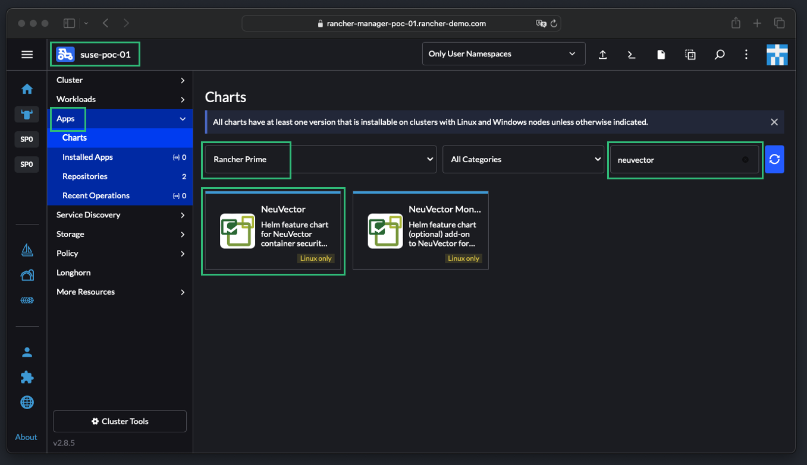
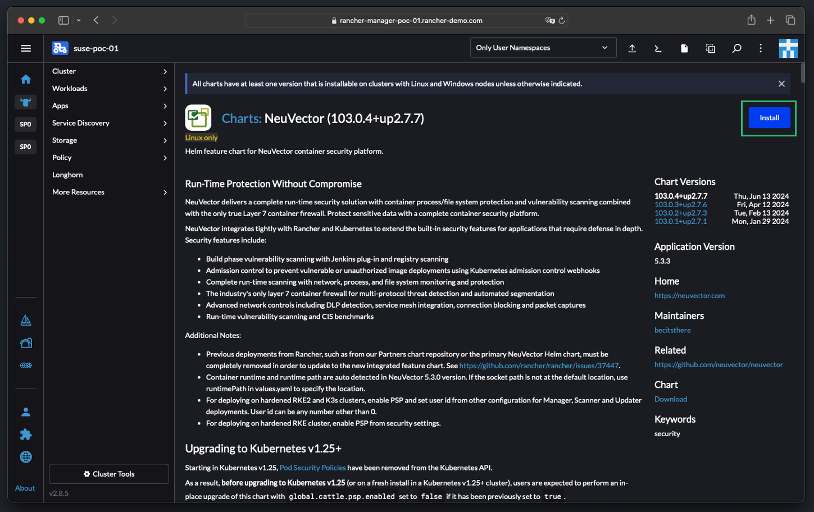
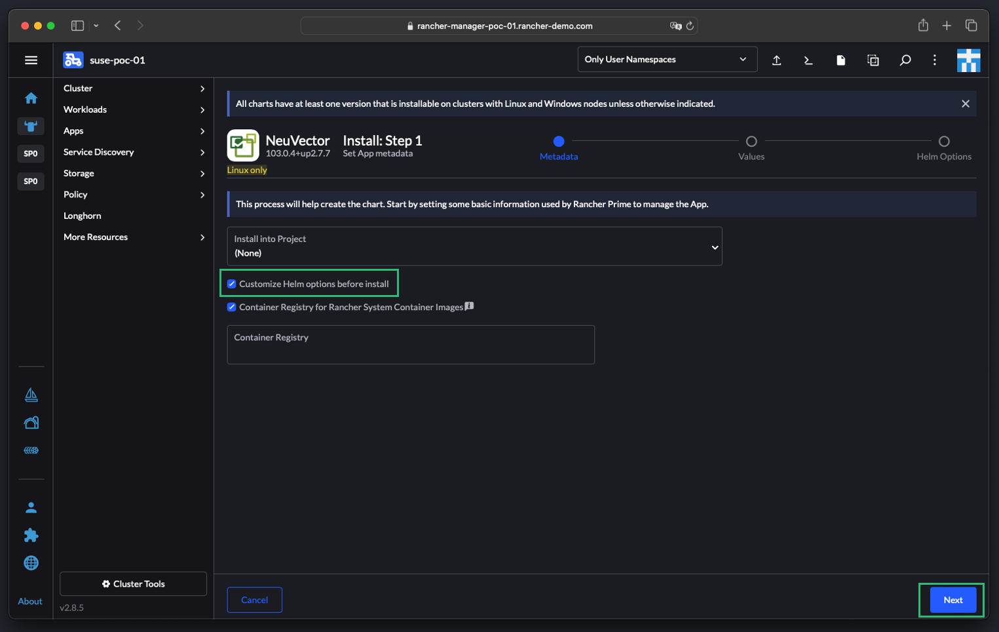
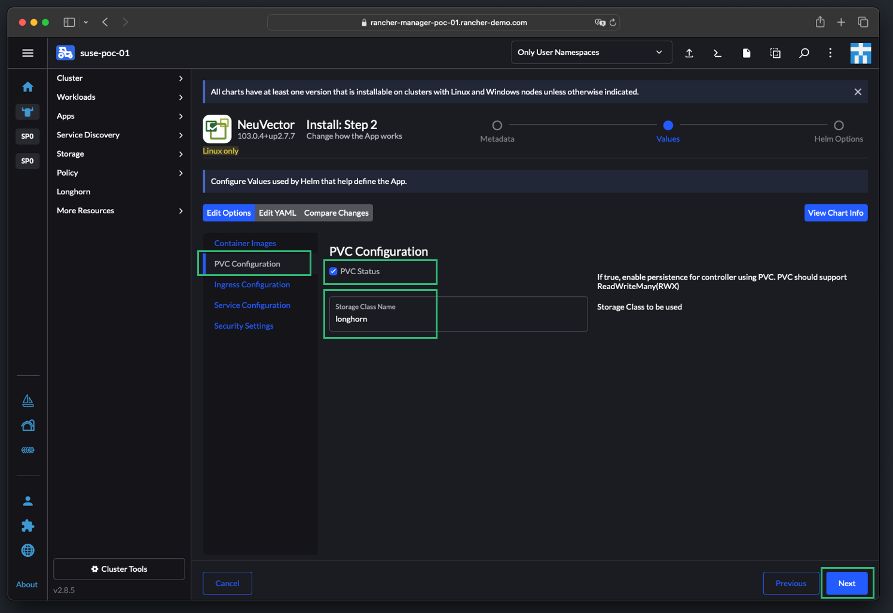
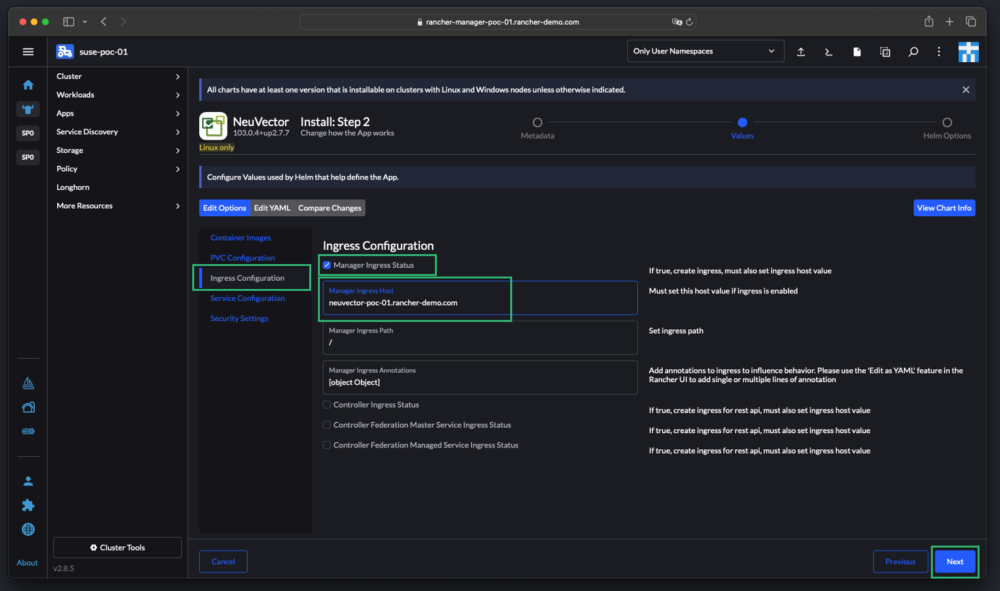
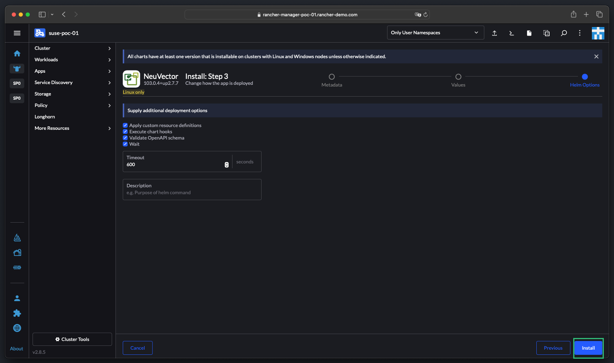
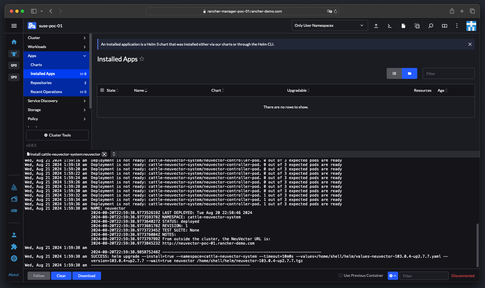
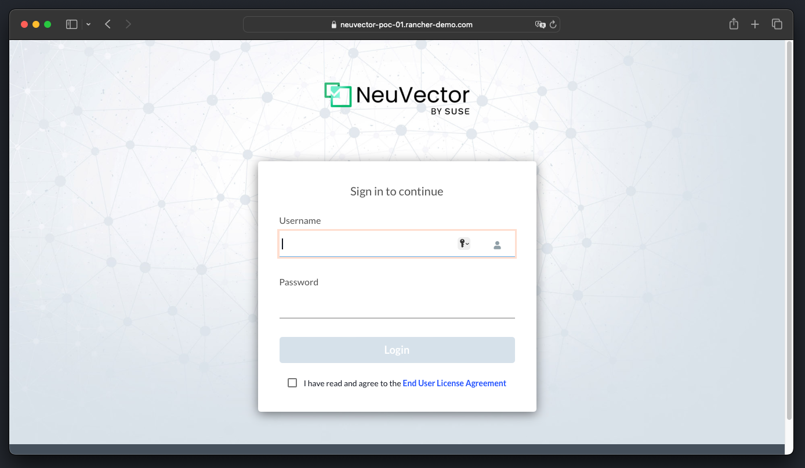

# Installing SUSE NeuVector Through SUSE Rancher UI

This repo is created to provide the reader all the required information on install `SUSE NeuVector` through `SUSE Rancher` UI. This repo provide a high-level explanation along with install and configure step-by-step guides and scripts.

---

    

---

## About This Repo

`SUSE NeuVector` provides several method of deployment with the easiest of them is through the `SUSE Rancher`. Also, this method provides the capability for direct integration with `SUSE Rancher`, however, there are some criteria need to be available to do so. This guide will provide a step-by-step guide on how to deploy `SUSE NeuVector` through the `SUSE Rancher` UI.

`SUSE NeuVector` is able to be deployed easily either through `SUSE Rancher` Extensions for Prime customers, or `SUSE Rancher` Apps and Marketplace. The default (Helm-based) `SUSE NeuVector` deployment will deploy `SUSE NeuVector` containers into the cattle-neuvector-system namespace.

Only `SUSE NeuVector` deployments through `SUSE Rancher` Extensions (NeuVector) of `SUSE Rancher` version 2.7.0+, or Apps & Marketplace of `SUSE Rancher` version 2.6.5+ can be managed directly (single sign on to NeuVector console) through `SUSE Rancher`. If adding clusters to `SUSE Rancher` with `SUSE NeuVector` already deployed, or where `SUSE NeuVector` has been deployed directly onto the cluster, these clusters will not be enabled for SSO integration.

---

===============================================

## Installing SUSE NeuVector Step-By-Step Guide

===============================================

This section is a ste-by-step guide for installing the `SUSE NeuVector` through the `SUSE Rancher` UI.

---

1. Login to Rancher, navigate to the required cluster, then click on `Apps`, then chose the `Rancher Charts`, then filter for `NeuVector`, then click on the `NeuVector` chart. The Rancher Charts will be available by default when deploying Rancher.

    

2. Review the NeuVector Chart and then click on `Install`

    

3. Check the `Customize Helm Options Before Install` and then click `Next`. If you want to deploy NueVector is an specific Rancher Project, chose the project name from the `Install Into Project` section, in this guide we are not choosing any projects.

    

4. In the chart options page, click on the `PVC Configuration`, then check the `PVC Status` box and then provide the StorageClass you have in your cluster (in this guide we are using longhorn). Please Note: if you did not do this configuration, NeuVector will be deployed as a stateless application and no configuration will be saved.

    

5. Click on the `Ingress Configuration`, then check the `Manager Ingress Status`, then provide the URL for the NeuVector. This will create an Ingress rule to route traffic to the NeuVector through Ingress. You can perform the same for the controller, Federation Master, and Federation Managed Service. However, several other requirements will be needed such as secrets and more.

    

6. Click on the `Services Configuration` and then chose the `Service Type` (NodePort, ClusterIP, LoadBalancer) for the `Manager Service Type`. In this guide, as we will be configuring NeuVector Federation as well as testing Controller REST API communication, we are setting all of them as we need to expose these services to the external network for access. Please Note: In a production environment, in most of the cases, there will be an external load balancer, so you should set the Service Type to Load Balancer, in this guide we do not have a load balancer, thus we are setting it as NodPort for simplicity.

    

7. Once done, click `Next`, then `Install`

    

8. Rancher will now install NeuVector and will show the actions in the shell terminal 

    

9. Now you can log in to NeuVector

    

---

## References

- [SUSE NeuVector Rancher Installation](https://open-docs.neuvector.com/deploying/rancher)

---

**Enjoy** :blush: