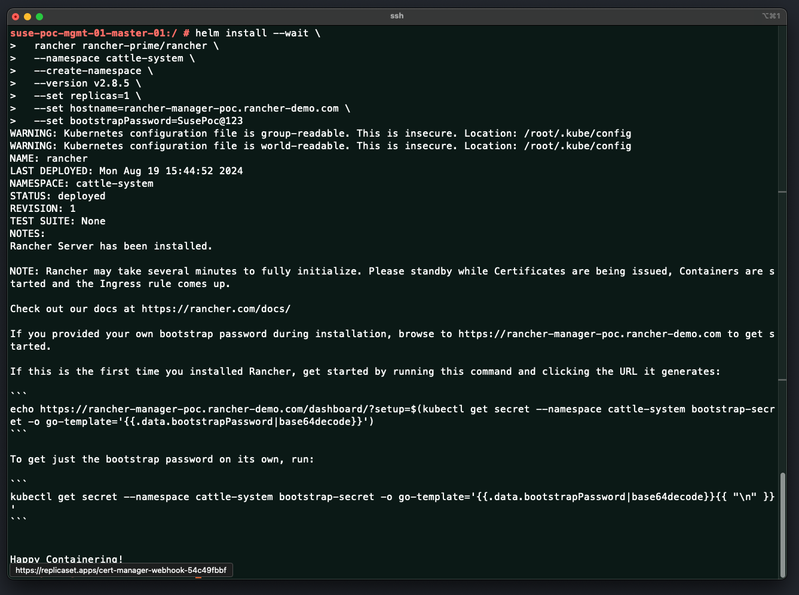
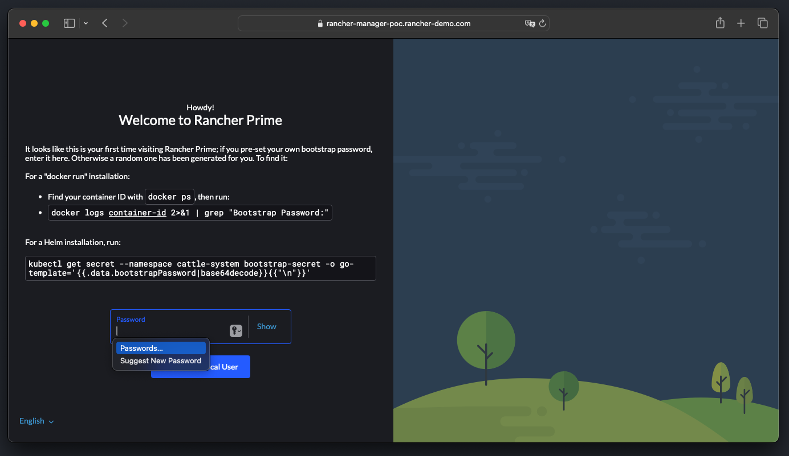

# Installing SUSE Rancher Using Helm Chart

This repo is created to provide the reader all the required information on install `SUSE Rancher` using the official Helm Chart method. This repo provide a high-level explanation along with install and configure step-by-step guides and scripts.

---

<p align="center">
    
</p>

---

## About This Repo

`SUSE` recommends using Helm, a Kubernetes package manager, to install `SUSE Rancher`. This is the main recommended method of installing and deploying Rancher in your environment. Even in an Air-Gapped environment, Helm is also the preferred method for deploying `SUSE Rancher`. 

`SUSE Rancher` also supports the installation behind an HTTP proxy, if any exists in your environment, however, some extra configurations is required when deploying and installing `SUSE Rancher`. These configuration is also going to be passed thorough the Helm Chart Values. For more information regarding the deployment of Rancher behind a Proxy, please refer to this [link](https://ranchermanager.docs.rancher.com/getting-started/installation-and-upgrade/other-installation-methods/rancher-behind-an-http-proxy)

`SUSE Rancher` has officially provided a Helm Chart Repository to be used when deploying and installing `SUSE Rancher`. The available `SUSE Rancher` Helm Charts repositories can be found in [this link](https://ranchermanager.docs.rancher.com/getting-started/installation-and-upgrade/install-upgrade-on-a-kubernetes-cluster#1-add-the-helm-chart-repository)

`SUSE Rancher` Depends on `cert-manager` for certificate management, thus, it is also required to deploy and install `cert-manager` while installing `SUSE Rancher`. `cert-manager` is also recommended to be deployed and installed using Helm Chart. The Helm Chart Repository for `cert-manager` can be found at https://charts.jetstack.io

This repo is designed and created to provide a documented step-by-step guide and scripts for installing `SUSE Rancher` using the official Helm Chart method. Using this method, Internet access is required.

---

## Step-By-Step Guide

This section is a ste-by-step guide for installing the `SUSE Rancher` using the official Helm Chart method with the Helm CLI tool.

---

### Prerequisites For Installing SUSE Rancher

---

Before installing `SUSE Rancher`, you must confirm that all requirements are in place to avoid any issues during or after the installation.

> Ensure Using A Supported OS

All supported operating systems are 64-bit x86. `SUSE Rancher should` work with any modern Linux distribution. The `SUSE Rancher` support matrix - [link here](https://www.suse.com/suse-rancher/support-matrix/all-supported-versions/rancher-v2-8-6/) - lists which OS and Docker versions were tested for each Rancher version.

> Ensure Using A Supported Kubernetes Distribution

`SUSE Rancher` needs to be installed on a supported Kubernetes version. `SUSE Rancher` supports several kubernetes distribution and versions of those kubernetes distributions. For the list of supported kubernetes distributions and the associated versions, please refer to the `SUSE Rancher` support matrix - [link here](https://www.suse.com/suse-rancher/support-matrix/all-supported-versions/rancher-v2-8-6/) - to ensure that your intended version of Kubernetes is supported.

> IF Using K3S Kubernetes Distribution, Ensure Specific Requirements Are In Place

If you are deploying `SUSE Rancher` on `SUSE Rancher K3S` cluster, several specific requirements are required. Please refer to this [link](https://ranchermanager.docs.rancher.com/getting-started/installation-and-upgrade/installation-requirements#k3s-specific-requirements) for the list of specific requirements needed

> Ensure Sufficient Hardware Resources

`SUSE Rancher's` hardware footprint depends on a number of factors, including:
- Size of the managed infrastructure (e.g., node count, cluster count).
- Complexity of the desired access control rules (e.g., RoleBinding object count).
- Number of workloads (e.g., Kubernetes deployments, Fleet deployments).
- Usage patterns (e.g., subset of functionality actively used, frequency of use, number of concurrent users).

Thus, The hardware resources requirements may vary, `SUSE` have officially provided recommended hardware resources requirements as a starting point:
- For hardware requirements when using RKE2 as a kubernetes distribution, please refer to this [link](https://ranchermanager.docs.rancher.com/getting-started/installation-and-upgrade/installation-requirements#rke2-kubernetes)
- For hardware requirements when using K3S as a kubernetes distribution, please refer to this [link](https://ranchermanager.docs.rancher.com/getting-started/installation-and-upgrade/installation-requirements#k3s-kubernetes)
- For hardware requirements when using Hosted Kubernetes (EKS, GKE, AKS) as a kubernetes distribution, please refer to this [link](https://ranchermanager.docs.rancher.com/getting-started/installation-and-upgrade/installation-requirements#hosted-kubernetes)

> Ensure Proper Disk Requirements Are In Place

`SUSE Rancher` performance depends on etcd in the cluster performance. To ensure optimal speed, we recommend always using SSD disks to back your `SUSE Rancher` management Kubernetes cluster. On cloud providers, you will also want to use the minimum size that allows the maximum IOPS. In larger clusters, consider using dedicated storage devices for etcd data and wal directories.

> Disable Firewalld Services On Node(s)

Some distributions of Linux may have default firewall rules that block communication within the Kubernetes cluster. Since Kubernetes v1.19, firewalld must be turned off, because it conflicts with the Kubernetes networking plugins. To do so, please use the following command:

```bash
sudo systemctl stop firewalld
sudo systemctl disable firewalld
```

If you don't feel comfortable doing so, you might check other suggestions. Some users were successful creating a separate firewalld zone with a policy of ACCEPT for the Pod CIDR. To do so, please refer to this [link](https://github.com/rancher/rancher/issues/28840#issuecomment-787404822)

> Ensure Node IP Is Static Assignments Or DHCP Have Reservation

Each node used (where `SUSE Rancher` will be deployed on) should have a static IP configured, regardless of whether you are installing Rancher on a single node or on an HA cluster. In case of DHCP, each node should have a DHCP reservation to make sure the node gets the same IP allocated.

> Ensure Proper Node Networking And Communication To Downstream Clusters

`SUSE Rancher` is a kubernetes clusters management solution, thus, `SUSE Rancher` will need to communication with downstream clusters to be able to manage them. Thus, proper networking and routing configuration from the nodes(s) (where `SUSE Rancher` will be deployed on) to the downstream cluster is required.

Also, `SUSE Rancher` may integrate with external tools such as external authentication provider (LDAP, AD, etc.). Thus, proper networking and routing configuration from the nodes(s) (where `SUSE Rancher` will be deployed on) to these external tools is required.

> Ensure NTP Is Set Properly

The ntp (Network Time Protocol) package should be installed. This prevents errors with certificate validation that can occur when the time is not synchronized between the client and server.

> Ensure Require Network Ports Are Opened On Firewall (If Any Exists)

To operate properly, `SUSE Rancher` requires a number of ports to be open on `SUSE Rancher` node(s) (where `SUSE Rancher` will be deployed on) and on downstream Kubernetes cluster nodes. Port Requirements lists all the necessary ports for Rancher and Downstream Clusters for the different cluster types.

---

==========================================================================

### Install SUSE Rancher Using The Official Helm Chart - Step-By-Step Guide

==========================================================================

---

In this guide, we will be deploying an `SUSE Rancher` on a single node RKE2 cluster. For production environment, it is required to deploy `SUSE Rancher os a highly-available cluster with minimum of 3 nods. For a high-available RKE2 cluster, please refer to [this link](https://docs.rke2.io/install/ha)

1. Ensure you have performed and satisfied all prerequisites mentioned [here](#prerequisites-for-installing-suse-rancher)
2. Login to the Node and ensure kubectl and helm are installed properly 
```bash
kubectl version --client
kubectl get nodes
helm version 
```

<p align="center">
    
</p>

3. Add the required Helm Repositories to deploy cert-manager and `SUSE Rancher`
```bash
helm repo add jetstack https://charts.jetstack.io
helm repo add rancher-prime https://charts.rancher.com/server-charts/prime
helm repo update
```

<p align="center">
    
</p>

Please Note: The above `SUSE Rancher` Helm Chart Repository is for the community edition. If you are looking to deploy `SUSE Rancher Prime` which is the enterprise edition, you need to use a different URL for the `SUSE Rancher Prime` Helm Repositories. To retrieve the `SUSE Rancher Prime` Helm Repositories, please refer to your `SUSE` representative.

4. Install cert-manager using Helm Chart. In this guide we are installing cert-manager version 1.13.0
```bash
helm install --wait \
  cert-manager jetstack/cert-manager \
  --namespace cert-manager \
  --version v1.13.0 \
  --set installCRDs=true \
  --create-namespace
```

<p align="center">
    
</p>

You can check the deployment using the command `kubectl -n cert-manager get all`

<p align="center">
    
</p>

5. Install `SUSE Rancher` using Helm Chart. In this guide we are installing `SUSE Rancher` version 2.8.5

```bash
helm install --wait \
  rancher rancher-prime/rancher \
  --namespace cattle-system \
  --create-namespace \
  --version v2.8.5 \
  --set replicas=1 \
  --set hostname=rancher-manager-poc.rancher-demo.com \
  --set bootstrapPassword=SusePoc@123
```

<p align="center">
    
</p>

You can check the deployment using the command `kubectl -n cattle-system get all`

<p align="center">
    
</p>

Please Note: The above command will install `SUSE Rancher` with a self-signed certificate. `SUSE Rancher` supports other methods of deployment such as using a LetsEncrypt certificate or a private signed certificate. For more information regarding the available options of the certificates and the required values, please refer to this [link](https://ranchermanager.docs.rancher.com/getting-started/installation-and-upgrade/installation-references/helm-chart-options#common-options).

To deploy `SUSE Rancher` with LetsEncrypt certificate, add the below Helm Chart Values to the above command
```bash
  --set ingress.tls.source=letsEncrypt \
  --set letsEncrypt.email=<your-email-address.com> \
```

To Deploy `SUSE Rancher` with private certificate, create a kubernetes secret and add the certificate into it as explained in this [link](https://ranchermanager.docs.rancher.com/getting-started/installation-and-upgrade/resources/add-tls-secrets), then add the below Helm Chart Values to the above command

```bash
  --set ingress.tls.source=secret \
  --set privateCA=true \
```

6. Now you can login to your `SUSE Rancher` UI using the provided URL and password in the Helm Chart install command used

<p align="center">
    
</p>

---

## References

- [SUSE Rancher Installation Requirements](https://ranchermanager.docs.rancher.com/getting-started/installation-and-upgrade/installation-requirements)
- [SUSE Rancher Support Matrix](https://www.suse.com/suse-rancher/support-matrix/all-supported-versions/rancher-v2-8-6/)
- [SUSE Rancher Install Behind A Proxy](https://ranchermanager.docs.rancher.com/getting-started/installation-and-upgrade/other-installation-methods/rancher-behind-an-http-proxy)
- [Install SUSE Rancher with Helm](https://ranchermanager.docs.rancher.com/getting-started/quick-start-guides/deploy-rancher-manager/helm-cli#install-rancher-with-helm)
- [SUSE Rancher Helm Chart Options](https://ranchermanager.docs.rancher.com/getting-started/installation-and-upgrade/installation-references/helm-chart-options#common-options)
- [SUSE Rancher Using a Private CA Signed Certificate](https://ranchermanager.docs.rancher.com/getting-started/installation-and-upgrade/resources/add-tls-secrets#using-a-private-ca-signed-certificate)

---

**Enjoy** :blush:
