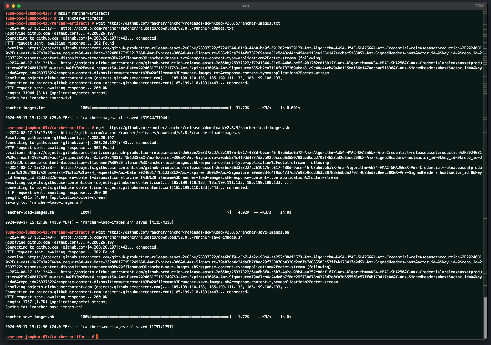
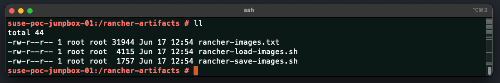
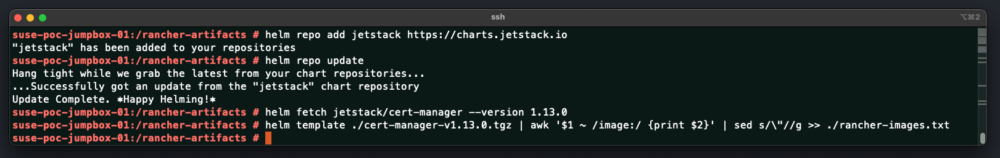
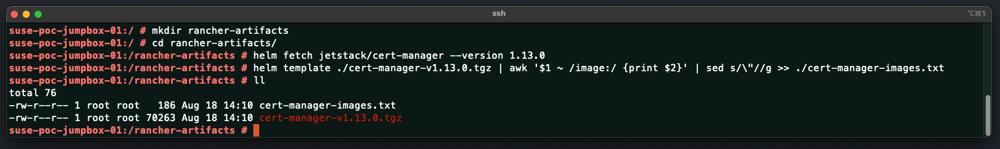
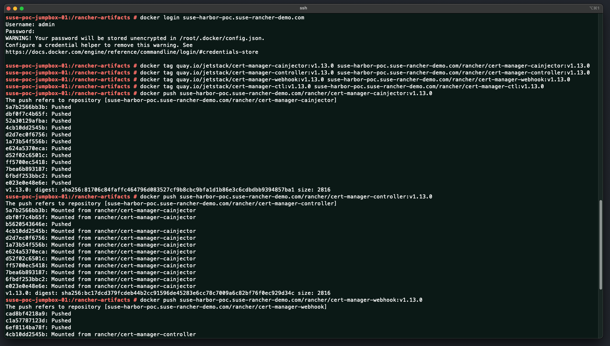
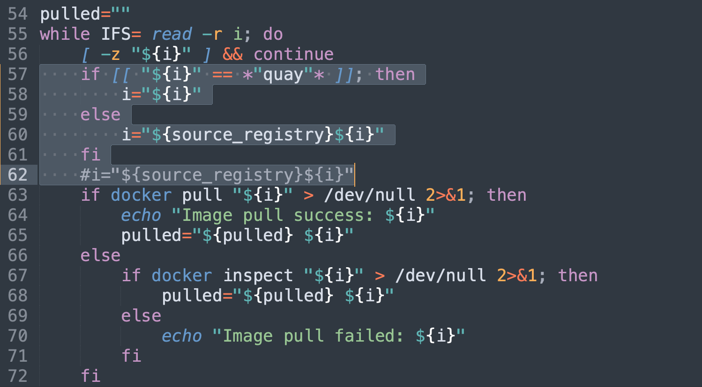
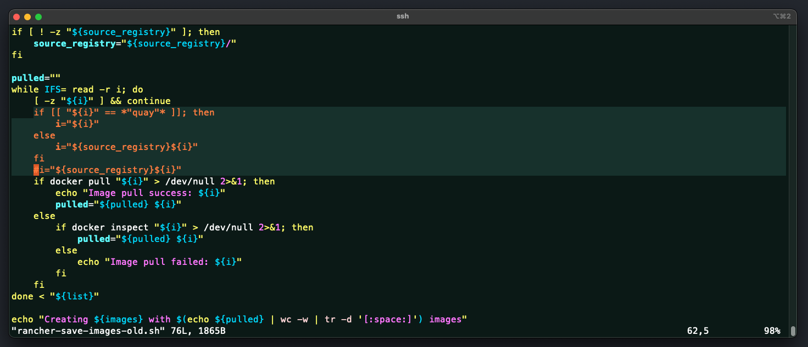

# Installing SUSE Rancher In An Air-Gapped

This repo is created to provide the reader all the required information on install `SUSE Rancher` using the Air-Gapped Manual method. This repo provide a high-level explanation along with install and configure step-by-step guides and scripts.

---

<p align="center">
    
</p>

---

## About This Repo

`SUSE` recommends using Helm, a Kubernetes package manager, to install `SUSE Rancher`. This is the main recommended method of installing and deploying Rancher in your environment. Even in an Air-Gapped environment, Helm is also the preferred method for deploying Rancher, however, in an Air-Gapped environment, all required files and images must be downloaded on a JumpBpx with internet access and then move files to the Kubernetes Cluster nodes and images added to the private local registry. 

`SUSE Rancher` also supports the installation behind an HTTP proxy, if any exists in your environment, however, some extra configurations is required when deploying and installing `SUSE Rancher`. These configuration is also going to be passed thorough the Helm Chart Values.

`SUSE Rancher` has officially provided a Helm Chart Repository to be used when deploying and installing `SUSE Rancher`. The available `SUSE Rancher` Helm Charts repositories can be found in [this link](https://ranchermanager.docs.rancher.com/getting-started/installation-and-upgrade/install-upgrade-on-a-kubernetes-cluster#1-add-the-helm-chart-repository)

`SUSE Rancher` Depends on `cert-manager` for certificate management, thus, it is also required to deploy and install `cert-manager` while installing `SUSE Rancher`. `cert-manager` is also recommended to be deployed and installed using Helm Chart. The Helm Chart Repository for `cert-manager` can be found at https://charts.jetstack.io

This repo is designed and created to provide a documented step-by-step guide and scripts for installing `SUSE Rancher` using Air-Gapped method. Using this method, Internet access is not required for the nodes, however, it is required for the JumpBox or Laptop that will be used to download the required files and images.

---

## Step-By-Step Guide

This section is a ste-by-step guide for installing the `SUSE Rancher` using the Air-Gapped method with the Helm CLI tool.

---

### Prerequisites For Installing SUSE Rancher

---

Before installing `SUSE Rancher`, you must confirm that all requirements are in place to avoid any issues during or after the installation.

> Ensure Using A Supported OS

All supported operating systems are 64-bit x86. `SUSE Rancher should` work with any modern Linux distribution. The `SUSE Rancher` support matrix - [link here](https://www.suse.com/suse-rancher/support-matrix/all-supported-versions/rancher-v2-8-6/) - lists which OS and Docker versions were tested for each Rancher version.

> Ensure Using A Supported Kubernetes Distribution

`SUSE Rancher` needs to be installed on a supported Kubernetes version. `SUSE Rancher` supports several kubernetes distribution and versions of those kubernetes distributions. For the list of supported kubernetes distributions and the associated versions, please refer to the `SUSE Rancher` support matrix - [link here](https://www.suse.com/suse-rancher/support-matrix/all-supported-versions/rancher-v2-8-6/) - to ensure that your intended version of Kubernetes is supported.

> IF Using K3S Kubernetes Distribution, Ensure Specific Requirements Are In Place

If you are deploying `SUSE Rancher` on `SUSE Rancher K3S` cluster, several specific requirements are required. Please refer to this [link](https://ranchermanager.docs.rancher.com/getting-started/installation-and-upgrade/installation-requirements#k3s-specific-requirements) for the list of specific requirements needed

> Ensure Sufficient Hardware Resources

`SUSE Rancher's` hardware footprint depends on a number of factors, including:
- Size of the managed infrastructure (e.g., node count, cluster count).
- Complexity of the desired access control rules (e.g., RoleBinding object count).
- Number of workloads (e.g., Kubernetes deployments, Fleet deployments).
- Usage patterns (e.g., subset of functionality actively used, frequency of use, number of concurrent users).

Thus, The hardware resources requirements may vary, `SUSE` have officially provided recommended hardware resources requirements as a starting point:
- For hardware requirements when using RKE2 as a kubernetes distribution, please refer to this [link](https://ranchermanager.docs.rancher.com/getting-started/installation-and-upgrade/installation-requirements#rke2-kubernetes)
- For hardware requirements when using K3S as a kubernetes distribution, please refer to this [link](https://ranchermanager.docs.rancher.com/getting-started/installation-and-upgrade/installation-requirements#k3s-kubernetes)
- For hardware requirements when using Hosted Kubernetes (EKS, GKE, AKS) as a kubernetes distribution, please refer to this [link](https://ranchermanager.docs.rancher.com/getting-started/installation-and-upgrade/installation-requirements#hosted-kubernetes)

Please note that `SUSE` have provided the starting point (AKA Minimum Hardware Requirements) listed in the above links are based on assumptions. These assumptions are:
- Under 60,000 total Kubernetes resources, per type.
- Up to 120 pods per node.
- Up to 200 CRDs in the upstream (local) cluster.
- Up to 100 CRDs in downstream clusters.
- Up to 50 Fleet deployments.

> Ensure Proper Disk Requirements Are In Place

`SUSE Rancher` performance depends on etcd in the cluster performance. To ensure optimal speed, we recommend always using SSD disks to back your `SUSE Rancher` management Kubernetes cluster. On cloud providers, you will also want to use the minimum size that allows the maximum IOPS. In larger clusters, consider using dedicated storage devices for etcd data and wal directories.

> Disable Firewalld Services On Node(s)

Some distributions of Linux may have default firewall rules that block communication within the Kubernetes cluster. Since Kubernetes v1.19, firewalld must be turned off, because it conflicts with the Kubernetes networking plugins. To do so, please use the following command:

```bash
sudo systemctl stop firewalld
sudo systemctl disable firewalld
```

If you don't feel comfortable doing so, you might check other suggestions. Some users were successful creating a separate firewalld zone with a policy of ACCEPT for the Pod CIDR. To do so, please refer to this [link](https://github.com/rancher/rancher/issues/28840#issuecomment-787404822)

> Ensure Node IP Is Static Assignments Or DHCP Have Reservation

Each node used (where `SUSE Rancher` will be deployed on) should have a static IP configured, regardless of whether you are installing Rancher on a single node or on an HA cluster. In case of DHCP, each node should have a DHCP reservation to make sure the node gets the same IP allocated.

> Ensure Proper Node Networking And Communication To Downstream Clusters

`SUSE Rancher` is a kubernetes clusters management solution, thus, `SUSE Rancher` will need to communication with downstream clusters to be able to manage them. Thus, proper networking and routing configuration from the nodes(s) (where `SUSE Rancher` will be deployed on) to the downstream cluster is required.

Also, `SUSE Rancher` may integrate with external tools such as external authentication provider (LDAP, AD, etc.). Thus, proper networking and routing configuration from the nodes(s) (where `SUSE Rancher` will be deployed on) to these external tools is required.

> Ensure NTP Is Set Properly

The ntp (Network Time Protocol) package should be installed. This prevents errors with certificate validation that can occur when the time is not synchronized between the client and server.

> Ensure Require Network Ports Are Opened On Firewall (If Any Exists)

To operate properly, `SUSE Rancher` requires a number of ports to be open on `SUSE Rancher` node(s) (where `SUSE Rancher` will be deployed on) and on downstream Kubernetes cluster nodes. Port Requirements lists all the necessary ports for Rancher and Downstream Clusters for the different cluster types.

> Ensure A JumpBox Server Is In Place With Sufficient Storage Capacity

As this deployment is based on the Air-Gapped method (no internet access to the node(s)), we would need to download several files and images to a JumpBox server which have internet access. The JumpBox server could be of any operating system. The JumpBox will require at least 350GB of disk space or more available. The JumpBox must have docker CLI tool (or any other alternatives) installed to be able to communicate, pull and push images to the image registries(s). The JumpBox also required Helm CLI toll to be installed.

> Ensure A Local Image Registry Is In Place With Sufficient Storage Capacity

As this deployment is based on the Air-Gapped method (no internet access to the node(s)), we would need to download several files and images to the JumpBox server (which have internet access). Once this is completed, we will be uploading the images to a local Image Registry. Thus, a local image registry is required. There is no specific Image Registry required, any OCI Image Registry tool will be enough. The local Images Registry will require at least 350GB of disk space or more available.

---

### Downloading The Required Files And Images To The JumpBox

---

As this deployment is based on the Air-Gapped method (no internet access to the node(s)), we would need to download several Helm Charts, CRDs (Customer Resources Definitions), files, and images to the JumpBox server (which have internet access). Once this is completed, we will be uploading the images to the local Image Registry (Thus you need to have a local image registry already available in your environment). After uploading the required images to the local Image Registry, we will then move the required Helm Charts, CRDs, and files from the JumpBox to the node(s) to start the Air-Gapped Deployment.

> Helm Charts

The recommended way of deploying `SUSE Rancher` is through using Helm, even in Air-Gapped situation. Also, `SUSE Rancher Depends on Cert-Manager for certificate generation. Cert-Manager is also recommended to be deployed using Helm. Thus, several Helm charts are required to be downloaded

The required Helm Repositories to be added to the JumpBox so that we can retrieve the required Helm Charts are:
- JetStack [For Cert-Manager] - URL: https://charts.jetstack.io
- `SUSE Rancher` provides several Helm Charts Repository, please chose one of the below (Recommended Stable Option):
  - `SUSE Rancher` Latest [Recommended for trying out the newest features] - URL: https://releases.rancher.com/server-charts/latest
  - `SUSE Rancher` Stable [Recommended for trying out the newest features] - URL: https://releases.rancher.com/server-charts/stable
  - `SUSE Rancher` Alpha [Recommended for trying out the newest features] - URL: https://releases.rancher.com/server-charts/alpha
    - Please Note: The above mentioned `SUSE Rancher` Helm repositories are for the community edition, for Rancher Prime Repository, please refer to SUSE representative to retrieve it.

To add the above mentioned Helm Repositories, please use the below commands:
```bash
helm repo add jetstack https://charts.jetstack.io
helm repo add rancher https://releases.rancher.com/server-charts/stable
helm repo update
```

> Files

`SUSE Rancher` have officially provided several files that can help in the Air-Gapped deployment. These files are:
- rancher-images.txt
  - This file will include all required `SUSE Rancher` images name to be able to pull them from the internet
- rancher-load-images.sh
  - This is a script that will help loading all required images in to the private registry
- rancher-save-images.sh
  - This is a script that will help saving all of the images needed for `SUSE Rancher` to a tarball file

You can download these files from the `SUSE Rancher` official GitHub. For the release page, please refer to this [link](https://github.com/rancher/rancher/releases). Chose the release you would like to deploy, go to the release page itself (this [link](https://github.com/rancher/rancher/releases/tag/v2.8.5) is an example for `SUSE Rancher` version 2.8.5) and then scroll down to the end of the page where you will be able to find al the assets including the above-mentioned files.

> Images

To deploy `SUSE Rancher`, several images is required to be downloaded and pushed to the local images registry. The above-mentioned file and scripts in the files sub-section will help to pull and push the required images. `SUSE Rancher` required Cert-Manager to be deployed to handel the certificate generation of the `SUSE manager` solution. However, the above-mentioned file and script do not include the required images of the Cert-Manager, BUT, the provided script can still help in pulling and pushing the images, you only need to update the rancher-images.txt with the required Cert-Manager images name.

To do so, we will use the Helm Cli tool to perform this action. Please follow the below steps:
- fetch the cert-manager helm chart using Helm Cli tool - This can only be done after you have added the jetstack Helm repository and updated it.
```bash
helm fetch jetstack/cert-manager --version <required-version-if-needed>
```
- Get all required images of this Helm chart using Helm template command and export them to the rancher-images.txt
```bash
helm template ./cert-manager-<version>.tgz | awk '$1 ~ /image:/ {print $2}' | sed s/\"//g >> ./rancher-images.txt
```

---

### Install SUSE Rancher In An Air-Gapped Environment - Step-By-Step Guide

---

In this guide, we will be deploying an `SUSE Rancher` on a single node RKE2 cluster. For production environment, it is required to deploy `SUSE Rancher os a highly-available cluster with minimum of 3 nods. For a high-available RKE2 cluster, please refer to [this link](https://docs.rke2.io/install/ha)

1. Ensure you have performed and satisfied all prerequisites mentioned [here](#prerequisites-for-installing-suse-rancher)
2. SSH to the JumpBox (Or use your laptop), create a folder called `rancher-artifacts` and download the required files in it. In this guide we will be deploying `SUSE Rancher` version 2.8.5. To download the required file for this release, please refer to this [link](https://github.com/rancher/rancher/releases/tag/v2.8.5). The files to be downloaded are rancher-images.txt, rancher-load-images.sh, and rancher-save-images.sh.

<p align="center">
    
</p>

```bash
mkdir rancher-artifacts
cd rancher-artifacts
wget https://github.com/rancher/rancher/releases/download/v2.8.5/rancher-images.txt
wget https://github.com/rancher/rancher/releases/download/v2.8.5/rancher-load-images.sh
wget https://github.com/rancher/rancher/releases/download/v2.8.5/rancher-save-images.sh
```

<p align="center">
    
</p>

ensure you have all required files downloaded properly

<p align="center">
    
</p>

3. Retrieve the list of cert-manager images and add them to the rancher-images.txt file. In this example we will be using cert-manager version 1.13.0

```bash
helm repo add jetstack https://charts.jetstack.io
helm repo update
helm fetch jetstack/cert-manager --version 1.13.0
helm template ./cert-manager-v1.13.0.tgz | awk '$1 ~ /image:/ {print $2}' | sed s/\"//g >> ./rancher-images.txt
```

<p align="center">
    
</p>

4. Sort and unique the images list to remove any overlap between the sources

```bash
sort -u rancher-images.txt -o rancher-images.txt
```

<p align="center">
    
</p>

5. Ensure that cert-manager images name are added to the rancher-images.txt along with the rest of the `SUSE Rancher` images
```bash
cat rancher-images.txt
```

<p align="center">
    
</p>

6. Save the images to a Tarball using the rancher-save-images.sh script. 
- Please Note: 
  - This process may take more than 1 hour to complete depending on the hardware.
  - The downloaded images may require more than 100GB of storage.
  - The compressed tarball will be 20-40GB in size.

```bash
# Make Script Executable
chmod +x rancher-save-images.sh
# Run Script
./rancher-save-images.sh -l rancher-images.txt -i rancher-images.tar.gz
```

<p align="center">
    
</p>

Please Note: the above commands will download the Rancher Community edition from the public GitHub registry, if you are deploying Rancher Prime edition, you ned to add to the rancher-save-image.sh the -s with the official Rancher prime registry. to get the official Rancher Prime registry, please reach out to you SUSE representative. Also, there should be an edit to be done on the script if you are using the `SUSE Rancher Prime` official registry. If you remember, we added cert-manager images which should be downloaded from quay registry (or at the time it is). If you added the -s along with the `SUSE Rancher Prime` official registry, the script will amend this to the image name and it will not be able to download the required images then. To workaround it, we will edit the script so that if the image name include (quay), then it will leave it with no amendment else it will then amend the `SUSE Rancher Prime` official registry

Edit the rancher-save-images.sh file by adding the below starting from line 57 and then comment out line 62
```bash
    if [[ "${i}" == *"quay"* ]]; then
        i="${i}"
    else
        i="${source_registry}${i}"
    fi
```

<p align="center">
    
</p>

The script should look like this after editing

<p align="center">
    
</p>

Now you can run the same command (using the -s and the `SUSE Rancher Prime` official registry) to pull all required images and add them to the tarball

```bash
# Make Script Executable
chmod +x rancher-save-images.sh
# Run Script
./rancher-save-images.sh -l rancher-images.txt -i rancher-images.tar.gz -s <prime-official-reg.com>
```

<p align="center">
    
</p>


## References

- [SUSE Rancher Installation Requirements](https://ranchermanager.docs.rancher.com/getting-started/installation-and-upgrade/installation-requirements)
- [SUSE Rancher Support Matrix](https://www.suse.com/suse-rancher/support-matrix/all-supported-versions/rancher-v2-8-6/)
- [SUSE Rancher Air-Gapped Deployment With Helm CLI](https://ranchermanager.docs.rancher.com/getting-started/installation-and-upgrade/other-installation-methods/air-gapped-helm-cli-install)
- [SUSE Rancher Required Images For Air-Gapped Install](https://ranchermanager.docs.rancher.com/getting-started/installation-and-upgrade/other-installation-methods/air-gapped-helm-cli-install/publish-images)
- [Install SUSE Rancher](https://ranchermanager.docs.rancher.com/getting-started/installation-and-upgrade/other-installation-methods/air-gapped-helm-cli-install/install-rancher-ha)
- [SUSE Rancher GitHub Release Page](https://github.com/rancher/rancher/releases)


---

**Enjoy** :blush:
