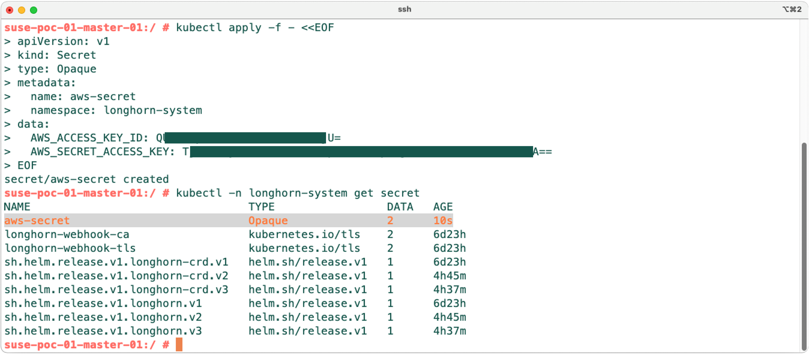

# SUSE Longhorn Configuration - Setting Up A Backup Target

**`SUSE Longhorn` Configuration Guide Series...**

---

<p align="center">
    
</p>

---

## About This Repo

This repo is created to provide the reader with a step-by-step guide for configuring the `SUSE Longhorn` Backup Target. 

---

## SUSE Longhorn Backup Target

`SUSE Longhorn` provides the capability to create backups to the created cloud-native volumes in a Kubernetes cluster where `SUSE Longhorn` is installed. To perform this action and make use of this built-in feature, a Backup Target must be set in `SUSE Longhorn`. Another feature built-in in `SUSE Longhorn` that depends on setting a Backup Target first is `SUSE Longhorn` DR Volumes. For more information regarding the `SUSE Longhorn` DR Volumes, please refer to this [link]( https://longhorn.io/docs/1.7.0/snapshots-and-backups/setup-disaster-recovery-volumes/)

In `SUSE Longhorn`, A backup target is an endpoint used to access a backup store in Longhorn. When the backup target is configured in the `SUSE Longhorn`, `SUSE Longhorn` can connect to the backup store and use it to store volume backups. A backup store is an NFS server, SMB/CIFS server, Azure Blob Storage server, or S3-compatible server that stores the backups of `SUSE Longhorn` volumes. The backup target can be set in `SUSE Longhorn` at the Settings > General > BackupTarget.

Based on `SUSE Longhorn` - utilizing an object store such as S3 is preferable because it generally offers better reliability. Another advantage is that you do not need to mount and unmount the target, which can complicate failover and upgrades. - [Reference link](https://longhorn.io/docs/1.7.0/snapshots-and-backups/backup-and-restore/set-backup-target/)

For more information about how the backup store works in Longhorn, please refer to this [link](https://longhorn.io/docs/1.7.0/concepts/#3-backups-and-secondary-storage)

If an AWS, GCP, Azure, or any cloud-based S3-compatible storage is not available and you need to perform testing or try this feature, `SUSE Longhorn` provides a way to setup a local S3 testing backup store using MinIO. For more information, please refer to this [link]( https://longhorn.io/docs/1.7.0/snapshots-and-backups/backup-and-restore/set-backup-target/#set-up-a-local-testing-backupstore)

For configuring all types of supported storage to be used as a `SUSE Longhorn` Backup Target, please refer to this [link](https://longhorn.io/docs/1.7.0/snapshots-and-backups/backup-and-restore/set-backup-target/)

> Please Note: In this guide we will be using AWS S3 Storage.

---

## Step-By-Step Guide - Setting Up A Backup Target In SUSE Longhorn

Before starting the configuration to setup a backup target on `SUSE Longhorn`, please ensure you have a supported storage available to be used. If you do not have one, you can refer to this [link](https://longhorn.io/docs/1.7.0/snapshots-and-backups/backup-and-restore/set-backup-target/#set-up-a-local-testing-backupstore) which will guide you deploying an S3 testing backup store using MinIO.

In this guide we are using an AWS S3 bucket, accessible using this link - s3://suse-rancher-poc-s3-bucket-01@eu-west-2/. For more information on how to configure the AWS S3 to be used with `SUSE Longhorn`, please refer to this [link](https://longhorn.io/docs/1.7.0/snapshots-and-backups/backup-and-restore/set-backup-target/#set-up-aws-s3-backupstore)

1. Create the AWS access key and secrete on your kubernetes cluster. 

For the `SUSE Longhorn` to be able to authenticate and access the AWS S3 bucket, a secret is required to be configured on the Kubernetes cluster where the `SUSE Longhorn` is installed holding the AWS account access key and the secret access key. Create the secret using the below command - Make sure you have created the secret in the proper kubernetes namespace:

```bash
kubectl apply -f - <<EOF
apiVersion: v1
kind: Secret
type: Opaque
metadata:
  name: aws-secret
  namespace: longhorn-system
data:
  AWS_ACCESS_KEY_ID: <aws-access-key>
  AWS_SECRET_ACCESS_KEY: <aws-secret-access-key>
EOF
```

<p align="center">
    
</p>


---

## References

- [SUSE Longhorn - Terminology](https://longhorn.io/docs/1.7.0/terminology/#backup-target)
- [SUSE Longhorn - Setting a Backup Target](https://longhorn.io/docs/1.7.0/snapshots-and-backups/backup-and-restore/set-backup-target/)
- [SUSE Longhorn - Setting Up a Local Testing Backup Store](https://longhorn.io/docs/1.7.0/snapshots-and-backups/backup-and-restore/set-backup-target/#set-up-a-local-testing-backupstore)

---

**Enjoy** :blush: