# SUSE Longhorn Configuration - Configuring Longhorn DR Volumes

**`SUSE Longhorn` Configuration Guide Series...**

---

    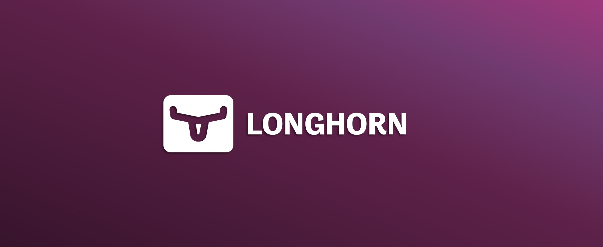

---

## About This Repo

This repo is created to provide the reader with a step-by-step guide for configuring the `SUSE Longhorn` Backup Target. 

---

## SUSE Longhorn Disaster Recovery Volumes

`SUSE Longhorn` provide the capability to perform disaster recovery for cloud-native applications running in one kubernetes cluster to another kubernetes cluster using a feature called Disaster Recovery Volumes. As a summary, this functionality is based on creating a backup (in the backup store based on the backup target you have configured) to the volumes attached to the cloud-native applications running in the main kubernetes cluster and then create a DR volume on the DR kubernetes cluster using the backup files you have created on the backup store. Both `SUSE Longhorn` deployed in the main and DR kubernetes cluster must be configured with the same backup target. for more information regarding `SUSE Longhorn` Backup Target, please refer to this [link](https://longhorn.io/docs/1.7.0/snapshots-and-backups/backup-and-restore/set-backup-target/). For a step-by-step guide on how to configure `SUSE Longhorn` Backup Target, please refer to this [link](/2-Configure/Longhorn/1-Setting-Up-A-Backup-Target/)

A disaster recovery (DR) volume is a special volume that is mainly intended to store data in a backup cluster in case the whole main cluster goes down. Disaster recovery volumes are used to increase the resiliency of Longhorn volumes. For more information regarding how DR volumes work, please refer to this [link](https://longhorn.io/docs/1.7.0/concepts/#33-disaster-recovery-volumes)

Each backup volume in the backup store maps to one original volume in the Kubernetes cluster. Likewise, each DR volume maps to a backup volume in the backup store. DR volumes can be created to accurately reflect backups of a Longhorn volume, but they cannot be used as a normal Longhorn volume until they are activated.

A DR volume can be created from a volume’s backup in the backup store. After the DR volume is created, Longhorn will monitor its original backup volume and incrementally restore from the latest backup. A backup volume is an object in the backup store that contains multiple backups of the same volume.

If the original volume in the main cluster goes down, the DR volume can be immediately activated in the backup cluster, so it can greatly reduce the time needed to restore the data from the backup store to the volume in the backup cluster.

When a DR volume is activated, Longhorn will check the last backup of the original volume. If that backup has not already been restored, the restoration will be started, and the activate action will fail. Users need to wait for the restoration to complete before retrying.

The Backup Target in the Longhorn settings cannot be updated if any DR volumes exist.

After a DR volume is activated, it becomes a normal Longhorn volume and it cannot be deactivated.

---

## Step-By-Step Guide - SUSE Longhorn Disaster Recovery Volumes

To configure the `SUSE Longhorn` and show case its capability in this step-by-step guide, the below is the current infrastructure and the flow of action we will be using:
- 2 Kubernetes clusters are already deployed and added a `SUSE Rancher` - (suse-poc-01 & suse-poc-02)
- A namespace ise created with the same name on both cluster (suse-wordpress-poc namespace)
- Longhorn is deployed on both cluster and is configured with the same Backup Target which is an AWS S3 Bucket
- We will deploy a wordpress application on the first kubernetes cluster from the `SUSE Rancher` Helm Chart App Market Place and use persistent volumes
- We will configure the wordpress website deployed
- We will take backups to the wordpress applications volumes
- We will create DR Volumes on the second kubernetes cluster
- After the Volumes are in sync, we will activate the DR volumes on the second kubernetes cluster and convert them into PersistentVolumes
- We will deploy a wordpress application on the second kubernetes cluster from the `SUSE Rancher` Helm Chart App Market Place and use the created persistent volumes from the DR volumes
- We will log in to the wordpress application deployed on the second kubernetes cluster and we should see that exact same changes we have made on the application deployed on the first kubernetes cluster.

Let Us Start........

1. Deploy wordpress application on the first kubernetes cluster using SUSE Rancher` Helm Chart App Market Place. In this step, we will configure the application to create persistent volumes and configure specific DB username and password to be able to use them when deploying the application on the secondary kubernetes cluster. The namespace used is suse-wordpress-poc

    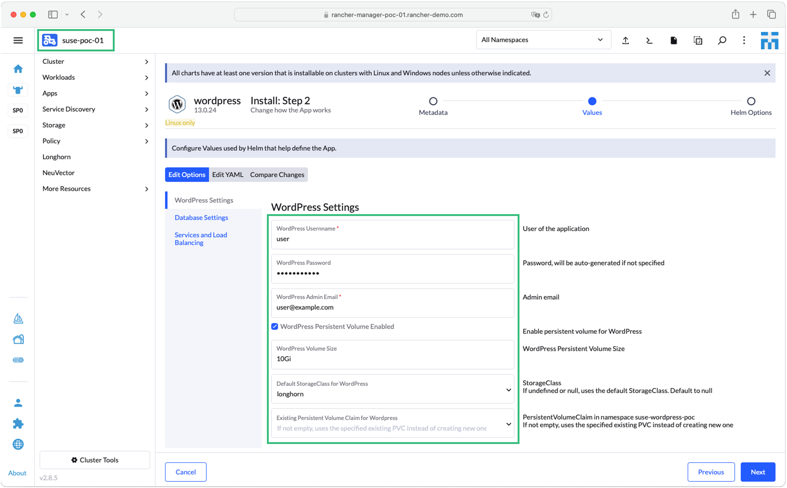

    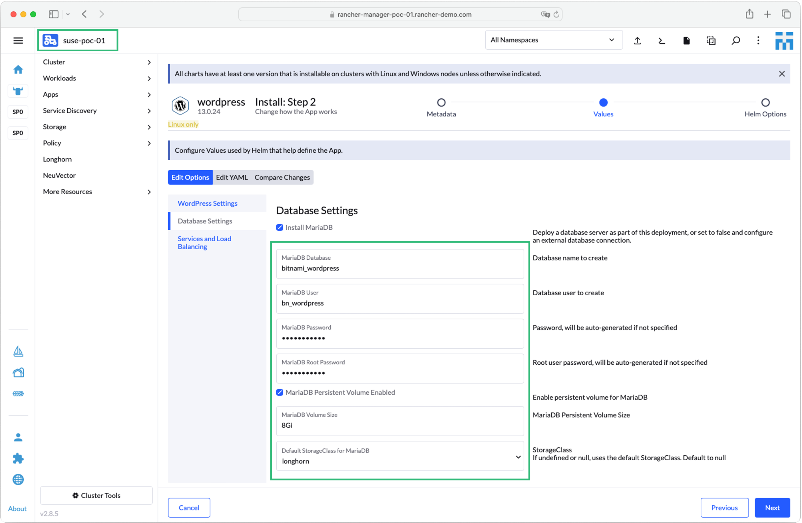

    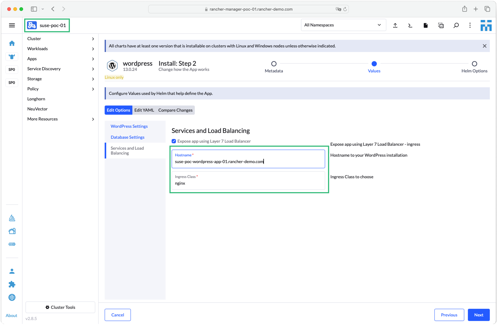

    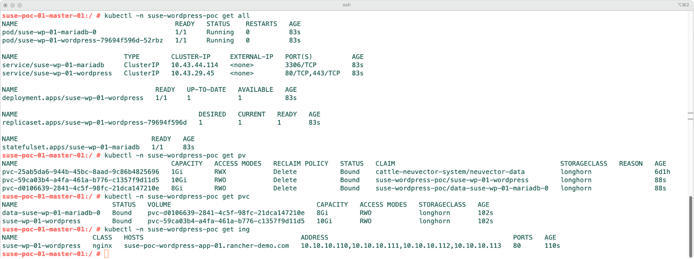

    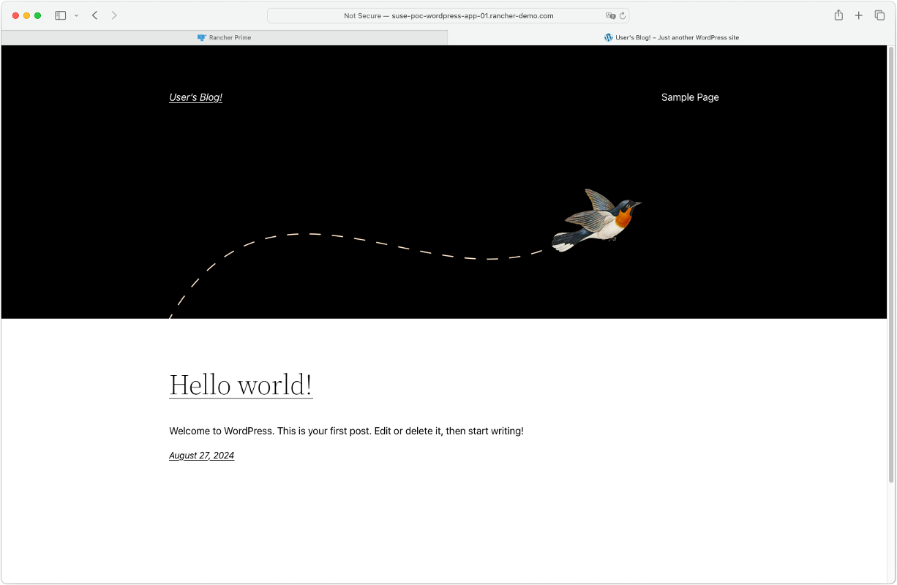

2. Now, change the configuration of the deployed wordpress application as you see fit, you can create a new post, change the page setup, or any other changes you would like to do. In this guide, i have just changed the page setup to just add the SUSE Logo and a couple of paragraphs.

    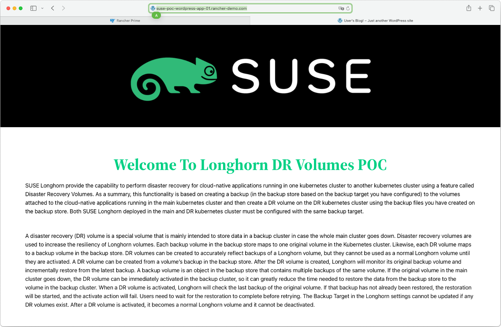

3. Login to `SUSE Longhorn` and then click on `Volume`, then click on the 2 volumes created by the wordpress application and click on `Create Backup`

    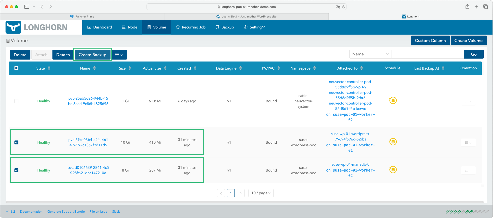

4. Check if the backups are created. Click on `Backup` and confirm that the 2 backups are listed.

    

5. Login to the `SUSE Longhorn` deployed in the second kubernetes cluster and click on the `Backup` tab. You should see all the backups created from the application deployed on the first kubernetes cluster. Select the 2 backups and click on `Create Disaster Recovery Volume`

    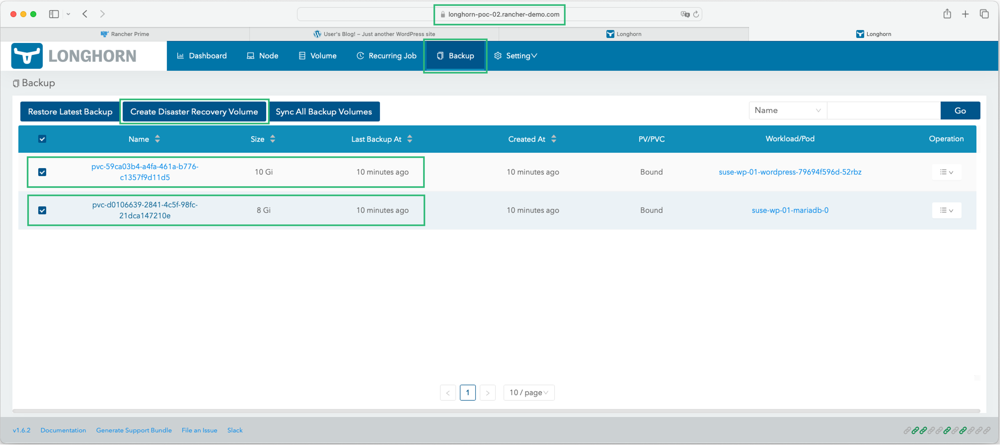

6. Click on the `Volume` tab, you should see the 2 volumes listed and not bounded with an indication that they are a DR volumes.

    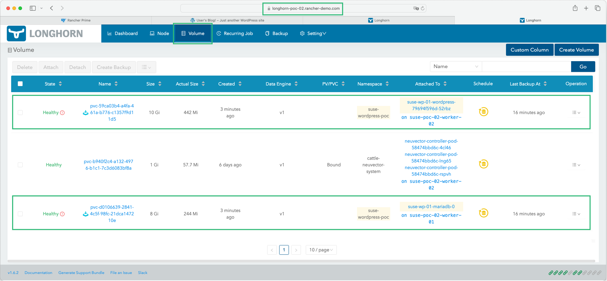

> At this point, you can perform any type of changes on the application deployed on the first kubernetes cluster and it should be synced as the volumes in the first kubernetes cluster is backed up and synced with the DR volumes created in the second kubernetes cluster. For the simplicity, we will skip this step and will go forward with the DR process. (We will not be deleting the application on the first kubernetes cluster, we will be installing another application on the secondary cluster and provide a different URL for it)

7. Now we need to Activate the DR Volumes to stop the syncing process and convert them to a normal kubernetes PersistentVolumes. On the `SUSE Longhorn` deployed on the second kubernetes cluster, click on the `Volume` tab, select the 2 DR volumes, then click on the action box and then chose `Activate Disaster Recovery Volume`. The volumes will go into a detach process and will then show as a normal volumes

    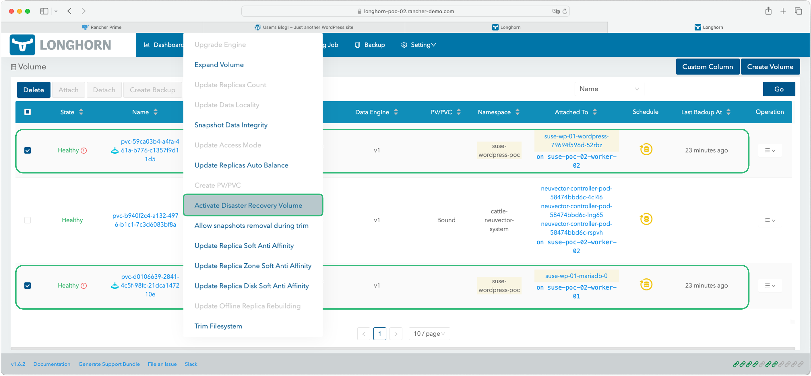

8. Once the volumes are detached, select the 2 DR volumes, then click on the action box and then chose `Create PV/PVC` to create actual kubernetes volumes using these DR Volumes. Provide the StorageClass name (in this case it should be longhorn) and the namespace (in this guide we are using the same namespace name - suse-wordpress-poc). Once this is completed, you should also see the volumes in kubernetes cluster.

    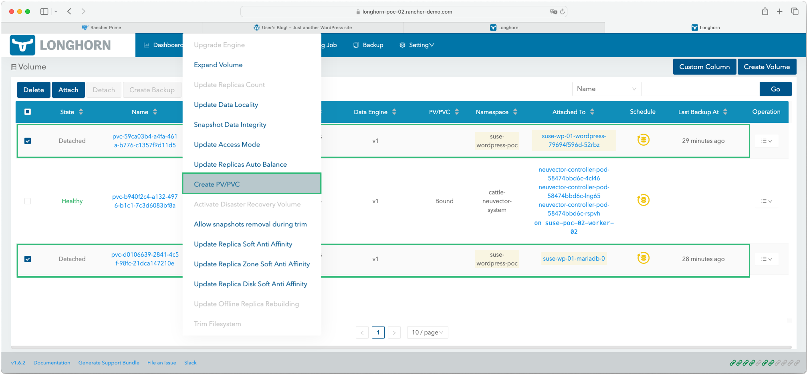

    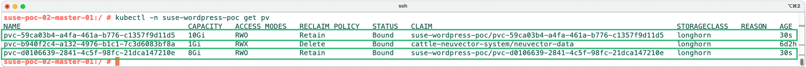

9. Deploy wordpress application on the second kubernetes cluster using SUSE Rancher` Helm Chart App Market Place. In this step, we will configure the application to use the existing persistent volumes and configure the DB username and password used when deploying the application on the first kubernetes cluster. The namespace used is suse-wordpress-poc

    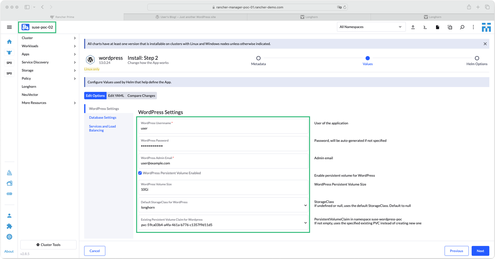

    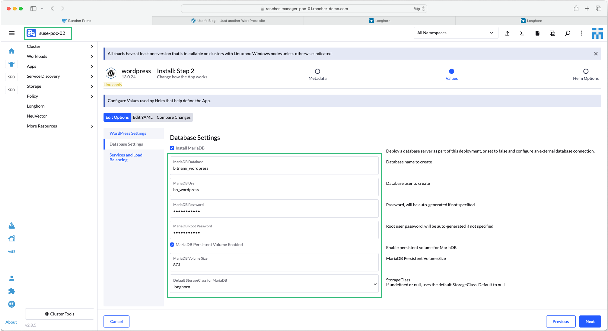

    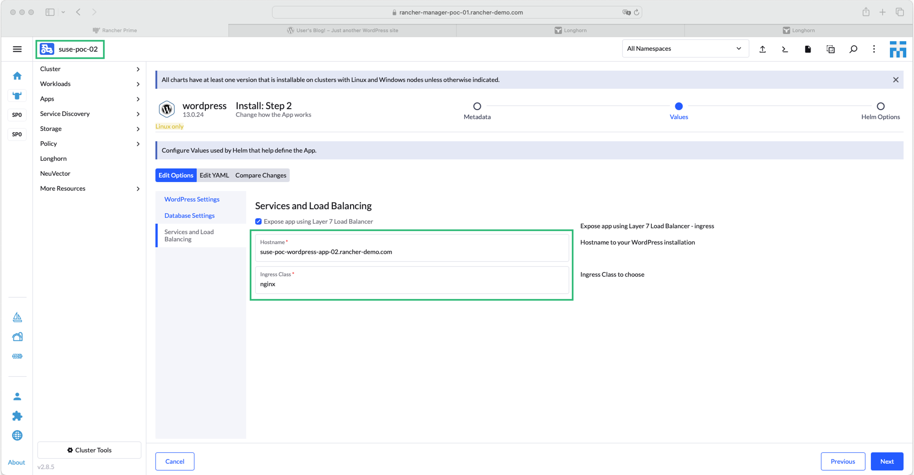

10. You should now access the wordpress application deployed on the second kubernetes cluster and see that same configuration you have done on the application deployed on the first kubernetes cluster.

    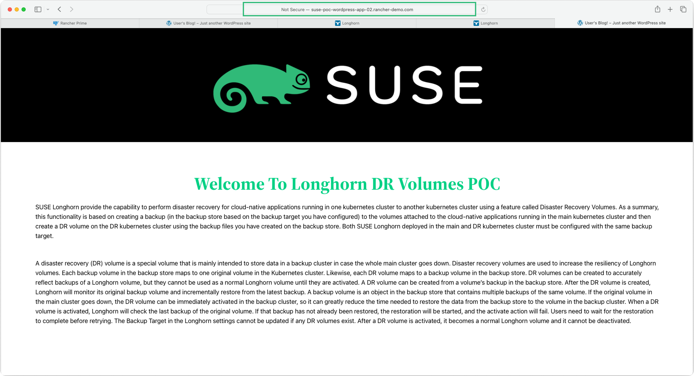

---

## References

- [SUSE Longhorn - Terminology](https://longhorn.io/docs/1.7.0/terminology/#disaster-recovery-volumes-dr-volume)
- [SUSE Longhorn - Disaster Recovery Volumes](https://longhorn.io/docs/1.7.0/snapshots-and-backups/setup-disaster-recovery-volumes/)
- [SUSE Longhorn - Architecture & Concepts - Disaster Recovery Volumes](https://longhorn.io/docs/1.7.0/concepts/#33-disaster-recovery-volumes)
- [SUSE Longhorn - Setting a Backup Target](https://longhorn.io/docs/1.7.0/snapshots-and-backups/backup-and-restore/set-backup-target/)

---

**Enjoy** :blush: