# SUSE NeuVector Configuration - Multi-Cluster Federation

This repo is created to provide the reader all the required information on configuring `SUSE NeuVector`. This repo provide a high-level explanation along with configure step-by-step guides and scripts.

---

<p align="center">
    
</p>

---

## About This Repo

This repo is designed and created to provide a documented step-by-step guide for configuring Multi-Cluster Federation for `SUSE NeuVector`. 

`SUSE NeuVector` is deployed per cluster (for each cluster `SUSE NeuVector` will be deployed in this cluster and will have it own management UI interface), however, for multi-cluster deployment, `SUSE NeuVector` provide the capability of federation to connect multiple `SUSE NeuVector` together and have a single pane of glass for managing these clusters together as well as the capability to create federated rules to be pushed on all (or some) clusters.

The NeuVector console can be used to manage large enterprise multi-cluster and multi-cloud deployments. One cluster should be selected as the Primary cluster, and other Remote clusters will then be able to join the Primary. Once connected, the Primary cluster can push Federated rules down to each remote cluster, which display as Federated rules in the consoles of each remote cluster. Scanned Federated registries will also sync the scan results with remote clusters. Only local users & Rancher users who have admin permission can promote a cluster to become the primary cluster. 

For NeuVector to be able to provide Federation services, there are 2 services that will be enabled and configured access to (which you need to perform and it is not done by default). The first service called `NeuVector Fed Master` and this works on the Primary cluster. The second service called `Nuevector Fed managed` and this works on the remote cluster(s). Before you configure the NeuVector for federation, you need to ensure that these services are running and there are access configuration to them (in normal situation, this access done by external LoadBalancer). So you need to first configure the kubernetes service for these services to allow external access to them.

For more information regarding `SUSE NeuVector` multi-cluster management & federation, please refer to this [link](https://open-docs.neuvector.com/navigation/multicluster/)

---

==================================================================

## Step-By-Step Guide - Importing Existing Cluster To SUSE Rancher

==================================================================

In this step-by-step guide we will be configuring NeuVector Multi-Cluster Federation. As explained in the above section, we need to configure NeuVector in a way to allow external access to the Fed Master and Fed managed services. In a normal situation, there will be an external load balancer integrated with the kubernetes cluster, so all what you need to do is to change the configuration of these services on the primary and remote cluster to use a load balancer service. However, in this guide we do not have an external load balancer so we will be using Ingress instead to allow access to these services. We also need to create secrets for the self-signed certificate to be added to the Ingress configuration for both the services.

1. Create secrete for the Fed Master services Ingress connection on the primary cluster (suse-poc-01 cluster will be our primary cluster). Log in to the master node (or a JumpBox with Kubectl access to the cluster) and configure a self-signed certificate and add it to a secrete in the NeuVector namespace.
```bash
mkdir tls-certs && cd tls-certs
# Generate a Private Key & CSR
openssl req -newkey rsa:2048 -nodes -keyout tls.key -out tls.csr
# Create Self-Signed Certificate
openssl x509 -req -sha256 -days 365 -in tls.csr -signkey tls.key -out tls.crt
# Store Certificate in Kubernetes Secret
kubectl -n cattle-neuvector-system create secret tls tls-ingress --cert=tls.crt --key=tls.key
```

<p align="center">
    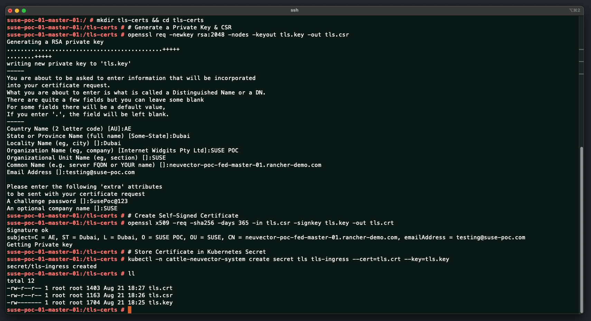
</p>

2. Create secrete for the Fed Managed services Ingress connection on the remote cluster (suse-poc-02 cluster will be our remote cluster). Log in to the master node (or a JumpBox with Kubectl access to the cluster) and configure a self-signed certificate and add it to a secrete in the NeuVector namespace.
```bash
mkdir tls-certs && cd tls-certs
# Generate a Private Key & CSR
openssl req -newkey rsa:2048 -nodes -keyout tls.key -out tls.csr
# Create Self-Signed Certificate
openssl x509 -req -sha256 -days 365 -in tls.csr -signkey tls.key -out tls.crt
# Store Certificate in Kubernetes Secret
kubectl -n cattle-neuvector-system create secret tls tls-ingress --cert=tls.crt --key=tls.key
```

<p align="center">
    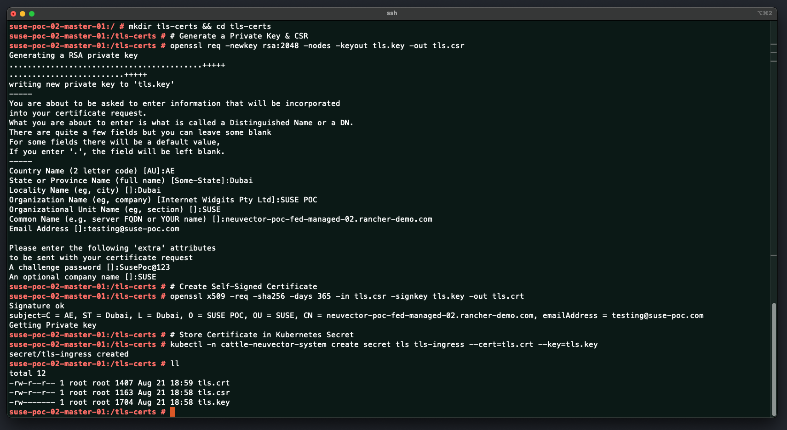
</p>

3. [We now need to Update NeuVector Configuration on primary cluster to configure external connection using Ingress for the Fed Master service] Log In to Rancher manager, click on the primary cluster, click on `Apps`, then `charts`, filter to NeuVector, then click on the `NeuVector` Chart

<p align="center">
    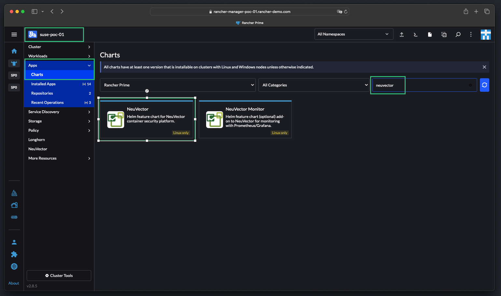
</p>

4. Click on Update

<p align="center">
    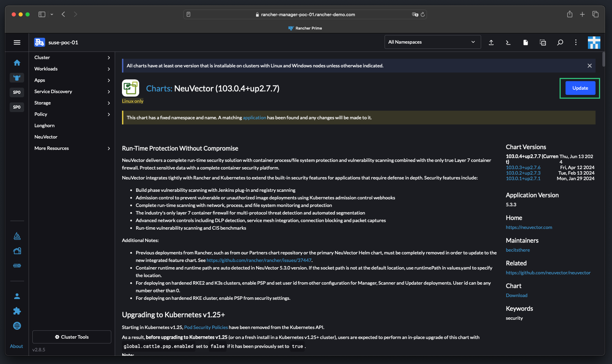
</p>

5. check the `Customize Helm options before install` box option and then click `Next`

<p align="center">
    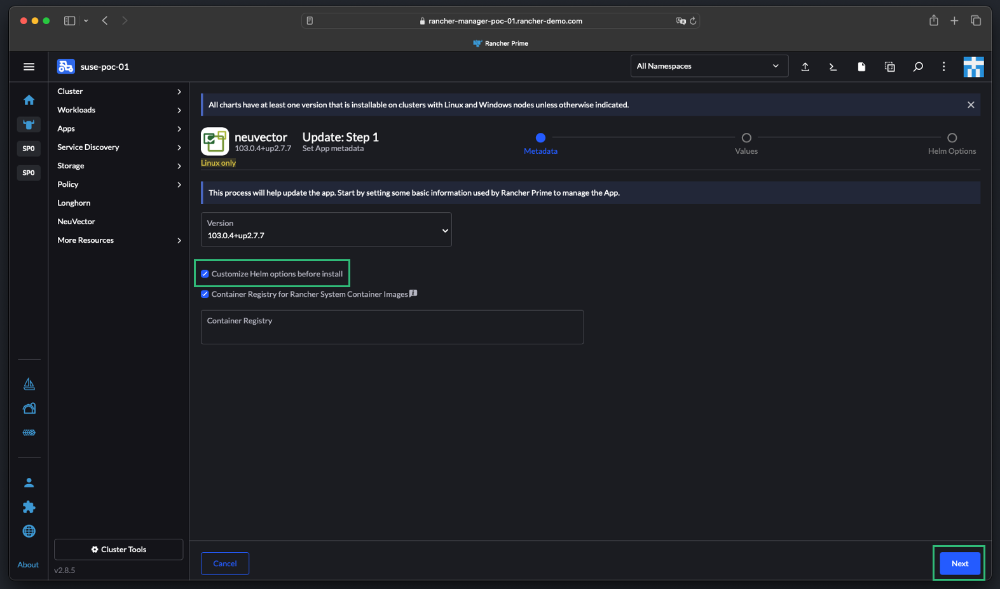
</p>

6. Click on `Ingress Configuration`, then check the `Controller Federation Master Service Ingress Status` Option, then provide the FQDN of this service along with the secret that we have just created on the primary cluster

<p align="center">
    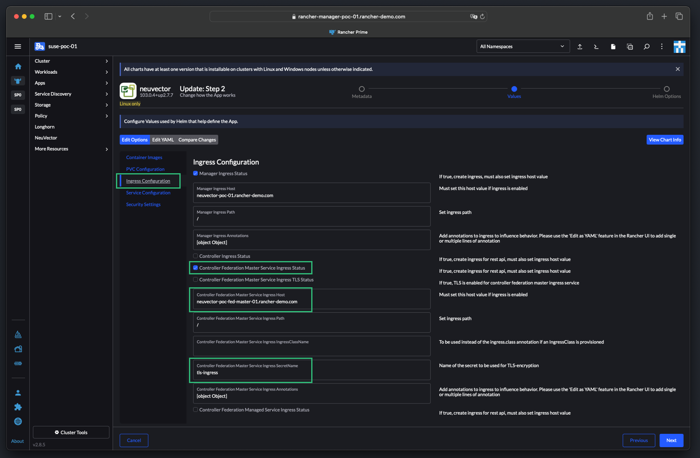
</p>

7. Click on `Service Configuration` then choose the Service Type for the `Fed Master Service Type`. You can chose NodePort or ClusterIP. In this guide we are using Node Port

<p align="center">
    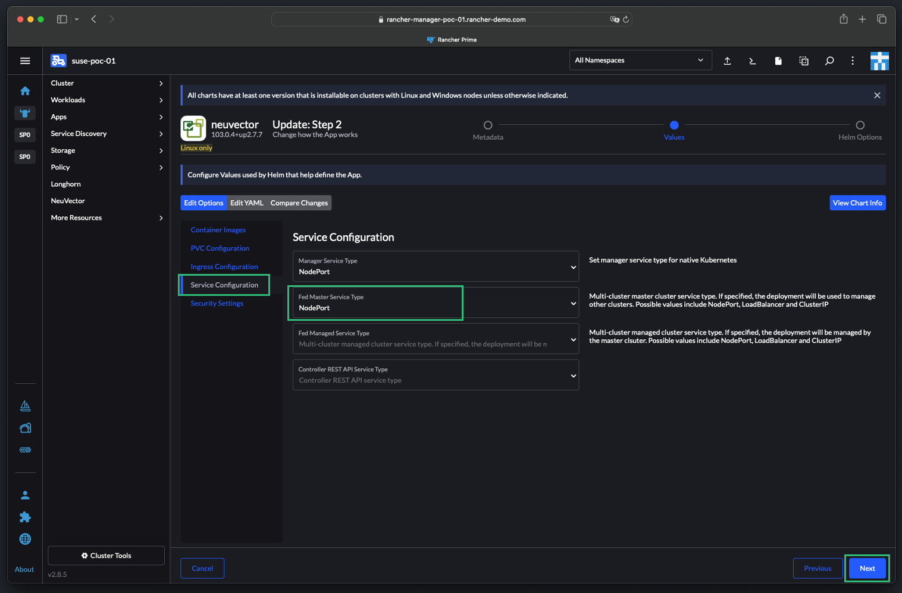
</p>

8. Once done, click Next and Install

<p align="center">
    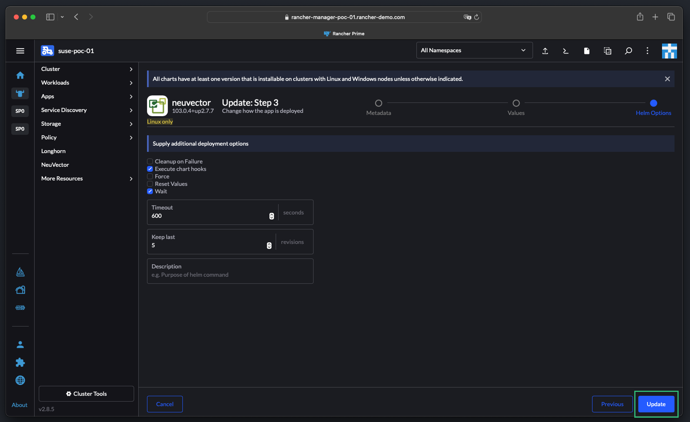
</p>

9. [We now need to Update NeuVector Configuration on primary cluster to configure external connection using Ingress for the Fed Master service] Login to the Rancher Manager, click on the remote cluster and repeat steps 3 to 8 on the remote cluster. Please Note in step 6, check the  `Controller Federation Managed Service Ingress Status` Option not the Master, then provide the required info for the managed service. Please Note in step 7, choose the Service Type for the `Fed Managed Service Type` not the Master.

Once these are done, you can check on both clusters if the Services and the Ingress are created properly
```bash
kubectl -n cattle-neuvector-system get svc
kubectl -n cattle-neuvector-system get ing
```

<p align="center">
    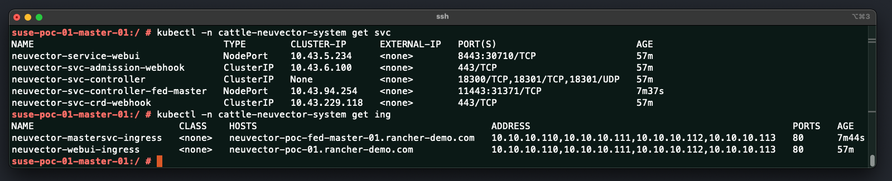
</p>

10. Log On to the NeuVector of the primary cluster then click on the user on the top right corner then click on `Multiple Cluster`

<p align="center">
    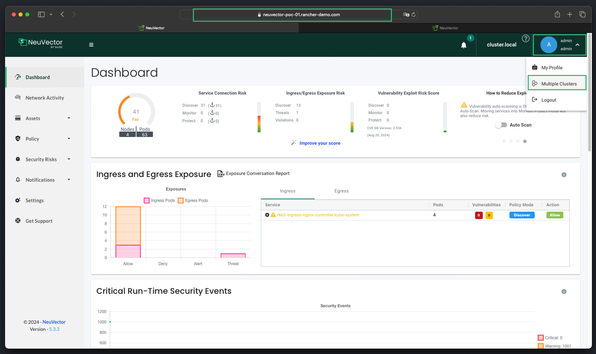
</p>

11. Click on Promote 

<p align="center">
    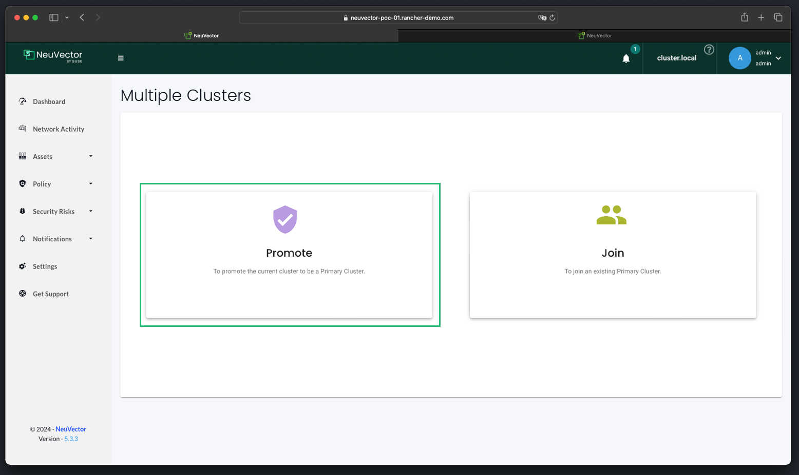
</p>

12. Add a name for the cluster in the `The Current Cluster Name` box, add the FQDN of the Fed Master Ingress in the `Primary Cluster Server` box, and change the default port (11443) to port 443 in the `Primary Cluster Port` box, then click `Submit`. We are changing the default port as we are using an ingress in this guide. If you are using a Load Balancer, you should leave it as the default port.

<p align="center">
    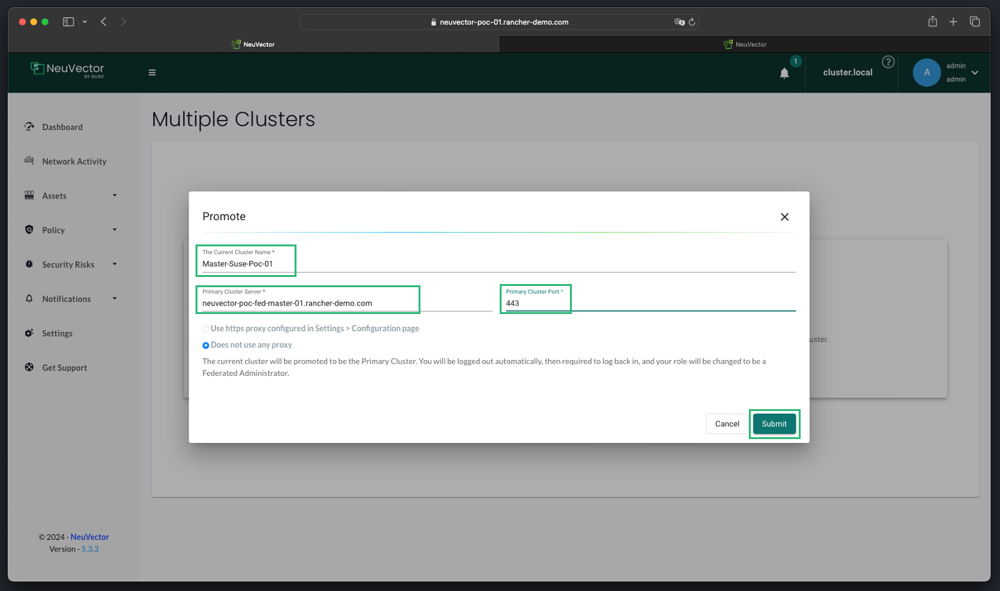
</p>

13. Once done, you will be logged out of the NeuVector, if you log In again and go to the user on the top right corner then click on `Multiple Cluster`, you will find the first cluster listed in the list of Federation Cluster Management. Click on the key Icon where it says generate token.

<p align="center">
    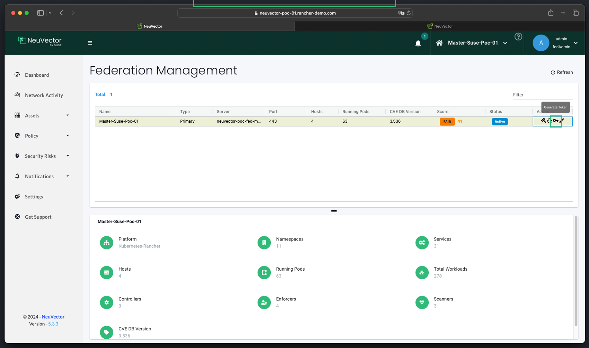
</p>

14. A Pop-Out window will appear with a token, save this token to be used when adding the remote cluster.

<p align="center">
    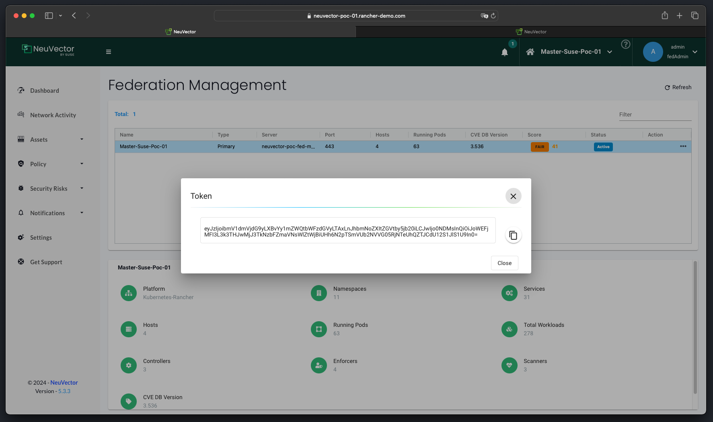
</p>

15. Now log in to the NeuVector of the remote cluster, then click on the user on the top right corner then click on `Multiple Cluster`. Now click on `Join`

<p align="center">
    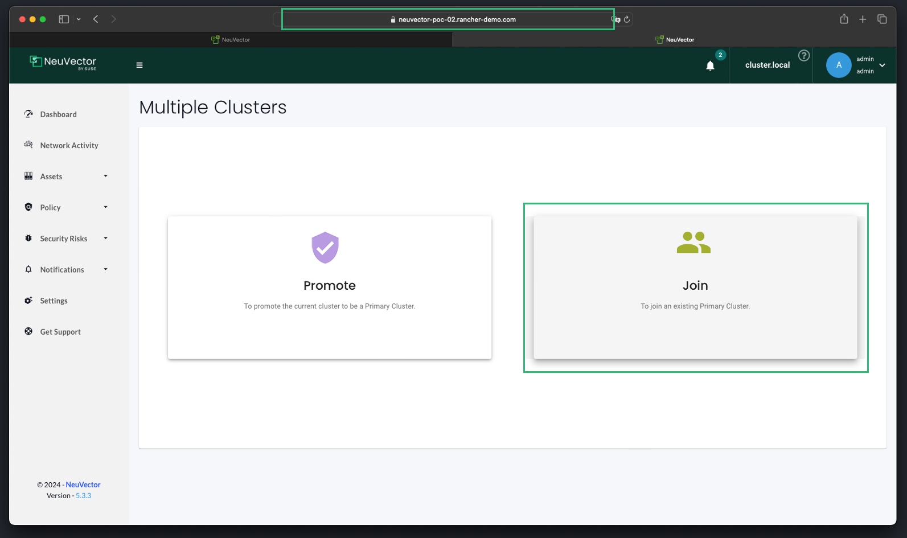
</p>

16. Add a name for the cluster in the `The Current Cluster Name` box, add past the primary cluster token in the `Token` box, automatically the `Primary Cluster Server` and the `Primary Cluster Port` will be populated (if not then add them manually). Then add the Ingress FQDN of the Fed managed Service in the `Controller Server` box, and change the default port (10443) to port 443 in the `Port` box, then click `Submit`. We are changing the default port as we are using an ingress in this guide. If you are using a Load Balancer, you should leave it as the default port.

<p align="center">
    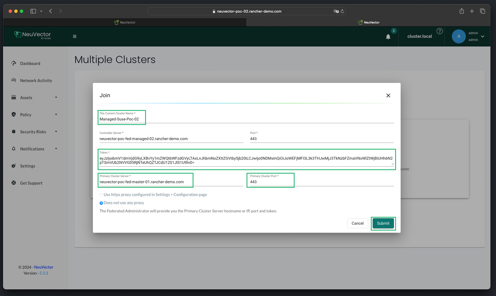
</p>

17. We will be automatically redirected to the Federation Management page and you will find the primary cluster listed and the remote cluster added with the status of joined.

<p align="center">
    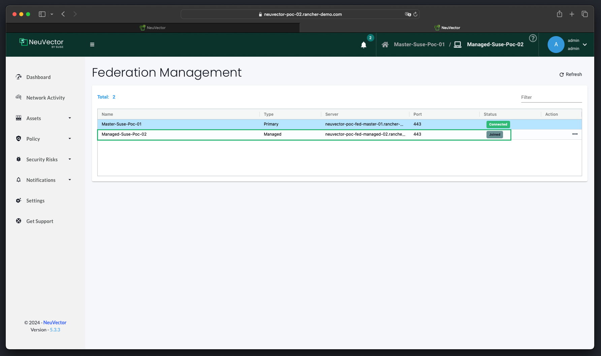
</p>

18. If you logged back to the primary cluster and then click on the user on the top right corner then click on `Multiple Cluster` to be directed to the Federation Management, you will find the remote site listed with a status of Synced. Also, now you can switch between cluster by clicking on the cluster name on the top right of the UI.

<p align="center">
    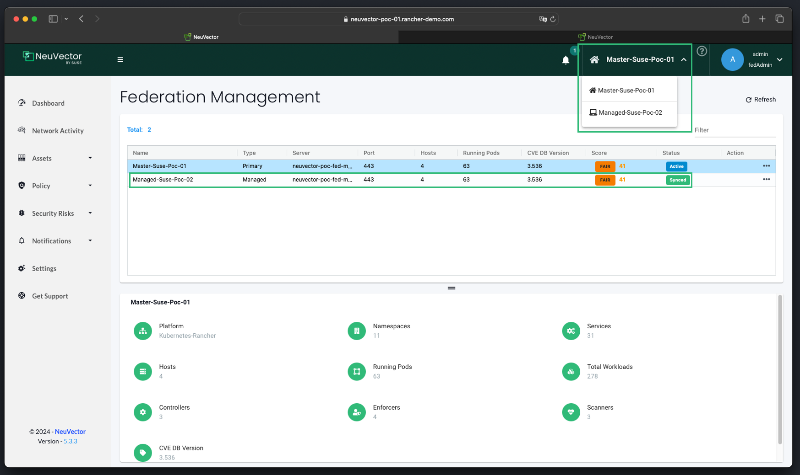
</p>

---

## References

- [SUSE NeuVector Enterprise Multi-Cluster Management](https://open-docs.neuvector.com/navigation/multicluster/)

---

**Enjoy** :blush: