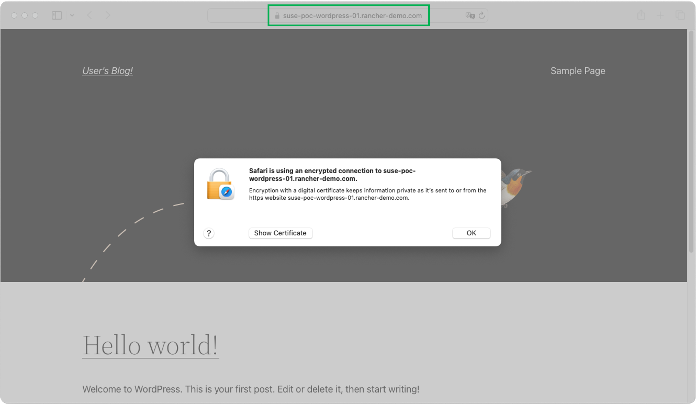
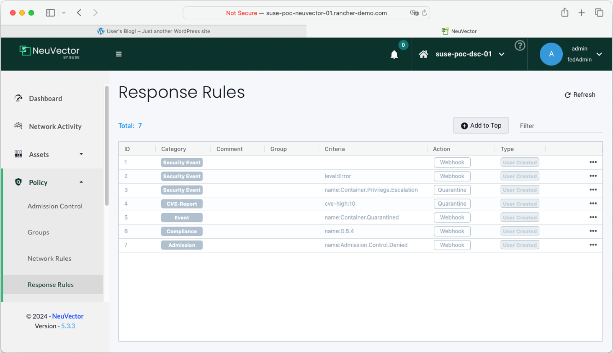
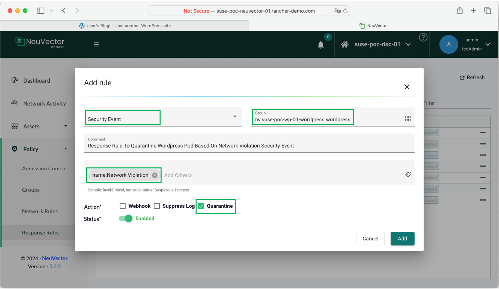

# SUSE NeuVector Configuration - Response Rules

This repo is created to provide the reader all the required information on configuring `SUSE NeuVector`. This repo provide a high-level explanation along with configure step-by-step guides and scripts.

---

    

---

## About This Repo

This repo is designed and created to provide a documented step-by-step guide for configuring Response Rules for `SUSE NeuVector`. 

`SUSE NeuVector` supports a feature called `Response Rules`, Response Rules provide a flexible, customizable rule engine to automate responses to important security events. This feature will trigger an automated response action based on a triggering event. Triggering events can include Security Events (such as network violation), Vulnerability Scan results, CIS Benchmarks, Admission Control events and general Events. 

The automated Response Actions includes:
- Quarantine – container is quarantined. Note that Quarantine means that all network traffic is blocked. The container will remain and continue to run - just without any network connections. Kubernetes will not start up a container to replace a quarantined container, as the api-server is still able to reach the container.
- Webhook - a webhook log generated
- suppress-log – log is suppressed - both syslog and webhook log

Actions from multiple rules will be applied if an event matches multiple rules. Each rule can have multiple actions and multiple match criteria. All actions defined will be applied to containers when events match the response rule criteria. In the case there is a match for Host (not container) events, currently the actions webhook and suppress log are supported.

For a complete list of categorized criteria that can be configured for Response Rules, please refer to this [link](https://open-docs.neuvector.com/policy/responserules#complete-list-of-categoried-criteria-that-can-be-configured-for-response-rules)

---

=====================================================

## Step-By-Step Guide - SUSE NeuVector Response Rules

=====================================================

In this step-by-step guide we will be configuring NeuVector Response Rules and test it. The testing will depend on creating a Response Rule to be triggered based on Network Violation Security Event with an action to quarantine the related container. A wordpress is already deployed in the cluster, we will create a custom network policy rule to deny HTTPS traffic to the wordpress application Pod. Once the rule is configured and applied, we will then open an HTTPS session to the wordpress application to trigger the network violation security event and check the Response Rule have successfully quarantined the wordpress Pod

1. Access the Wordpress application before creating the custom network policy to deny HTTP traffic for testing

    

2. Login to `SUSE NeuVector`, click on Policy > Response Rules > Then click on `Add to Top`

    

3. Provide the below configuration in the Response Rule Window and then click `Add`
  - Category: Security Event
  - Group: < Chose the Group/Pod To Apply The Response Rule On > - In this example we are using the wordpress pod 
  - Comment: Provide the comment that you see fit
  - Criteria: name:Network.Violation
  - Action: check the Quarantine Box
  - Status: Enabled

    

    

4. Create a custom network policy to deny HTTPS traffic to the Pod. click on Policy > Network Rules > Then click on `Add to Top` and provide the proper configuration to create the required rule. Once done click on Add and then Save. (PS: Make sure that the Group/Pod is in Protect mode)

    

5. Open a new session to the Wordpress application using HTTPS. This session should not work (due to the configured policy) and a Security Event of type Network Violation Should have been created in NeuVector.

    

    

6. Now confirm if the POD got quarantined. Go to Network Activity and filter with the namespace, You will find that the Pod got quarantined.

    

---

## References

- [SUSE NeuVector Response Rules](https://open-docs.neuvector.com/policy/responserules)

---

**Enjoy** :blush: