# SUSE NeuVector Configuration - Response Rules

This repo is created to provide the reader all the required information on configuring `SUSE NeuVector`. This repo provide a high-level explanation along with configure step-by-step guides and scripts.

---

<p align="center">
    
</p>

---

## About This Repo

This repo is designed and created to provide a documented step-by-step guide for configuring Response Rules for `SUSE NeuVector`. 

`SUSE NeuVector` supports a feature called `Response Rules`, Response Rules provide a flexible, customizable rule engine to automate responses to important security events. This feature will trigger an automated response action based on a triggering event. Triggering events can include Security Events (such as network violation), Vulnerability Scan results, CIS Benchmarks, Admission Control events and general Events. 

The automated Response Actions includes:
- Quarantine – container is quarantined. Note that Quarantine means that all network traffic is blocked. The container will remain and continue to run - just without any network connections. Kubernetes will not start up a container to replace a quarantined container, as the api-server is still able to reach the container.
- Webhook - a webhook log generated
- suppress-log – log is suppressed - both syslog and webhook log

Actions from multiple rules will be applied if an event matches multiple rules. Each rule can have multiple actions and multiple match criteria. All actions defined will be applied to containers when events match the response rule criteria. In the case there is a match for Host (not container) events, currently the actions webhook and suppress log are supported.

For a complete list of categorized criteria that can be configured for Response Rules, please refer to this [link](https://open-docs.neuvector.com/policy/responserules#complete-list-of-categoried-criteria-that-can-be-configured-for-response-rules)

---

=====================================================

## Step-By-Step Guide - SUSE NeuVector Response Rules

=====================================================

In this step-by-step guide we will be configuring NeuVector Response Rules and test it. In our testing, we will deploy an nginx pod to be used as the source of our tests. We will be doing 2 tests:
  - [Process Violation Response Rule] - The first test will be testing a response rule to quarantine a Pod when it uses a process that is not allowed.
  - [Network Violation Response Rule] - The second test will be testing a response rule to quarantine a Pod when it try to access an external website using HTTPS which is not permitted.

| Deploy Nginx POD & Ingress (Optional) |

1. SSH to the master node of the cluster and copy and past the 2 files in the [YAML-Files](/2-Configure/NeuVector/2-Response-Rules/YAML-Files/) Directory
```bash
# Create a directory and change to it
mkdir nv-response-rule && cd nv-response-rule
# Create a file and past the content of the nginx-pod.yaml into it
vi nginx-pod.yaml
# Create a file and past the content of the ingress.yaml into it (This is optional - you can change the service into nodePort and use it)
vi ingress.yaml
```

2. Create the Namespace and the resources from the files
```bash
kubectl create ns nv-response-rule-demo
kubectl apply -f nginx-pod.yaml
kubectl apply -f ingress.yaml
```

<p align="center">
    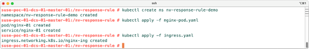
</p>

<p align="center">
    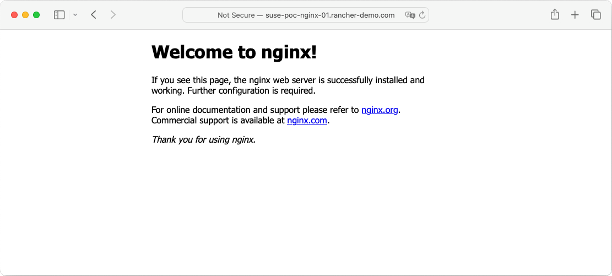
</p>

| Process Violation Response Rule Testing |

3. Create a Response Rule. Login to `SUSE NeuVector`, click on Policy > Response Rules > Then click on `Add to Top`

<p align="center">
    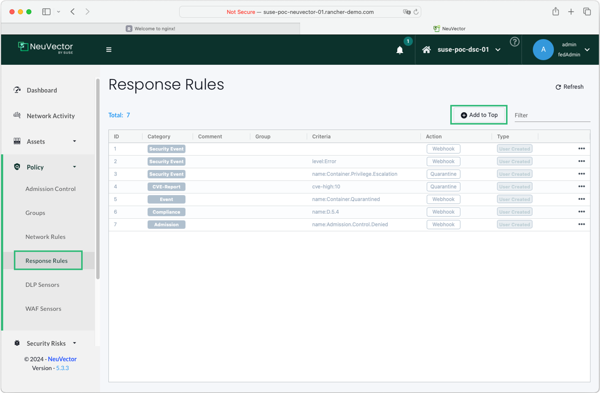
</p>

4. Provide the below configuration in the Response Rule Window and then click `Add`
  - Category: Security Event
  - Group: < Chose the Group/Pod To Apply The Response Rule On > - In this example we are using the nginx pod in the nv-response-rule-demo namespace
  - Comment: Provide the comment that you see fit
  - Criteria: name:Process.Profile.Violation
  - Action: check the Quarantine Box
  - Status: Enabled

<p align="center">
    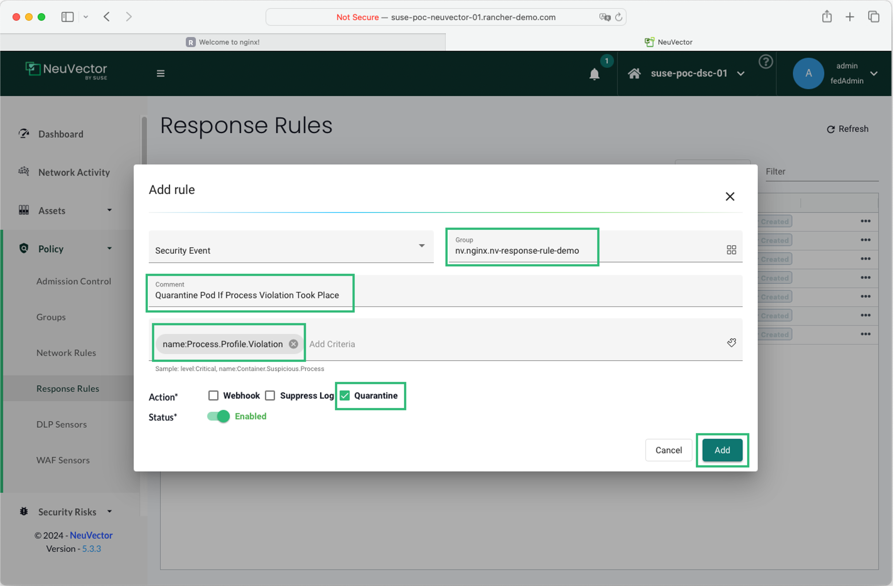
</p>

5. Go to Groups and then filter for the Pod and then click on Response Rules. You should see the rule we created above. Also check the Process list Allowed, you will not see Curl in it.

<p align="center">
    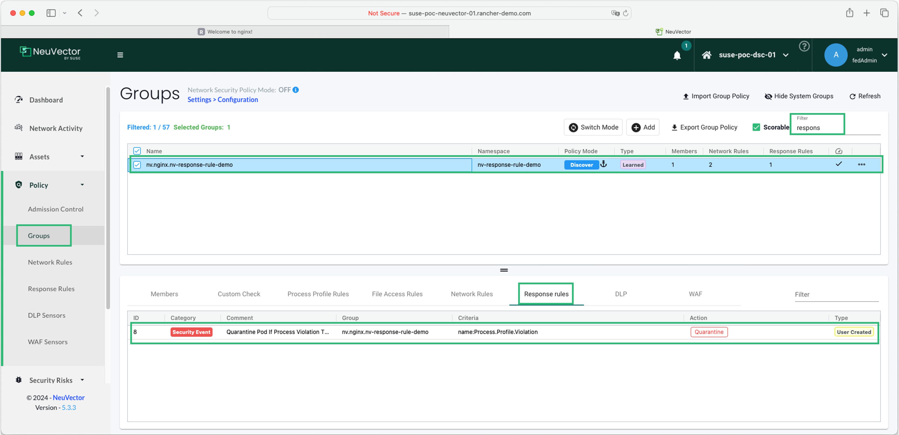
</p>

<p align="center">
    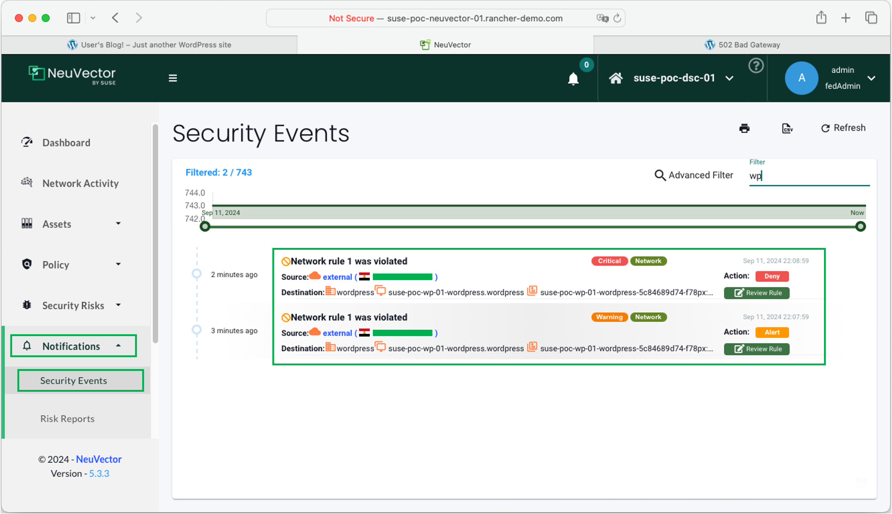
</p>

6. Change the NeuVector Protection Mode to Protect for the nginx pod. Click on switch mode and then chose protect.

<p align="center">
    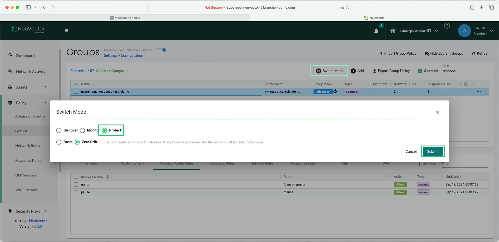
</p>

7. Login to the Master Node of the cluster and execute a curl command on the POD to curl google.com - You should see Operation Not Permitted Error.
```bash
kubectl -n nv-response-rule-demo exec nginx-01 -- curl -vk http://google.com
```

<p align="center">
    
</p>

8. In NeuVector, In the Groups Page, Click on Member, You should see the containers as quarantined. Also, Click on Network Activity and filter with the namespace, you should see the Pod as Quarantined. If you check the Security Events, you will see a process violation which triggered the Response Rule to Quarantine.

<p align="center">
    
</p>

<p align="center">
    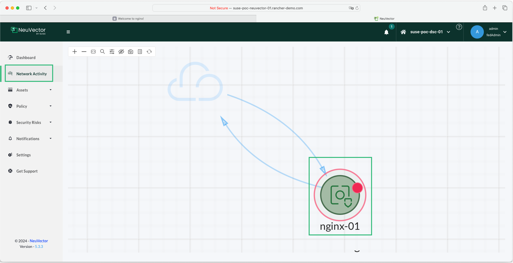
</p>

<p align="center">
    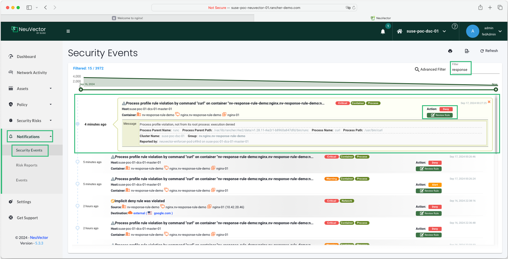
</p>

9. Un-quarantine the POD, Go to Network Activity and filter with the namespace, right-click on the POD and click on Un-quarantine

<p align="center">
    
</p>

| Network Violation Response Rule Testing |

10. Add Curl to the allowed process in the nginx POD. Login to NeuVector, click on Policy > Groups, Filter with the POD Name, click on Process Profile, click Actions, then click on Add Rule. Provide the below information then click on Deploy. You should then see Curl added as an allowed process.

<p align="center">
    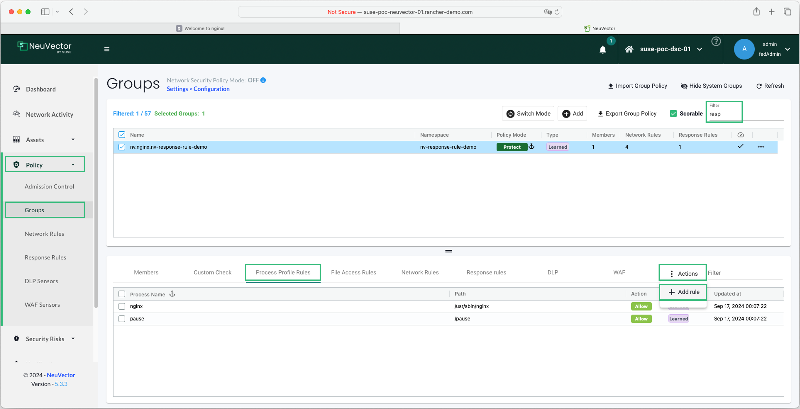
</p>

<p align="center">
    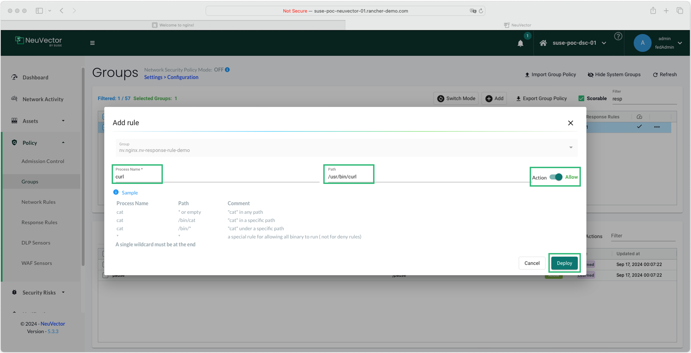
</p>

<p align="center">
    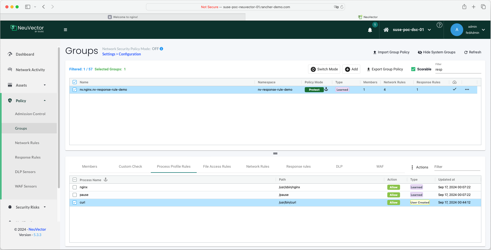
</p>

11. Click on Network Rules Tab, you should not see SSL in the allowed list (if for any reason you see it, just deleted it).

<p align="center">
    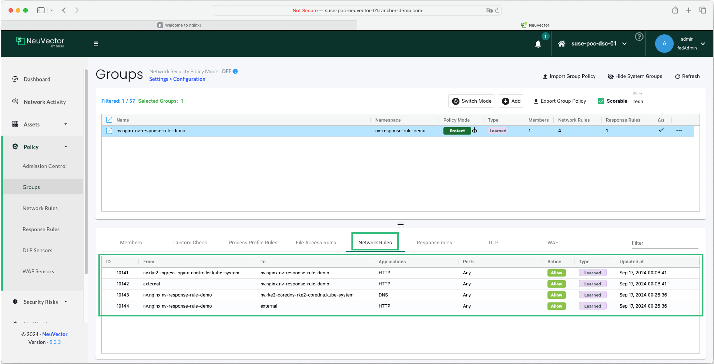
</p>

12. Create a Response Rule. Click on Policy > Response Rules > Then click on `Add to Top`. Provide the below configuration in the Response Rule Window and then click `Add`
  - Category: Security Event
  - Group: < Chose the Group/Pod To Apply The Response Rule On > - In this example we are using the nginx pod in the nv-response-rule-demo namespace
  - Comment: Provide the comment that you see fit
  - Criteria: name:Network.Violation
  - Action: check the Quarantine Box
  - Status: Enabled

<p align="center">
    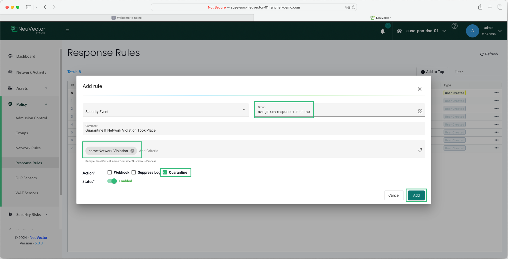
</p>

13. Repeat the same curl command on the POD but this time make sure to use HTTPS and not HTTP. Login to the Master Node of the cluster and execute a curl command on the POD to curl google.com - You should see the connection is not being established as it is blocked by NeuVector.
```bash
kubectl -n nv-response-rule-demo exec nginx-01 -- curl -vk https://google.com
```

14. In NeuVector, In the Groups Page, Click on Member, You should see the containers as quarantined. Also, Click on Network Activity and filter with the namespace, you should see the Pod as Quarantined. If you check the Security Events, you will see a process violation which triggered the Response Rule to Quarantine.

<p align="center">
    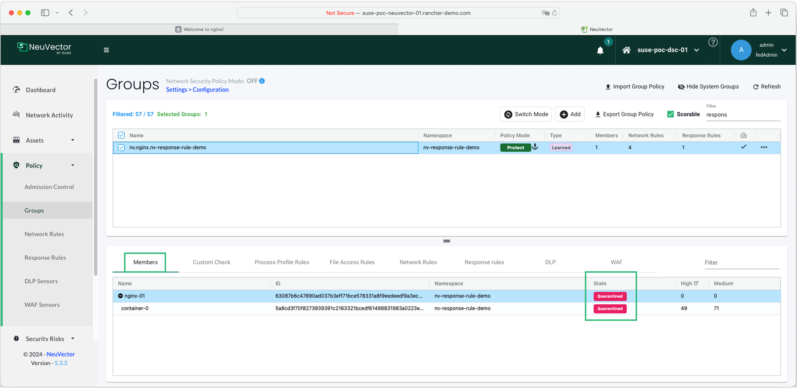
</p>

<p align="center">
    
</p>

<p align="center">
    
</p>


---

## References

- [SUSE NeuVector Response Rules](https://open-docs.neuvector.com/policy/responserules)

---

**Enjoy** :blush: