# SUSE NeuVector Configuration - WAF

This repo is created to provide the reader all the required information on configuring `SUSE NeuVector`. This repo provide a high-level explanation along with configure step-by-step guides and scripts.

---

<p align="center">
    
</p>

---

## About This Repo

This repo is designed and created to provide a documented step-by-step guide for configuring WAF - Web Application Firewall - for `SUSE NeuVector`. 

`SUSE NeuVector` supports a feature called `WAF`, WAF uses the Deep Packet Inspection (DPI) of `SUSE NeuVector` to inspect the network payloads of connections for sensitive data violations. `SUSE NeuVector` uses a regular expression (regex) based engine to perform packet filtering functions. With the use of DPI along with the regex, `SUSE NeuVector` WAF can then inspect the payload of the packet and compare it to the defined regex, if there is a match, WAF will block this traffic. WAF filtering is applied to inbound and outbound connections except for internal traffic where only inbound filtering is applied.

WAF sensors represent inspection of network traffic to/from a pod/container. These sensors can be applied to any applicable group, even custom groups (e.g. namespace groups). Incoming traffic to ALL containers within the group will be inspected for WAF rule detection. In addition, any outbound (egress) connections external to the cluster will be inspected.

This means that, while this feature is named WAF, it is useful and applicable to any network traffic, not only web application traffic, and therefore provides broader protections than simple WAFs. For example, API security can be enforced on outbound connections to an external api service, allowing only GET requests and blocking POSTs.

Extreme care should be taken when applying sensors to container traffic, as the filtering function incurs additional system overhead and can impact performance of the host.

The configuration of WAF sensors is simple. Create a sensor Name and any comment, then select the sensor to Add or Edit the rules for that sensor. Key fields include:
- Have/Not Have: Determines if the match requires the pattern to be found (Have) in order to take the action (e.g. Deny), or only if the pattern does not exist (Not Have) should the action be taken. It is recommended that the "Not Have" operator be combined in the rule with a pattern using the "Have" operator because a single pattern with "Not Have" operator will not be effective. (Multiple patterns are supported - up to 16 pattern)
- Pattern: This is the regular expression used to determine a match. You can test your regex against sample data to ensure correct Have/Not Have results.
- Context: Where to look for the pattern match. Choose packet for the broadest inspection of the entire network connection, or narrow the inspection to the URL, header, or body only.

<p align="center">
    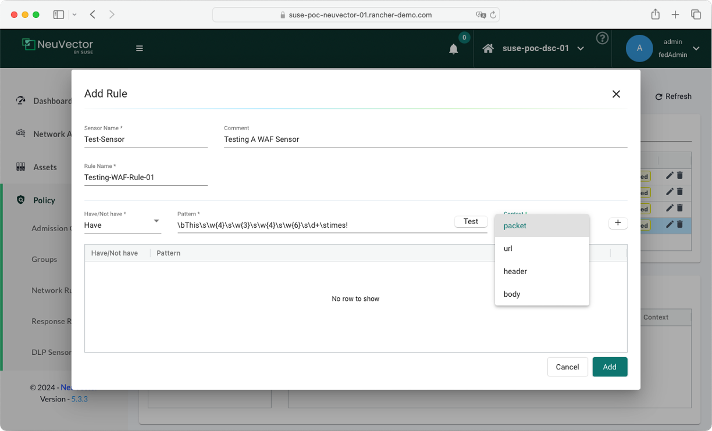
</p>

To activate a WAF sensor, login to `SUSE NeuVector` and then go to Policy -> Groups to select the group desired. Enable WAF for the Group and add the sensor(s). It is recommended that WAF sensors be applied only to Groups where incoming (e.g. ingress) connections are expected, unless the sensor(s) apply to specific internal applications (expecting east-west traffic).

WAF Behavior Summary:
- Cluster ingress and egress traffic is scanned for patterns if the workload is allowed to make ingress/egress connections.
- Multiple patterns per WAF rule (max 16 patterns are allowed per rule).
- Multiple alerts are generated for a single packet if it matches multiple rules.
- For performance reasons, only the first 16 rules are alerted and matched even if the packet matches more than 16 rules.
- Alerts are aggregated and reported together if same rule matches and alerts multiple times within 2 seconds.
- PCRE is used for pattern matching.
- Hyper scan library is used for efficient, scalable and high-performance pattern matching.

WAF Actions in Discover, Monitor, Protect Modes:
When adding sensors to groups, the WAF action can be set to Alert or Deny, with the following behavior if there is a match:
- Discover mode. The action will always be to alert, regardless of the setting Alert/Deny.
- Monitor mode. The action will always be to alert, regardless of the setting Alert/Deny.
- Protect mode. The action will be to alert if set to Alert, or block if set to Deny.

---

==========================================

## Step-By-Step Guide - SUSE NeuVector WAF

==========================================

In this step-by-step guide we will be configuring NeuVector WAF and test it. OUr test will be very simple and easy. We will be using an application used by NeuVector for testing. This application is a combination of Nginx, NodeJs, and Redis. One of the things that this application do is whenever you open a session to the application, the application will count the number of session and give you a message of `This page has been viewed [x] times`. We will deploy this application and create a WAF rule with a sensor that looks for this pattern in the body. If the WAF finds this pattern, it will then block the traffic. So before applying the WAF rule, if we accessed the application using a web browser, and continue to refresh, we will get responses. Once the WAF rule is applied, the reply from the application to the web browser will be blocked as the WAF sensor will match the pattern of `This page has been viewed [x] times` and will then block the reply. Thus once the WAF rule is applied we will be able to refresh the web browser anymore.

1. Deploy the application. Create the require namespace and then use the files available in the [YAML File Directory](/2-Configure/NeuVector/3-WAF-Rules/YAML-Files/) to deploy the application

```bash
# Create a directory 
mkdir nv-waf-demo && cd nv-waf-demo
# Copy and past the content of the nginx-pod.yaml file in the YAML-File directory
vi nginx-pod.yaml
# Copy and past the content of the node-pod.yaml file in the YAML-File directory
vi node-pod.yaml
# Copy and past the content of the redis-pod.yaml file in the YAML-File directory
vi redis-pod.yaml
# Optional create an ingress Yaml file
vi ingress.yaml
# Create namespace
kubectl create namespace nv-waf-demo
# Create the nginx 
kubectl apply -f nginx-pod.yaml
# Create the Nodejs
kubectl apply -f node-pod.yaml
# Create the Redis
kubectl apply -f redis-pod.yaml
# Optional create ingress
kubectl apply -f ingress.yaml
```

<p align="center">
    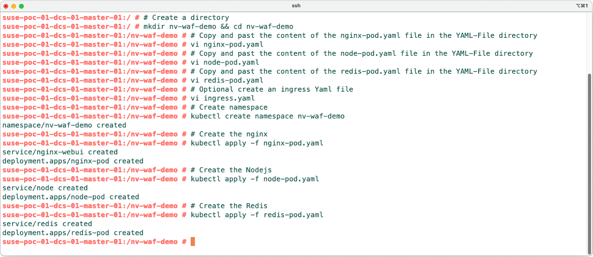
</p>

2. Login to the application using the expose method you have used (nodePort or Ingress - In this example we have used Ingress)

<p align="center">
    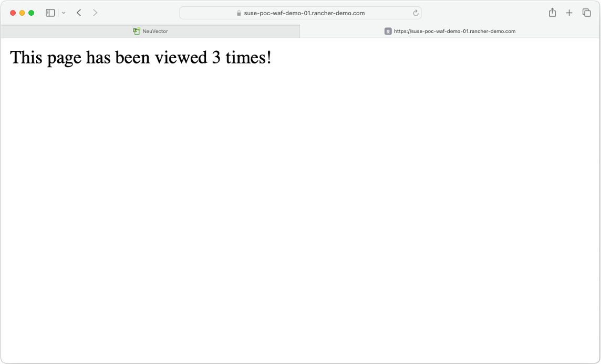
</p>

3. Refresh the page multiple time and you will find that with every refresh the application will keep track on the number of sessions/refresh that you did

<p align="center">
    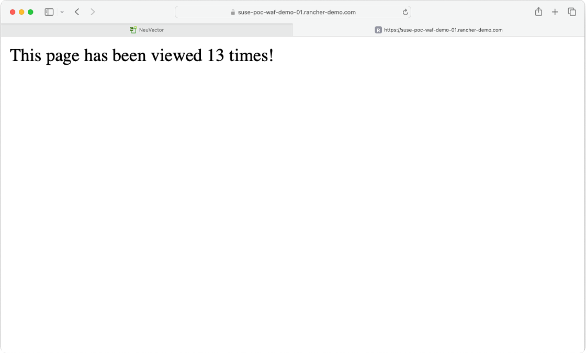
</p>

4. Configure NueVector WAF rule. Login to NeuVector, Go to Policy > WAF Sensors > Click Add > and provide the below info then click on add
- Sensor Name: Provide a suitable name - in this example - nv-waf-demo
- Comment: provide a suitable comment - in this example - NeuVector WAF Demo

<p align="center">
    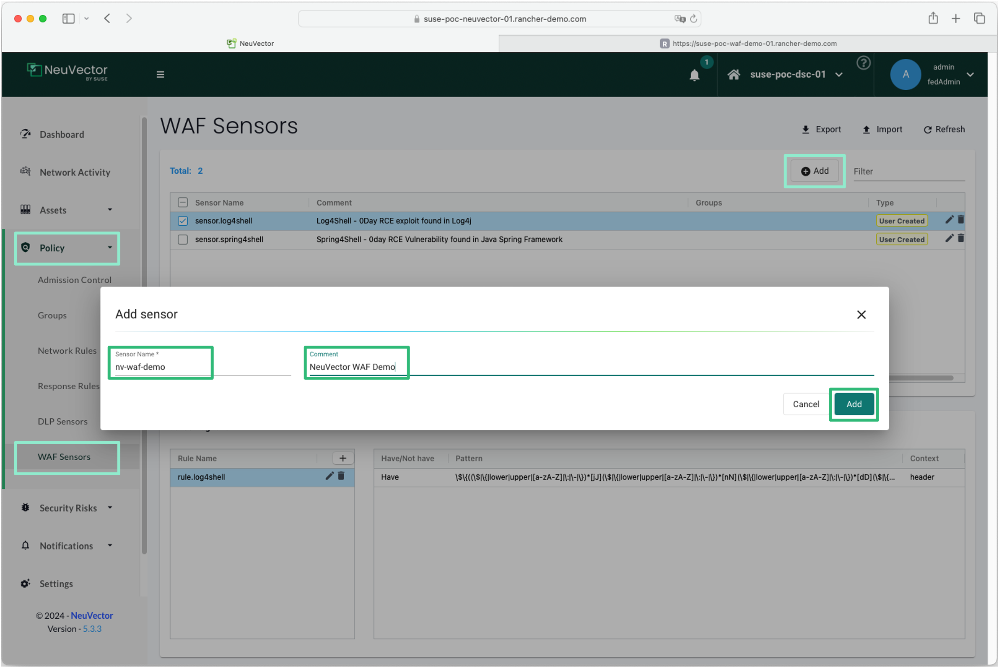
</p>

5. Check the created WAF Rule and then in the Rules section, click the `+` sign to add a rule, then provide the below info and then click on `+` sign to add the pattern then click on add
- Rule Name: Provide a suitable Rule Name - in this example - deny-demo-pattern
- Have/Not have: chose Have
- Pattern: \bThis\s\w{4}\s\w{3}\s\w{4}\s\w{6}\s\d+\stimes! - this regex will match with the pattern of the response of the application `This page has been viewed [x] times`
- Context: Chose body
- Click on the `+` sign to add this pattern
- click on Add to add the rule

<p align="center">
    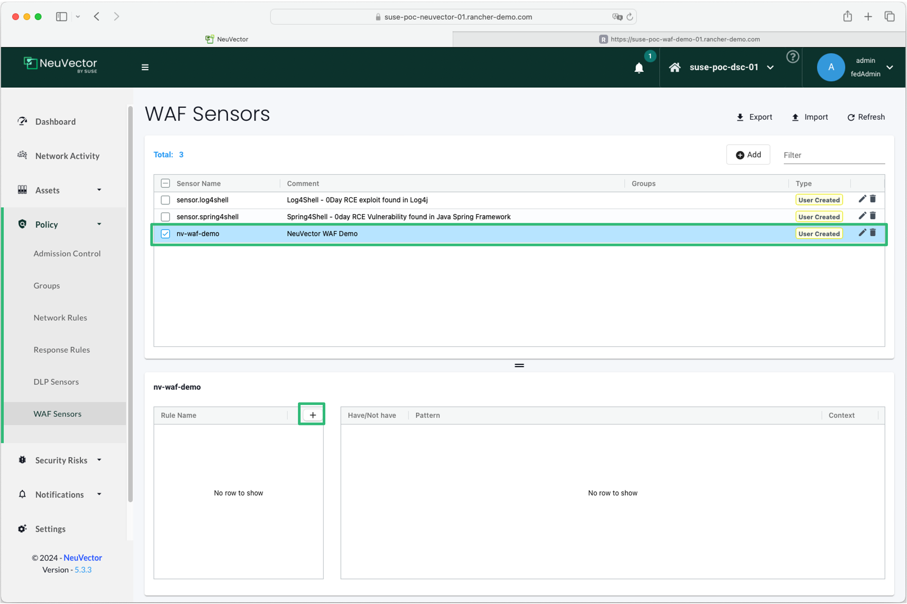
</p>

<p align="center">
    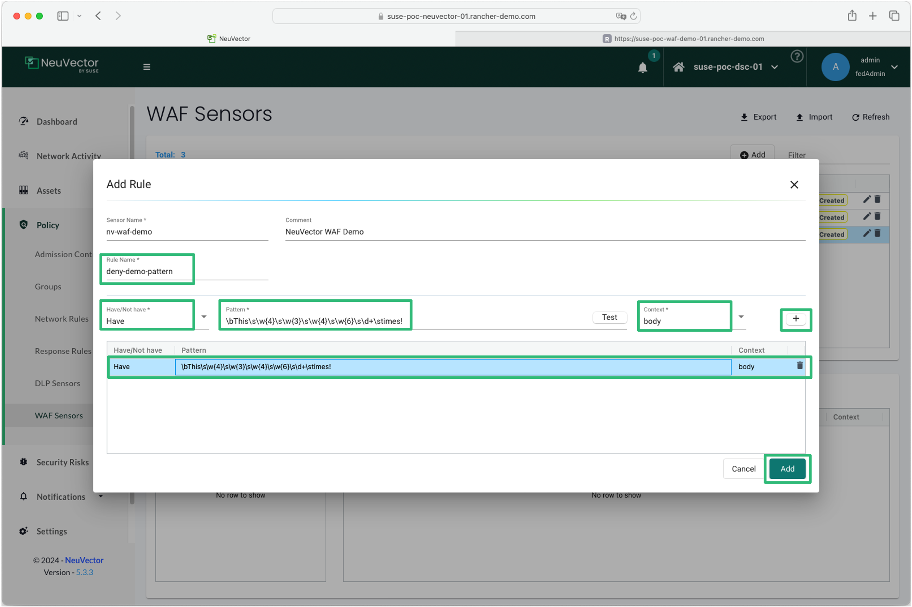
</p>

6. Add the WAF rule to the Group containing the nginx application. Go to Groups > Filter for the application > Select the Group > Click on WAF > Click on Actions > Click on Configure, Then chose the WAF Rule then click apply

<p align="center">
    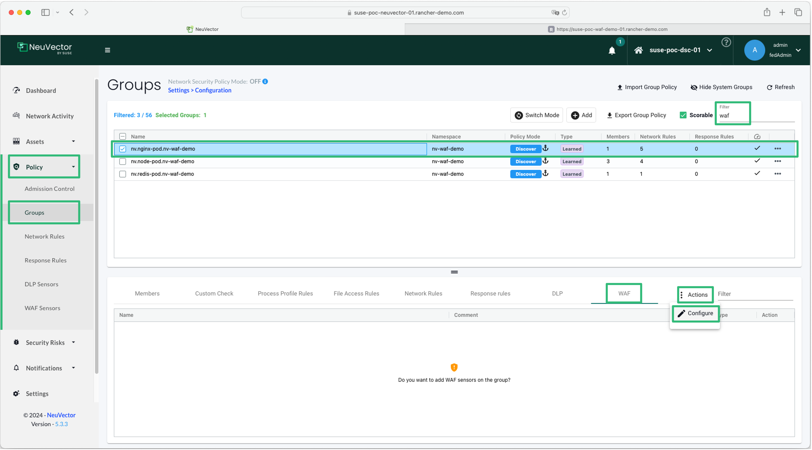
</p>

<p align="center">
    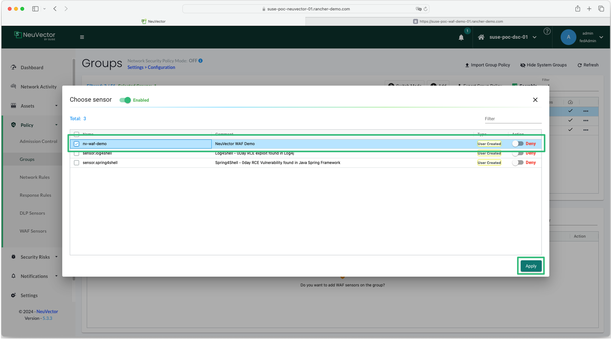
</p>

7. Change the Protection Policy to Protect. Click on Switch Mode, Chose Protect, Click on Submit

<p align="center">
    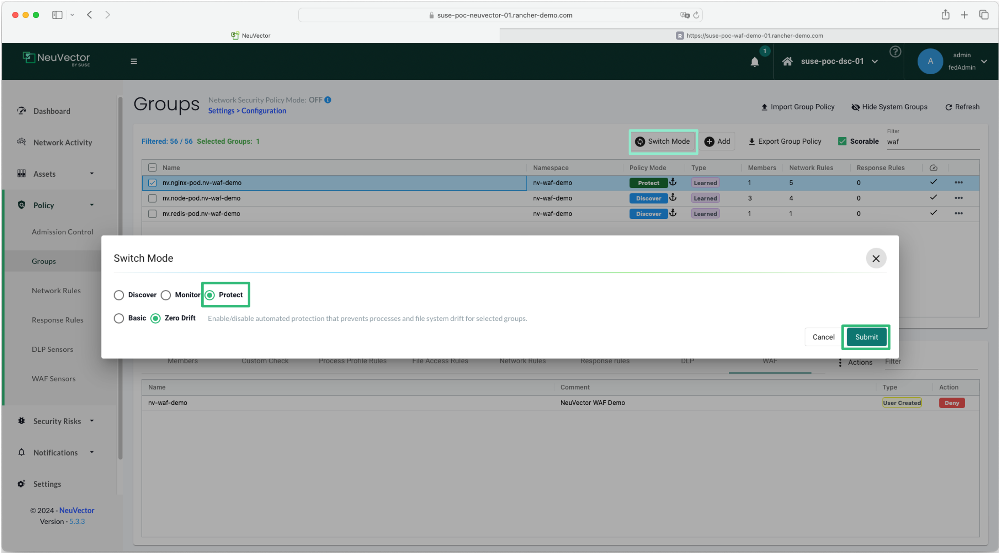
</p>

8. Try to refresh the web page again, you will find that there is no response the the page will keep waiting for a reply. The reply is now block as it matches the WAF rule and the rule is now blocking the reply form the application. Go to Notifications > Security Events > Filter with the application name > you will find a WAF violation event denying the traffic.

<p align="center">
    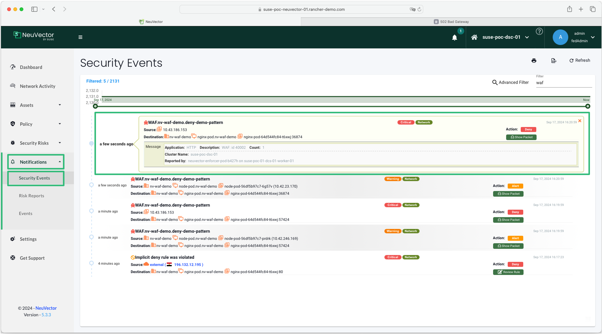
</p>

---

## References

- [SUSE NeuVector DLP & WAF Sensors](https://open-docs.neuvector.com/policy/dlp/)

---

**Enjoy** :blush: