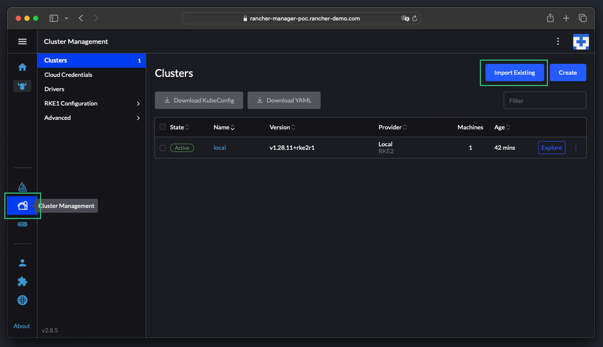
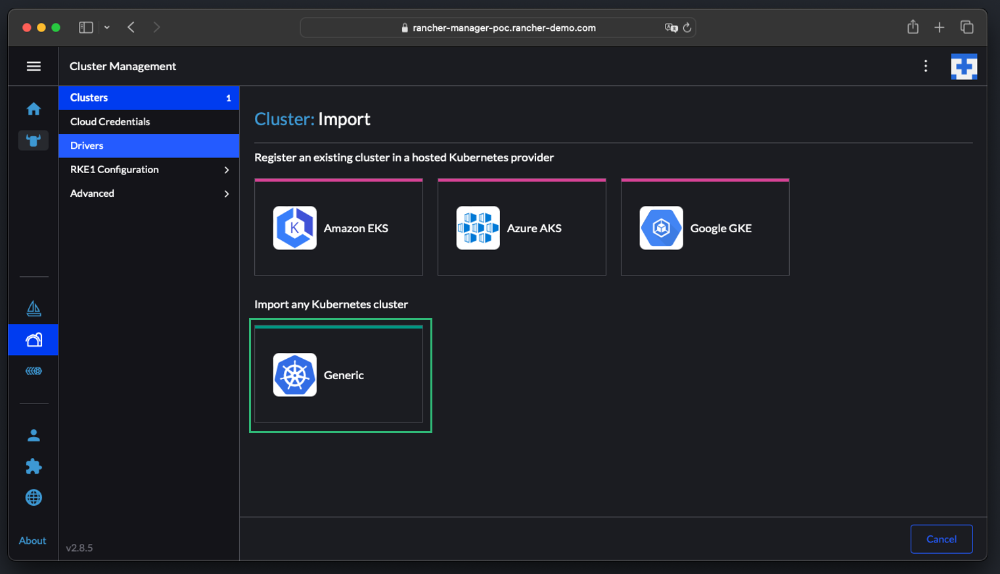
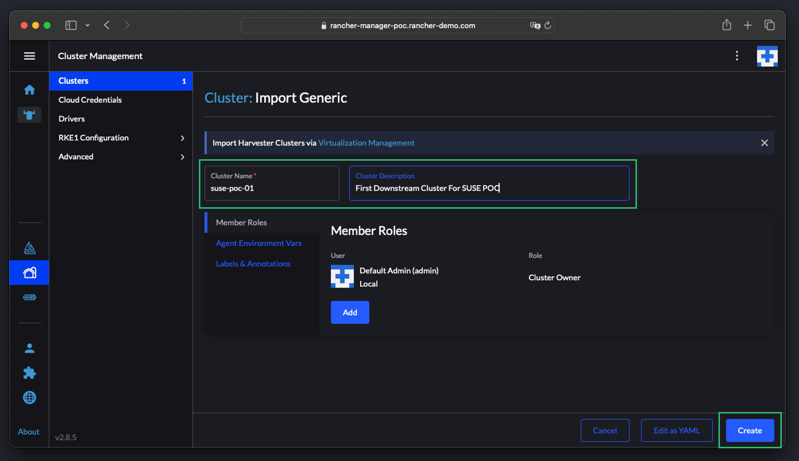
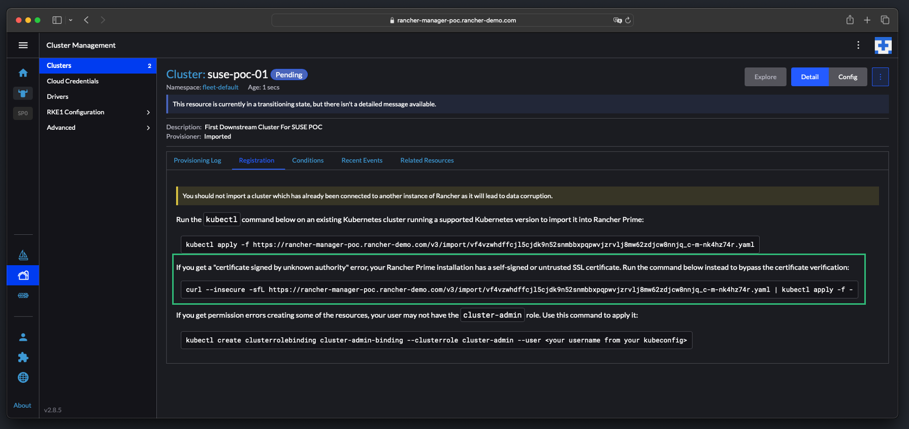
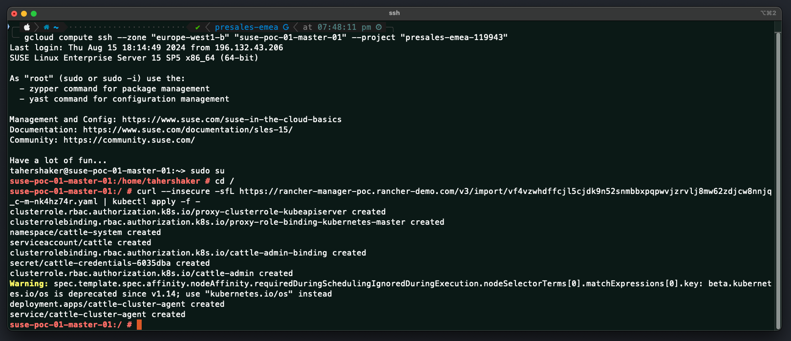
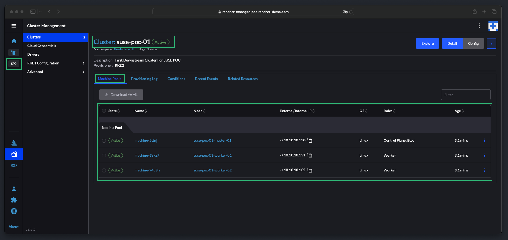
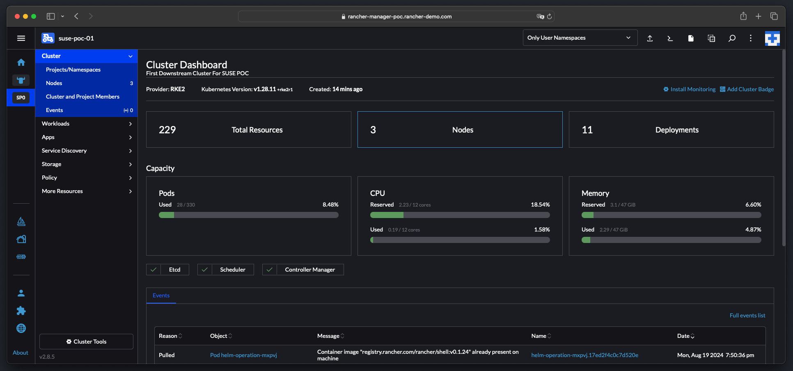

# SUSE Rancher Configuration - Importing Existing Cluster To SUSE Rancher

This repo is created to provide the reader all the required information on configuring `SUSE Rancher`. This repo provide a high-level explanation along with configure step-by-step guides and scripts.

---

    

---

## About This Repo

This repo is designed and created to provide a documented step-by-step guide for configuring Importing existing kubernetes clusters (that was deployed outside of `SUSE Rancher`) into `SUSE Rancher` to be able to provide full LifeCycle Management for these cluster.

`SUSE Rancher` not only provide the capability to automatically provision kubernetes clusters based on RKE2/K3S (Or Hosted Kubernetes Clusters - EKS, AKS, GKE), but also provide the capability import existing clusters into `SUSE Rancher` to be able to provide full LifeCycle Management for these cluster.

When managing an imported cluster, Rancher connects to a Kubernetes cluster that has already been set up. Therefore, Rancher does not provision Kubernetes, but only sets up the Rancher agents to communicate with the cluster.

Rancher features, including management of cluster, role-based access control, policy, and workloads, are available for imported clusters. Note that Rancher does not automate the provisioning or scaling of imported clusters.

For more information and requirements for the Importing Existing Clusters into `SUSE Rancher`, please refer to this [link](https://ranchermanager.docs.rancher.com/v2.0-v2.4/how-to-guides/new-user-guides/kubernetes-clusters-in-rancher-setup/import-existing-clusters)

---

==================================================================

## Step-By-Step Guide - Importing Existing Cluster To SUSE Rancher

==================================================================

1. Login to the `SUSE Rancher` UI and then click on `Cluster Management` and then click on `Import Existing`.

    

2. You have the option to also import hosted kubernetes cluster (EKS, AKS, GKE, etc..), however, in this guide we will be importing an RKE2 cluster built of 3 nodes (1 master and 2 workers). In the `Import Existing` page, click on `Generic`

    

3. Provide a name and description for the cluster. If required add required configuration such as the Member Role, Environment Variables, Labels, and Annotations if required. Once done, click `Create`

    

4. `SUSE Rancher` will then provide you with kubectl commands to be copied and pasted in the kubernetes cluster to be imported to `SUSE Rancher`. There will be 3 options, the first option is when you have proper cluster-admin role configured on the cluster to be imported and you are using signed certificates in your environment. The second option is when you have proper cluster-admin role configured on the cluster to be imported but you do not have signed certificates in your environment. The third option is when you do not have proper cluster-admin role configured. To configure the cluster-admin role, please refer to this [link](https://ranchermanager.docs.rancher.com/v2.0-v2.4/how-to-guides/new-user-guides/kubernetes-clusters-in-rancher-setup/import-existing-clusters#prerequisites). In this guide we are using a self-signed certificate, thus we will copy the second kubectl command.

    

5. Log in to the master node of the kubernetes cluster to be imported (or a JumpBox with Kubectl configured for this cluster) and run the copied command.

    

6. Once the command is executed on the downstream cluster, connection from this cluster to the `SUSE Rancher` will be created and the required actions will be taken (creating node agents and cluster agents pods in the downstream cluster to allow communication with `SUSE Rancher`). After couple of minutes, your cluster will be added to `SUSE Rancher` properly.

    

You can now use `SUSE Rancher` to perform any of the required actions on this imported cluster.

    

---

## References

- [SUSE Rancher Importing Existing Clusters](https://ranchermanager.docs.rancher.com/v2.0-v2.4/how-to-guides/new-user-guides/kubernetes-clusters-in-rancher-setup/import-existing-clusters)

---

**Enjoy** :blush: