# Upgrading SUSE Rancher Manager (With Internet Access)

This repository is your step-by-step guide to upgrading `SUSE Rancher Manager` in environments with internet access. Whether you’re performing a routine upgrade or preparing for a major version jump, this guide is here to help you do it smoothly, securely, and with confidence. This repository is primarily built for `SUSE` Solution Architects, but it’s also a valuable resource for Infrastructure, Cloud-Native, and DevOps teams managing `SUSE Rancher` solution in production environments. If you’re looking for a straightforward way to keep your `SUSE Rancher`  deployment up to date and rock-solid — you’re in the right place.

---

<p align="center">
    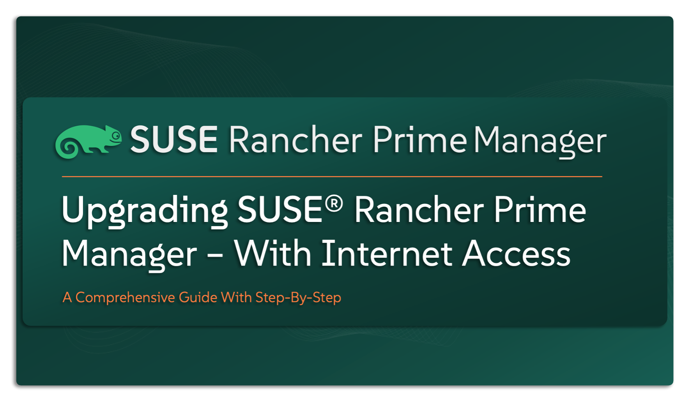
</p>

---

> ⚠️ Disclaimer
>
> This is not an official `SUSE` document. While it’s based on hands-on experience and proven practices, please refer to the official documentation for the latest guidance: https://documentation.suse.com

---

## About This Repo

Keeping your `SUSE Rancher Manager` up to date is key to maintaining stability, security, and gaining access to the latest features. The good news? Upgrading is simple — Upgrading is, in fact, a straightforward process — and that’s one of the great things about working with the `SUSE Rancher Manager`. It’s designed to make the upgrade experience as smooth and simple as possible. That said, how you approach the upgrade still matters. Taking the time to follow the right steps ensures everything continues running exactly as it should — with no disruptions, no surprises, and all the new features ready to go.. This repo provides a complete, step-by-step guide to help you confidently upgrade your `SUSE Rancher Manager` instance in an online (connected) environment. Here’s what you’ll find inside:
- Upgrade path & support matrix verification
- Pre-upgrade checklist
- Prerequisites and planning steps
- Step-by-step upgrade guide using Helm
- Automation scripts (when applicable)

If you’re running `SUSE Rancher Manager` in an environment with internet access, this guide is tailored just for you.

---

| 📝 **Please Note:** |
|:--------------------|
| This repository focuses solely on upgrading the `SUSE Rancher Manager`. If you’re looking to upgrade your entire environment, including the Kubernetes clusters managed by Rancher (both Management and Downstream Clusters), make sure to also refer to the appropriate guides - [Upgrade SUSE Rancher RKE2](/4-Upgrade-&-Rollback/SUSE-Rancher-RKE2/) for RKE2 environments or [Upgrade SUSE Rancher K3s](/4-Upgrade-&-Rollback/SUSE-Rancher-K3S/) for K3s environments|

---

> _________________________     
>     
> 🚀 **Let's Get Started** 
>     
> _________________________

---

|The first two sections provide a detailed explanation of each consideration in the upgrade planning process, along with important notes and insights. If you’d prefer to skip ahead to the checklist summary and step-by-step upgrade guide, feel free to [jump there](#suse-rancher-manager-upgrade-guide---check-list-summary).|
| :--------- |

---

## SUSE Rancher Manager Upgrade Guide – Understanding What Happens Under the Hood

Before we get into planning your upgrade, it’s helpful to take a step back and understand what actually happens during a `SUSE Rancher Manager` upgrade. Knowing what’s going on behind the scenes will make the rest of this guide easier to follow — and give you more confidence as you move forward.

`SUSE Rancher Manager` is deployed using Helm — and upgrading it follows that same approach. Helm is the official and standard method for upgrading Rancher, as it allows for clean version management, customization through values, and full control over lifecycle operations.

But what really happens when you run an upgrade?

When you execute a helm upgrade, Helm itself doesn’t directly restart containers or force a shutdown. Instead, it updates the underlying Kubernetes resources, such as the `Rancher` Deployment, by changing configurations like the container image version.

Once Helm applies the new configuration, Kubernetes takes care of the rest using a built-in strategy called **RollingUpdate**. This means the upgrade happens gradually — not all at once. Here’s what that looks like under the hood:
- A new pod running the updated Rancher version is spun up
- Kubernetes waits for that pod to become healthy and ready
- One old pod is then safely terminated
- This continues one pod at a time until the upgrade is complete

This behavior is designed to ensure minimal downtime, keep `SUSE Rancher Manager` highly available, and allow the platform to continue functioning during the upgrade process — though some downtime may still occur, depending on your specific setup, resource availability, or unexpected issues that arise along the way.

Now that you know what’s going on beneath the surface, it’s time to start preparing your upgrade path — the most important step before making any changes.

---

## SUSE Rancher Manager Upgrade Guide - Preparing For The Upgrade

Getting ready to upgrade your `SUSE Rancher Manager` is more than just a technical step — it’s a moment to pause, align your thoughts, and make sure everything is set up for success. Think of it like preparing for a journey: the more you plan ahead, the smoother the road will be. And don’t worry — you don’t need to overthink it. With the right questions in mind and a few smart checks in place, you’ll be on track for a clean and confident upgrade.

| 📝 **Please Note:** |
|:--------------------|
| If your environment includes Kubernetes clusters managed by `SUSE Rancher Manager` — whether that’s the Management Cluster itself or any of the connected Downstream Clusters — and you’re planning to upgrade those too, the same level of planning applies. You’ll want to make sure they follow a proper upgrade path just like the manager. To help with that, be sure to review the relevant guides: [Upgrade SUSE Rancher RKE2](/4-Upgrade-&-Rollback/SUSE-Rancher-RKE2/) for RKE2 environments or [Upgrade SUSE Rancher K3s](/4-Upgrade-&-Rollback/SUSE-Rancher-K3S/) for K3s environments|

So, now that you’ve got the foundation in place, where do you go from here? Let’s dive into some of the most common upgrade and planing questions and walk through them together.

> **What Component Should Be Upgraded First?**

One of the first things to consider is which components in your environment need to be upgraded, and in what order — a common question, and an important one. In `SUSE Rancher` environments, the upgrade should always begin with the management plane, which means starting with the `SUSE Rancher Manager`. Once that upgrade is complete and validated, you can shift your focus to the data plane — your Kubernetes clusters — whether those are `RKE2`, `K3s`, cloud services like EKS, AKS, GKE, or even vanilla Kubernetes. This sequence helps you avoid disruption and ensures a stable, well-orchestrated upgrade.

> **What Should My Upgrade Path Look Like?**

Next comes **version planning**. You’ll want to decide exactly which version you’re moving from, and which one you’re targeting. It’s not just about jumping to the latest — it’s about ensuring the upgrade path is supported and tested. When planning the version jump, there are **two golden rules** you’ll want to follow closely.

First, **don’t skip minor versions**. It might sound like a time-saver to go directly from v2.9.x to v2.11.x, but that approach isn’t recommended — and in most cases, may cause issues. Instead, you’ll want to take the path in stages (ex: v2.9.x → v2.10.x → v2.11.x). This ensures each version has the chance to apply its changes and keeps your upgrade path fully supported.

It’s also highly recommended to upgrade to the latest minor release within your current major version before moving to the next major release. And when you do move to the next major release, upgrade to its latest minor version as well. For example, if you’re currently on v2.8.6 and planning to upgrade to v2.10.1, your ideal upgrade path would look like this:
- v2.8.6 → v2.8.13 (latest in the 2.8.x series)
- v2.8.13 → v2.9.7 (latest in 2.9.x)
- v2.9.7 → v2.10.1 (your target version)

Second, always **avoid upgrading to or from pre-release or non-stable versions**. These pre-releases are intended for testing purposes, not production workloads. You can usually spot them by the -rc (release candidate) or -alpha tag in the version name. In contrast, a stable production-ready version would be something like `v2.10.0`. For example:
- v2.10.0-rc4 is a pre-release — [check it here](https://github.com/rancher/rancher/releases/tag/v2.10.0-rc4)
- v2.10.0-alpha12 is also a pre-release — [check it here](https://github.com/rancher/rancher/releases/tag/v2.10.0-alpha12)
- v2.10.0 is a stable release - [check it here](https://github.com/rancher/rancher/releases/tag/v2.10.0)

If you’re already on a pre-release, no problem — just upgrade first to its stable counterpart (for example, v2.10.0-rc4 → v2.10.0), and from there, you can safely continue with your upgrade journey.

> **How Do I Ensure Compatibility Between My Rancher and Kubernetes Versions?**

Now let’s talk about **compatibility** — a step that’s easy to overlook, but can have a big impact on your upgrade path. Not every version of `SUSE Rancher` is compatible with every Kubernetes release, so it’s important to make sure the versions you’re working with actually support each other. For example, if you’re running `RKE2` v1.29.x, you’ll want to verify that it aligns with the version of `SUSE Rancher Manager` you plan to upgrade to — say, v2.10.2. Doing this check early helps you avoid running into version conflicts mid-upgrade.

And here’s why this matters so much: **compatibility can reshape your upgrade sequence**. While the usual approach is to upgrade `SUSE Rancher Manager` first, there are scenarios where that needs to be reversed.

Imagine you’re running `RKE2` v1.27 with `SUSE Rancher` v2.9.7, and you’re aiming for v2.10.2. If v2.10.2 doesn’t support `RKE2` v1.27, you can’t upgrade `SUSE Rancher` right away. Instead, you’ll need to upgrade `RKE2` first — but to a version that’s supported by both v2.9.7 and v2.10.2, such as v1.29. Only then can you safely move forward with the `SUSE Rancher Manager` upgrade.

Also, don’t forget to check operating system compatibility. The OS version running on your management and Kubernetes nodes needs to be supported by the Rancher and Kubernetes versions you’re upgrading to — this can be a hidden blocker if overlooked.

So yes, checking compatibility might seem like a small step — but it can completely reshape your plan. The key is to build your upgrade path around what’s supported, not just what’s typical.

For the full picture, make sure to consult the official [SUSE Support Matrix](https://www.suse.com/suse-rancher/support-matrix/all-supported-versions/rancher-v2-10-2/) — it’s the definitive source for what works with what.

> **Do I Have the Right Tools and Access to Perform the Upgrade?**

Before starting the upgrade process, it’s essential to make sure you have everything in place — not just from a planning perspective, but also in terms of **access and tooling**. Having the right setup from the beginning helps you avoid last-minute delays, permission issues, or broken workflows midway through the upgrade.

To successfully upgrade `SUSE Rancher Manager`, you’ll need a few things ready to go:

First, ensure you have access to the management cluster — this is the Kubernetes cluster where `SUSE Rancher Manager` is deployed. You’ll need a valid kubeconfig file that grants you sufficient permissions on this cluster.
- If the management cluster is running on `RKE2`, the kubeconfig can be found at:
`/etc/rancher/rke2/rke2.yaml` - [More info on RKE2 cluster access](https://docs.rke2.io/cluster_access)
- If the cluster is running on `K3s`, the kubeconfig is typically located at:
`/etc/rancher/k3s/k3s.yaml` - [More info on K3s cluster access](https://docs.k3s.io/cluster-access)

Next, make sure the kubectl CLI is installed and properly configured on the same machine you’ll be using for the upgrade — usually a bastion host or your admin workstation.

And most importantly, have the `Helm` CLI installed — this is the tool used to initiate and manage the `SUSE Rancher Manager` upgrade. `Helm` commands should be executed from the same environment that has access to your kubeconfig. You can also explicitly reference the config file using the --kubeconfig flag, like this: `helm upgrade rancher rancher-prime/rancher --kubeconfig <path-to-the-kubeconfig-file>`

| ⚠️ **Important Note**:| 
| :---------------------|
|`SUSE Rancher` only supports `Helm` v3. `Helm` v2 is deprecated (as of the `Rancher` v2.7 and is removed in `Rancher` v2.9) and not supported for installation, upgrade, or management of `SUSE Rancher Manager`. If you’re unsure which version of `Helm` you’re using, you can check by running: `helm version`. If you’re still using `Helm` v2, you must migrate to `Helm` v3. You can find the official migration guide here: [Migrate from Helm v2 to Helm v3](https://helm.sh/blog/migrate-from-helm-v2-to-helm-v3/)|

Bringing it all together — your upgrade-ready toolkit should include:
- Access to the management cluster
- A valid kubeconfig for that cluster
- The kubectl CLI installed and configured
- The Helm v3 CLI installed and verified

Once all of that is set, you’re good to go. You now have everything you need to execute the upgrade confidently and cleanly — without having to pause midway for missing tools or access rights.

> **Is My cert-manager Setup Compatible with the Upgrade?**

If your deployment of `SUSE Rancher Manager` is using self-signed certificates or Let’s Encrypt, then **cert-manager** plays an essential role behind the scenes. `SUSE Rancher Manager` depends on **cert-manager** to automatically generate and renew TLS certificates.

So, before starting your upgrade, it’s important to understand whether your environment relies on **cert-manager** — and if it does, whether the version you’re running is fully supported.
- If you’re using a certificate from a Private CA, or terminating TLS externally on a load balancer, then **cert-manager** is likely not in use, and this section may not apply to your setup.

For those relying on **cert-manager** (typically with self-signed certs or Let’s Encrypt), version compatibility matters. `SUSE Rancher Manager` supports the cert-manager.io/v1 API version, and the latest validated version at the time of writing is **v1.13.1**.

Running an older **cert-manager** version may not only affect the upgrade — it can also introduce external issues. For example, [Let’s Encrypt stopped supporting cert-manager versions older than v0.8.0 as of November 1, 2019](https://community.letsencrypt.org/t/blocking-old-cert-manager-versions/98753), which can result in failed certificate requests or renewals.

If you’re running an outdated **cert-manager** version, it’s recommended to upgrade **cert-manager** before proceeding with the `SUSE Rancher Manager` upgrade. This ensures compatibility and avoids certificate-related issues mid-upgrade.

While this repository is not focused on the upgrade of **cert-manager**, you can refer to the official [SUSE documentation - Upgrading Cert-Manager](https://documentation.suse.com/cloudnative/rancher-manager/latest/en/installation-and-upgrade/resources/upgrade-cert-manager.html) for detailed steps and guidance.

Taking a few minutes now to verify your **cert-manager** setup — or confirm that it isn’t needed — can save you hours of troubleshooting later.

> **Is My Environment Behind a Proxy — and Is It Configured Correctly?**

If your `SUSE Rancher Manager` is deployed in an environment that accesses the internet through a proxy, it’s essential to make sure the proxy settings are configured correctly on each node of the management cluster — typically three nodes in a high-availability setup.

These settings are necessary to ensure that the underlying Kubernetes cluster (whether `RKE2` or `K3S`) has internet access to pull required container images and components during the upgrade of `SUSE Rancher Manager`. Without proper proxy configuration, the upgrade may fail due to missing packages or unreachable endpoints.

Now, if you’re also planning to upgrade one or more managed Kubernetes clusters — whether it’s the management cluster itself or any downstream cluster — and you’re initiating those upgrades from the `SUSE Rancher Manager` UI, then there’s an additional requirement - The ` SUSE Rancher Manager` itself must also have working internet access, and therefore must have its proxy settings configured properly. 

While this repository does not cover how to configure proxy settings in `RKE2`, `K3S` or in the `SUSE Rancher Manager`, you can refer to the official [SUSE documentation - Installing SUSE® Rancher behind an HTTP Proxy](https://documentation.suse.com/cloudnative/rancher-manager/latest/en/installation-and-upgrade/other-installation-methods/http-proxy/http-proxy.html) for detailed steps

Making sure proxy configurations are set up correctly ahead of time will save you time, prevent upgrade failures, and ensure a smooth experience across your environment.

> **Do I Have Enough Resources to Run This Upgrade Smoothly?**

While upgrading `SUSE Rancher Manager` usually doesn’t introduce new hardware demands or spike resource consumption, it’s still important to take a moment and check your cluster’s resource health before diving in.

Most versions of `SUSE Rancher Manager` follow a fairly consistent footprint in terms of CPU and memory usage — and the upgrade process itself doesn’t typically add overhead. That said, it’s still considered a best practice to verify that your management cluster has sufficient resources available to comfortably run ` SUSE Rancher Manager` during and after the upgrade.

Specifically, you’ll want to ensure that:
- There are enough resources (CPU and memory) to support each container in the `SUSE Rancher Manager` deployment — typically this includes three pods.
- The overall cluster resource utilization remains below 70%, both before and during the upgrade process. This helps you avoid issues related to resource contention or performance degradation.

By doing a quick resource health check ahead of time, you’re giving yourself extra confidence that the upgrade will proceed smoothly — without unexpected slowdowns, crashes, or deployment failures due to lack of available resources. For more information about `SUSE Rancher Manager` hardware and resource requirements, refer to the official [SUSE documentation - SUSE Rancher – Hardware Requirements](https://documentation.suse.com/cloudnative/rancher-manager/latest/en/installation-and-upgrade/requirements/requirements.html#_hardware_requirements)

> **Have I Reviewed the Known Issues for My Target Rancher Version?**

Before moving forward with your upgrade, it’s a smart idea to take a moment and check the known issues associated with the version of `SUSE Rancher Manager` you’re planning to upgrade to.

Every Rancher release comes with a set of release notes published on GitHub, and these often include a list of known bugs, limitations, and behaviors that may impact your environment. Reviewing these ahead of time gives you a clearer picture of what to expect — and helps you avoid surprises that could delay your upgrade or cause post-upgrade headaches.

You can find all release notes — including known issues — in the [official SUSE Rancher GitHub repository](https://github.com/rancher/rancher/releases)

Taking a few minutes to read through these notes now can help you save hours of troubleshooting later — and ensures you go into the upgrade fully informed and prepared.

> **Is My Backup Ready?**

Another essential part of your upgrade preparation — and one that’s often underestimated — is **having a reliable backup** in place. And no, this isn’t just a best practice checkbox. It’s your safety net.

Upgrades don’t usually go wrong… but when they do, having a backup can mean the difference between a smooth rollback and a full-blown recovery headache. Whether it’s a failed deployment, a configuration error, or an unexpected compatibility issue — a backup gives you the ability to pause, restore, and get back on track without losing your environment or data.

The good news? `SUSE Rancher` makes this easy with its **Backup Operator** — a tool purpose-built to help you protect your `SUSE Rancher Manager` environment. It automates the backup and restore process and is especially handy in upgrade and disaster recovery scenarios.

Now, this guide doesn’t go deep into how to install or configure the Backup Operator — but no worries. You can find everything you need in the [SUSE Official Documentation – Backup, Restore, and Disaster Recovery](https://documentation.suse.com/cloudnative/rancher-manager/latest/en/rancher-admin/back-up-restore-and-disaster-recovery/back-up-restore-and-disaster-recovery.html) or follow along with another guide in this series: [Installing SUSE Rancher Backup Operator](/2-Configure/SUSE-Rancher/2-SUSE-Rancher-Backup/).

Before going any further with your upgrade, take a moment to ask yourself:
**Is my backup ready** — and have I tested it? If the answer isn’t a confident yes, this is the perfect time to pause and set that up.

> **What’s My Plan If I Need to Roll Back?**

So here’s a final — but just as critical — question to ask before upgrading: **Do you have a rollback strategy in place?**

Hopefully, you’ll never need it. A well-prepared upgrade rarely goes sideways. But in the off chance that something unexpected happens — whether it’s a failed deployment, an unreachable service, or just something that doesn’t feel right — having a tested rollback plan can be a real lifesaver.

Rolling back a `SUSE Rancher Manager` upgrade involves more than just reverting the version — it typically includes cleanup steps, verification, and ensuring everything is brought back to a stable state. While this repository doesn’t focus on the rollback process in detail, you can refer to the official [SUSE documentation - Rollback](https://documentation.suse.com/cloudnative/rancher-manager/latest/en/installation-and-upgrade/rollbacks.html) or follow along with another guide in this series: [Rollback SUSE Rancher Manager](/4-Upgrade-&-Rollback/SUSE-Rancher-Manager/3-Rolback-SUSE-Rancher-Manager/)

> Important Recommendations

When you’re working through a multi-step upgrade path — for example, upgrading from v2.9.5 to v2.9.8, and then to v2.10.4 — it’s highly recommended to allow sufficient time between each upgrade phase. On average, giving yourself 3 to 6 hours between steps provides enough room to validate the environment and ensure everything is running smoothly before moving forward.

After executing each helm upgrade command, monitor the upgrade progress using the appropriate commands to check the status of the Rancher deployment. Once the pods are up and stable, log in to the `SUSE Rancher Manager` UI to confirm everything is functioning as expected.

Take a few minutes to validate access and verify that all managed downstream clusters are visible and healthy. Perform some day-to-day tasks such as creating a project or namespace, checking deployments, or browsing workloads — this helps confirm that your Rancher environment is behaving as expected before moving on to the next step.

```bash
kubectl -n cattle-system rollout status deploy/rancher
kubectl -n cattle-system get deployments
kubectl -n cattle-system get pod
kubectl -n cattle-system describe pod <pod-name>
```

--- 

## SUSE Rancher Manager Upgrade Guide - Check List Summary

By now, you’ve gone through all the key considerations that go into planning a smooth, confident upgrade of your `SUSE Rancher Manager`. This section brings it all together in one place — a practical checklist you can use to validate your readiness before moving forward.

Each item here reflects a critical step in the planning process. Going through this list before you begin ensures you’ve covered all bases and are fully prepared to move into the upgrade phase.

| ID | Checks | Description | Status |
| :--: | ------ | ----------- | :----: |
| 1 | **Define your upgrade flow** | Confirm which component will be upgraded first — typically `SUSE Rancher Manager`, unless compatibility exceptions apply. | ✅ |
| 2 | **Set your upgrade path** | Identify your current and target `SUSE Rancher Manager` versions. Ensure you’re not skipping minor versions and that both source and target versions are stable (non-pre-release). | ✅ |
| 3 | **Verify compatibility** | Check that the version of `SUSE Rancher Manager` you’re upgrading to is compatible with your Kubernetes cluster and OS version. | ✅ |
| 4 | **Ensure access and tooling** | Make sure you have access to the management cluster, the correct kubeconfig file, and the required CLI tools (kubectl and helm v3) installed and configured. | ✅ |
| 5 | **Check cert-manager** | If you’re using self-signed certs or Let’s Encrypt, verify that your cert-manager version is compatible with `SUSE Rancher Manager` (cert-manager.io/v1, tested with v1.13.1). | ✅ |
| 6 | **Validate proxy settings** | If your environment uses a proxy, confirm proxy configuration is in place on all nodes in the management cluster — and in any managed clusters if they’ll also be upgraded. | ✅ |
| 7 | **Confirm resource availability** | Ensure your management cluster has enough free CPU and memory, and that overall utilization stays below 70% during the upgrade. | ✅ |
| 8 | **Review known issues** | Go through the release notes for your target `SUSE Rancher Manager` version and make note of any known issues that may apply to your setup. | ✅ |
| 9 | **Take a backup** | Use the `SUSE Rancher` Backup Operator to take a full, verified backup of the `SUSE Rancher Manager` deployment before starting the upgrade. | ✅ |
| 10 | **Prepare your rollback plan** | Have a clear, tested rollback strategy in place in case something goes wrong during or after the upgrade. | ✅ |

Now that we’ve walked through the full upgrade planning checklist, it’s time to take a closer look at the first three — and arguably most critical — steps: deciding what to upgrade first, defining the correct upgrade path, and ensuring version compatibility between `SUSE Rancher Manager` and Kubernetes. These decisions form the foundation of a successful upgrade, and getting them right can make all the difference.

To make this crystal clear, we’re going to walk through a real-world example that shows exactly how to approach these three key points in a practical, step-by-step way. Whether you’re upgrading `SUSE Rancher Manager`, your Kubernetes clusters, or both, this example will help you understand the logic and reasoning behind each move — so you can plan your own upgrade path with confidence.

Here’s a real-world scenario:

> **Goal:** Upgrade `SUSE Rancher Manager` from v2.7.6 to v2.10.2, and the current Kubernetes clusters `RKE2` version is v1.26.8.

At first glance, this might seem simple. But if you try to leap directly to your target versions without validating compatibility or following the proper order, you’ll quickly run into roadblocks — or worse, break something in production.

For example, if you check the [SUSE Support Matrix](https://www.suse.com/suse-rancher/support-matrix/all-supported-versions/rancher-v2-10-2/), you’ll see that `SUSE Rancher Manager` v2.10.2 does not support `RKE2` v1.26.8. That means you’ll also need to upgrade RKE2 as part of this process — and plan carefully around which versions are compatible with which.

Let’s break it down step by step:
- You’re starting with `Rancher` v2.7.6. At the time of writing, the latest patch version in the 2.7.x line is v2.7.18, which still supports `RKE2` v1.26.8. So, the first step is safe: → Upgrade `Rancher` from v2.7.6 → v2.7.18
- Next, you move to v2.8.x. The latest minor release is v2.8.13, and it still supports `RKE2` v1.26.8, so you’re good to go: → Upgrade `Rancher` from v2.7.18 → v2.8.13
- Next, you move to v2.9.x. The latest minor release is v2.9.7, but here’s the catch: it requires at least `RKE2` v1.27.x — so before upgrading `Rancher` again, you’ll need to upgrade the Kubernetes layer first. Additionally, `Rancher` v2.8.13 supports `RKE2` up to v1.28.x, so you’ll want to bring your Kubernetes version to at least v1.28 while still on `Rancher` v2.8.13.

By now, you’ve got the idea — from this point on, simply continue following the same upgrade path and logic: validate version compatibility, move one step at a time, and make sure each upgrade is supported before progressing to the next.

Below is the complete upgrade path and set of actions required to move from `SUSE Rancher Manager` v2.7.6 to v2.10.2, along with the corresponding Kubernetes `RKE2` version upgrades.

- Upgrade `SUSE Rancher Manager` from 2.7.6 to 2.7.18
- Upgrade `SUSE Rancher Manager` from 2.7.18 to 2.8.12
- Upgrade `RKE2` from 1.26.6 to 1.26.15
- Upgrade `RKE2` from 1.26.15 to 1.27.16
- Upgrade `RKE2` from 1.27.16 to 1.28.15
- Upgrade `SUSE Rancher Manager` from 2.8.12 to 2.9.6
- Upgrade `SUSE Rancher Manager` from 2.9.6 to 2.10.2
- Upgrade `RKE2` from 1.28.15 to 1.29.13
- Upgrade `RKE2` from 1.29.13 to 1.30.9
- Upgrade `RKE2` from 1.30.9 to 1.31.5

---

## SUSE Rancher Manager Upgrade Guide - Step-By-Step Guide

In this step-by-step guide, we’ll walk through the process of upgrading a `SUSE Rancher Manager` instance deployed in a demo environment. For this example, Rancher is running on a single-node RKE2 management cluster — which is acceptable for demo or test purposes. However, for production environments, a three-node high-availability (HA) cluster is strongly recommended — in fact, it’s considered a best practice.

The current Rancher version in this environment is v2.9.2, and our goal is to upgrade to the latest available version at the time of writing, which is v2.10.4.

Here’s an overview of the demo environment setup:
- Management Cluster Node Count: 1
- Kubernetes Distribution & Version: RKE2 v1.30.6
- Node Operating System: SLES 15 SP5
- Current `SUSE Rancher` Version: v2.9.2
- Target `SUSE Rancher` Version: v2.10.4
- `SUSE Rancher` Backup Operator Deployed: Yes
- `SUSE Rancher` Backup Storage Location: AWS S3 Bucket

Below is a screenshot of the `SUSE Rancher Manager` UI, showing the current version in use.

---

<p align="center">
    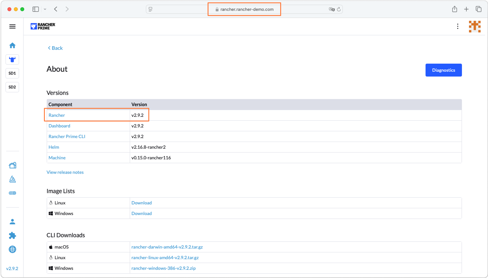
</p>

---

Below is a screenshot of an SSH session connected to the single-node management cluster, displaying key environment details — including the number of nodes in the cluster (1), the RKE2 version, and the underlying OS distribution and version.

---

<p align="center">
    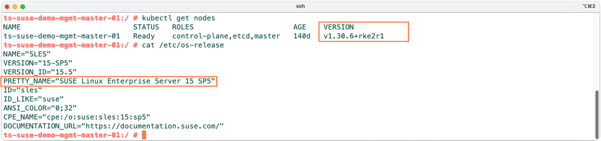
</p>

---

Below is a screenshot of the `SUSE Rancher Manager` UI, confirming that the Backup Operator is installed. It also shows that three successful backups have already been created, and that the configured storage destination is an S3 bucket.

---

<p align="center">
    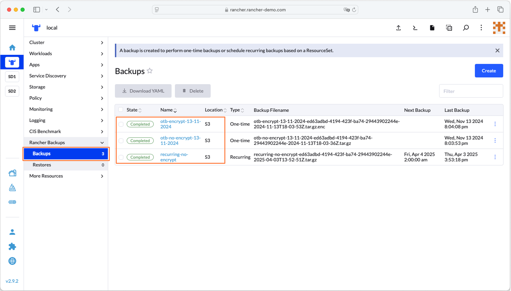
</p>

---

Let’s move on to the upgrade path planning. In our case, we’re currently running `SUSE Rancher Manager` version v2.9.2, and we’re targeting an upgrade to v2.10.4. The management cluster is running on RKE2 v1.30.6, which is fully supported by both the current and target Rancher versions — so there’s no need to upgrade RKE2 as part of this process. If you’d like, you can always upgrade RKE2 later, once Rancher has been successfully updated.

The operating system in use is SLES 15 SP5, which is also supported by both versions of `SUSE Rancher Manager`, so again — no action needed on the OS side.

We’re also starting from a stable release, not a pre-release or release candidate, which means there’s no cleanup or extra step required before initiating the upgrade.

So with all of that aligned — supported Kubernetes version, supported OS, and a stable starting point — the upgrade path is pretty straightforward:
You’ll move from v2.9.2 to v2.9.8 (the latest available patch in the 2.9.x series), and then from v2.9.8 to your target version, v2.10.4.

As always, it’s a good idea to double-check compatibility using the official [SUSE Rancher Support Matrix](https://www.suse.com/suse-rancher/support-matrix/all-supported-versions/rancher-v2-10-4/) before you begin.

Now that the upgrade path is defined, let’s quickly run through the remaining items in the checklist to make sure everything else is ready to go.
- We’ve got access and tooling covered — we can SSH into the single-node management cluster, kubectl is installed and configured, and Helm v3 is set up correctly and pointing to the right kubeconfig file. Everything needed to interact with the cluster is in place.
- Next up is cert-manager. The version currently deployed is v1.13.0, which is fully supported and aligns with the version of Rancher we’re upgrading to — so no issues there.
- As for proxy settings, this environment doesn’t use a proxy, so there’s nothing to configure or validate in that area.
- On the resource availability side, we’ve checked the node metrics and confirmed that CPU usage is hovering around 40%, and RAM utilization is at 35%. That puts us well below the 70% threshold we recommend staying under during upgrades.
- We’ve also taken time to review the known issues for the target Rancher version in the release notes — no red flags there.
- When it comes to backups, we’ll walk through the backup process as part of the step-by-step guide that follows, so you’ll see exactly how to handle that.
- And finally, a rollback plan has already been considered and prepared in case anything unexpected comes up during the upgrade.

With everything checked off, we’re now fully ready to move into the actual upgrade process. Let’s do it! 🚀

> Take A Backup For The Current `SUSE Rancher Manager`

To initiate the backup, log in to the `SUSE Rancher Manager UI`. From the main dashboard, select the local cluster — which represents the management cluster — from the list of available clusters on the right-hand side. Once inside the cluster view, go to the Backups section, then click on Create to start a new backup.

---

<p align="center">
    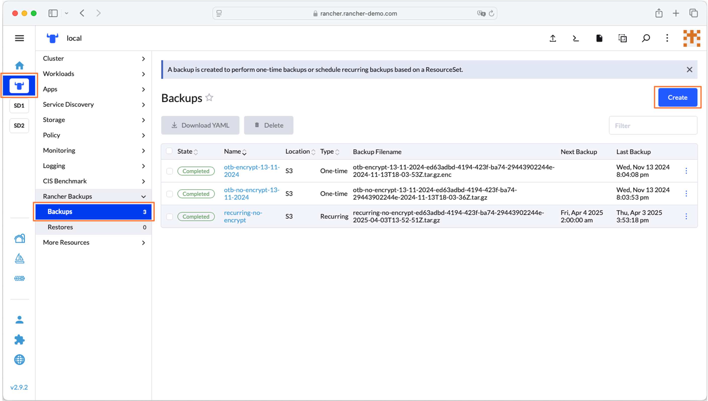
</p>

---

In the Create Backup wizard, start by giving your backup a name — in our case, we used bk-before-upgrade-v2-9-2. You can also add a description to help identify the backup later; for example, we entered: “This is a one-time backup created before upgrading from v2.9.2 to v2.9.8.”
- Under the Schedule section, select One-Time Backup.
- For Encryption, choose Unencrypted (or switch to Encrypted if you prefer added security).
- In the Storage Location section, select Use the default.
- click Create to launch the backup process.

---

<p align="center">
    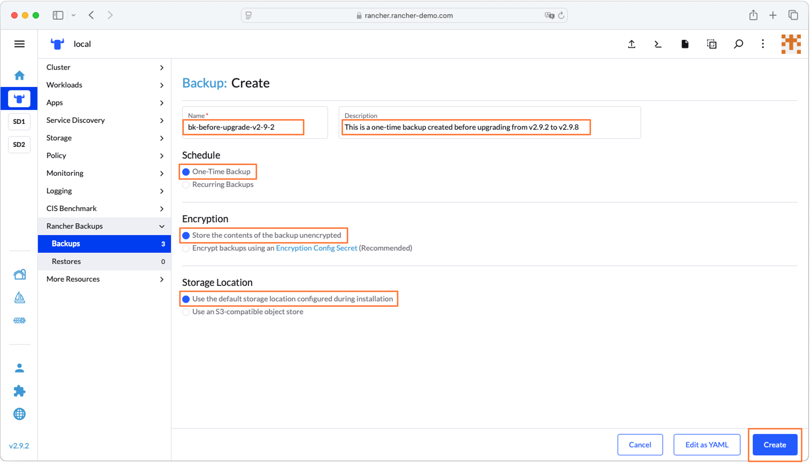
</p>

---

Once the backup is complete, it will appear in the list of backups with its state marked as Completed, confirming that the backup was created successfully.

---

<p align="center">
    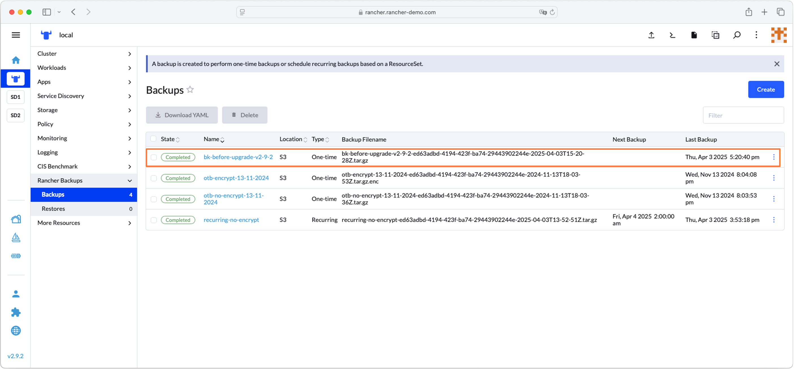
</p>

---

> Upgrade `SUSE Rancher Manager`

Since Helm v3 is the primary method for installing and upgrading `SUSE Rancher Manager` (as mentioned earlier), the first step is to update your Helm repositories and verify that the rancher-prime repository is correctly listed. You can do that using the following commands:

```bash
helm repo update
helm repo list
```

---

<p align="center">
    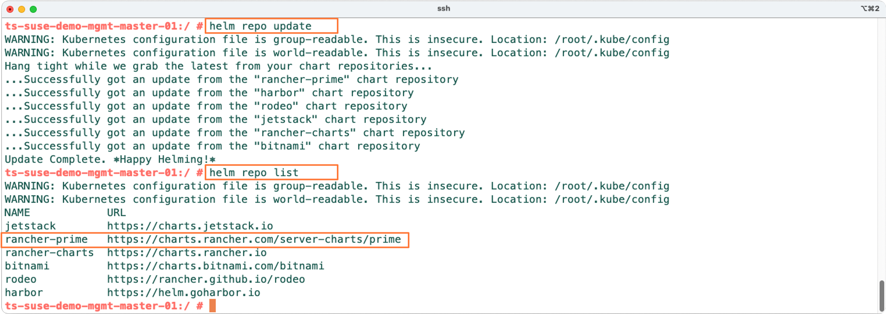
</p>

---

Once the Helm repo is updated, we now need to fetch the new `SUSE Rancher` Helm chart for the new version and then get all the helm values that we have used while installing the current version of `SUSE Rancher` to eidt the defualt configuration. for memory refresh, these values were passed with --set, from the current Rancher Helm chart that is installed. To do so, use the below commands

```bash
#You can also use the below command to confirm that the target version you are aiming for is available in the updated repo
#helm search repo rancher-prime/rancher --versions
helm fetch rancher-prime/rancher --version=2.9.8
helm get values rancher -n cattle-system
```

---

<p align="center">
    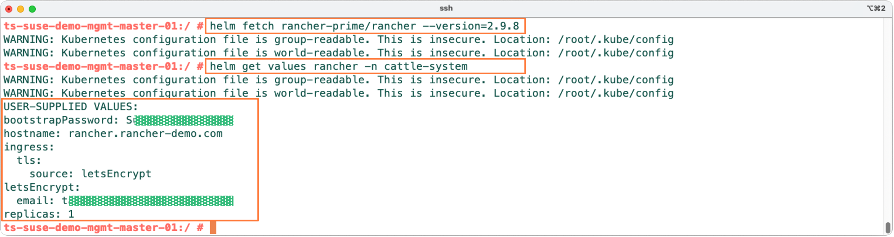
</p>

---

Now it’s time to upgrade `SUSE Rancher Manager` using the helm upgrade command, targeting the desired version — in this case, v2.9.8. You’ll need to include the values carried over from the existing deployment, which you retrieved in the previous step, by appending them to the command using the --set key=value format. You can use the example below as a reference:

```bash
helm upgrade rancher rancher-prime/rancher \
  --namespace cattle-system \
  --version 2.9.8 \
  --set hostname=rancher.rancher-demo.com \
  --set ingress.tls.source=letsEncrypt \
  --set letsEncrypt.email=<email-used-for-lets-encrypt-certificate> \
  --set bootstrapPassword=<bootstrap-password> \
  --set replicas=1 
```

---

<p align="center">
    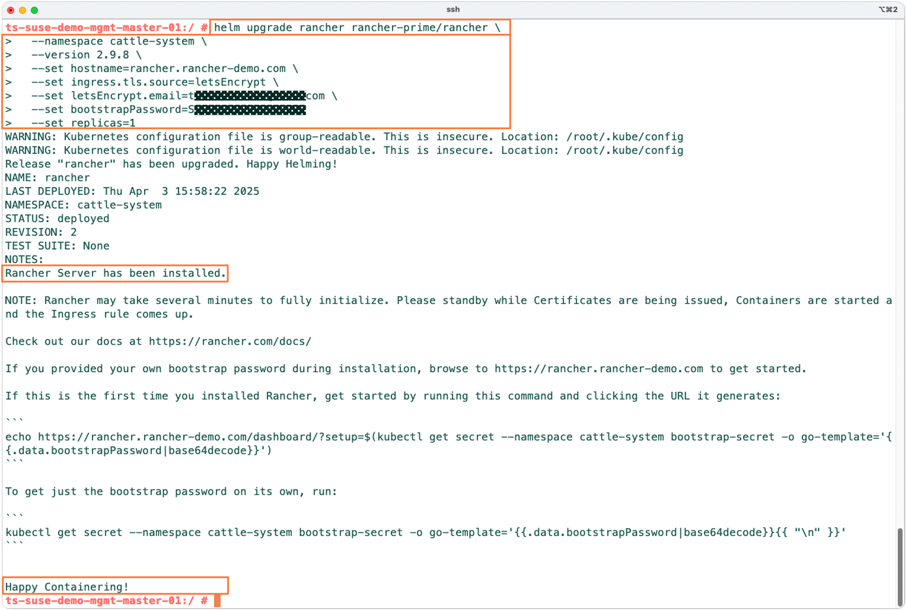
</p>

---

Next, verify that the `SUSE Rancher Manager` is deploying correctly by running the commands below. Ensure there are no errors, and that the new `Rancher` pods are up and running with a Ready status. Once everything looks good, log in to the `SUSE Rancher Manager` UI to confirm it’s accessible and check that the version displayed has been updated to v2.9.8.

```bash
kubectl -n cattle-system rollout status deploy/rancher
kubectl -n cattle-system get deployments
kubectl -n cattle-system get pod
```

---

<p align="center">
    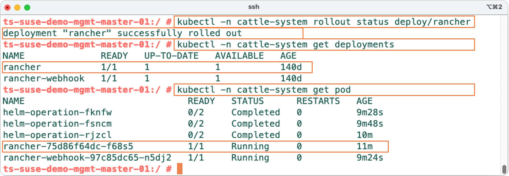
</p>

---

---

<p align="center">
    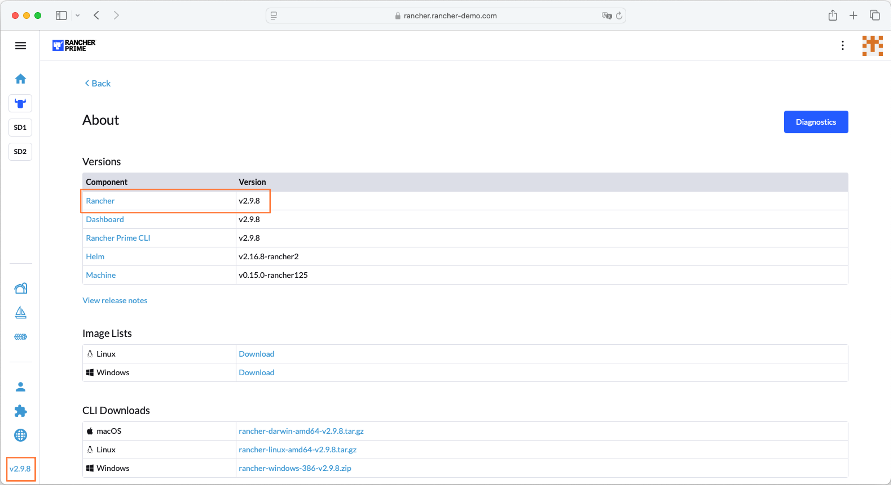
</p>

---

Now repeat the same steps to upgrade from `SUSE Rancher Manager` v2.9.8 to v2.10.4. Once the upgrade is complete, your `SUSE Rancher Manager` should be fully updated, and you’ll be able to see the new version — v2.10.4 — reflected in the UI.

---

<p align="center">
    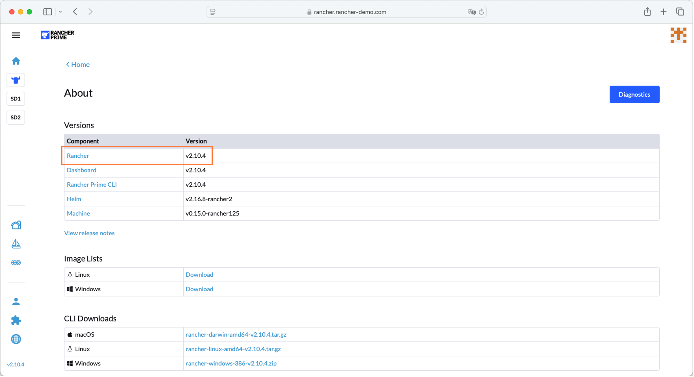
</p>

---

---

## References

- [SUSE Rancher Prime Support Matrix Link](https://www.suse.com/suse-rancher/support-matrix/all-supported-versions/rancher-v2-10-4/)
- [SUSE Rancher Prime Upgrade Check List](https://www.suse.com/support/kb/doc/?id=000020061)
- [SUSE Rancher Prime Documentation - Upgrade](https://documentation.suse.com/cloudnative/rancher-manager/latest/en/installation-and-upgrade/upgrades.html)
- [SUSE Rancher Prime Documentation - Rollback](https://documentation.suse.com/cloudnative/rancher-manager/latest/en/installation-and-upgrade/rollbacks.html)
---

**Enjoy** :blush:


