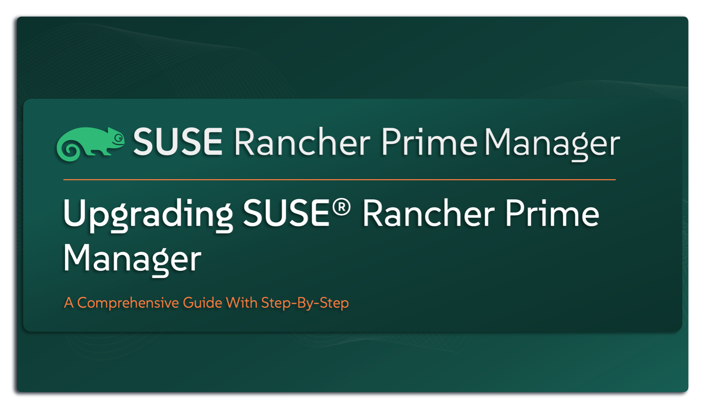

# Upgrading SUSE Rancher Prime Manager

This repository is your step-by-step guide to upgrading `SUSE Rancher Prime Manager` — whether you’re working in a connected environment or an isolated, air-gapped setup. It’s designed to make the upgrade process clear, efficient, and worry-free, with minimal disruption to your workloads. While this guide is primarily built for `SUSE` Solution Architects, it’s also a practical resource for Infrastructure, Cloud-Native, and DevOps teams managing `SUSE Rancher Prime` solution in real-world environments. If you’re looking for a reliable way to keep your `SUSE Rancher Prime` deployment secure, up-to-date, and running at its best — you’re in the right place.

---

    

---

> ⚠️ Disclaimer:
> 
> This is not an official `SUSE` document. While it is based on practical experience and best practices, it is strongly recommended to refer to the official `SUSE Rancher` documentation for the most accurate and up-to-date guidance: https://documentation.suse.com

---

## About This Repo

Keeping your `SUSE Rancher Prime Manager` up to date is one of the easiest and most important things you can do to keep your platform stable, secure, and always running with the latest features. Thankfully, `SUSE Rancher Prime` makes upgrades smooth and straightforward using Helm — no complex workflows, just clear steps.

This repo is your go-to guide for upgrading `SUSE Rancher Prime Manager`. It walks you through the entire process with a clean, step-by-step structure and includes everything you’ll need to get the job done right:
- How to verify your upgrade path
- What to check before you start
- Prerequisites to be ready
- A complete upgrade guide
- Scripts and automation (when needed)

Whether you’re running `SUSE Rancher Prime Manager` in an environment with internet access or in a fully restricted, air-gapped setup, this guide covers both scenarios with clear, dedicated instructions.

---

## Resources Available In This Repo

This repo is built to give you everything you need to plan, prepare, and upgrade your `SUSE Rancher Prime Manager` — smoothly and successfully. This repo cover multiple deployment scenarios, so no matter your setup, you’ll find what you need here.

Upgrade Scenarios Covered:
- [Upgrade SUSE Rancher Prime Manager deployed in an Online environment](/4-Upgrade-&-Rollback/SUSE-Rancher-Manager/1-Upgrade-SUSE-Rancher-Manager-Online/)
- [Upgrade SUSE Rancher Prime Manager deployed in an AirGapped environment](/4-Upgrade-&-Rollback/SUSE-Rancher-Manager/2-Upgrade-SUSE-Rancher-Manager-AirGapped/)
- [Rollback SUSE Rancher Prime Manager](/4-Upgrade-&-Rollback/SUSE-Rancher-Manager/3-Rolback-SUSE-Rancher-Manager/)

---

## References

- [SUSE Rancher Prime Documentation - Upgrade](https://documentation.suse.com/cloudnative/rancher-manager/latest/en/installation-and-upgrade/upgrades.html)

---

**Enjoy** :blush:

