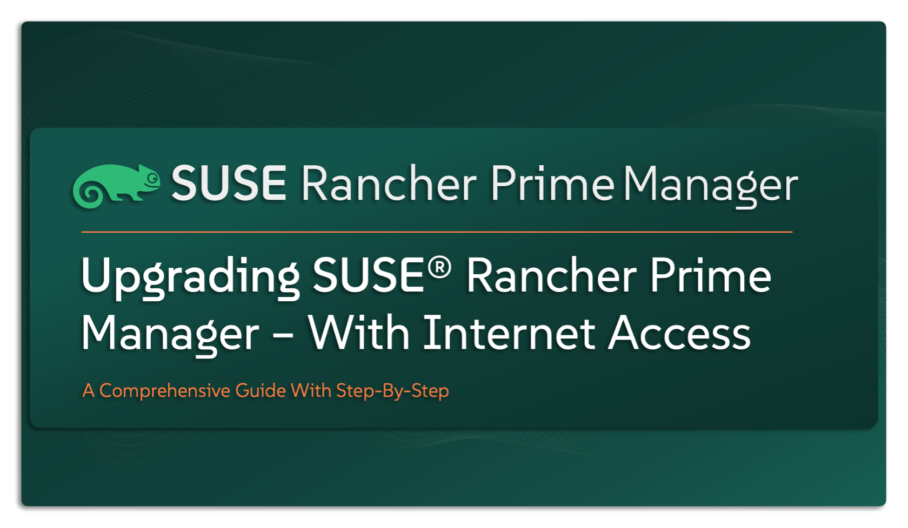

# Upgrading SUSE Rancher Prime Manager (With Internet Access)

This repository is your step-by-step guide to upgrading `SUSE Rancher Prime Manager` in environments with internet access. Whether you’re performing a routine upgrade or preparing for a major version jump, this guide is here to help you do it smoothly, securely, and with confidence. It’s primarily built for `SUSE` Solution Architects, but it’s also a valuable resource for Infrastructure, Cloud-Native, and DevOps teams managing `SUSE Rancher Prime` solution in production environments. If you’re looking for a straightforward way to keep your `SUSE Rancher Prime`  deployment up to date and rock-solid — you’re in the right place.

---

    

---

> ⚠️ Disclaimer
>
> This is not an official `SUSE` document. While it’s based on hands-on experience and proven practices, please refer to the official documentation for the latest guidance: https://documentation.suse.com

---

## About This Repo

Keeping your `SUSE Rancher Prime Manager` up to date is key to maintaining stability, security, and gaining access to the latest features. The good news? Upgrading is simple — thanks to Helm and `SUSE’s` streamlined process. This repo provides a complete, step-by-step guide to help you confidently upgrade your `SUSE Rancher Prime Manager` instance in an online (connected) environment. Here’s what you’ll find inside:
- Upgrade path & support matrix verification
- Pre-upgrade checklist
- Prerequisites and planning steps
- Step-by-step upgrade guide using Helm
- Automation scripts (when applicable)

If you’re running `SUSE Rancher Prime Manager` in an environment with internet access, this guide is tailored just for you.

---

> _________________________     
>     
> 🚀 **Let's Get Started** 
>     
> _________________________

---

> 📝 **Please Note:
>
> This repository focuses solely on upgrading the `SUSE Rancher Prime Manager`. If you’re looking to upgrade your entire environment, including the Kubernetes clusters managed by Rancher (both Management and Downstream Clusters), make sure to also refer to the appropriate guides - [Upgrade SUSE Rancher Kubernetes Engine – RKE2](/4-Upgrade/SUSE-Kubernetes-Engine-RKE2/) for RKE2 environments or [Upgrade SUSE Rancher Kubernetes Engine – K3s](/4-Upgrade/SUSE-Kubernetes-Engine-K3S/) for K3s environments

---

## SUSE Rancher Prime Manager Upgrade Guide - Upgrade Path & Support Matrix

Before you begin any upgrade, it’s important to plan your upgrade path carefully. This means:
- ✅ Knowing which version you’re upgrading from and to
- 🔄 Understanding the compatibility between the `SUSE Rancher Prime Manager` version and your Kubernetes cluster version
- ⬆️ Deciding the correct order in which components should be upgraded first

With that established, it’s time to ask the right questions and plan your upgrade path carefully and confidently.

> **What Component Should Be Upgraded First?**

Always start with upgrading the `SUSE Rancher Prime Manager`. Once that’s complete and verified, move on to upgrading your Kubernetes clusters — whether they are:
- RKE2 or K3s clusters managed by Rancher
- Public cloud services like EKS, AKS, or GKE
- Or even standalone/vanilla Kubernetes distributions

For the official guidance on upgrade order and supportability, refer to this `SUSE` KB article: [Which Component Should Be Upgraded First](https://www.suse.com/support/kb/doc/?id=000020061)

> **What should be my upgrade path (Version to Version)?**

To keep your environment stable and supported, follow these recommendations:

👉 **Don’t skip minor versions.**

For example, upgrading from v2.9.x to v2.11.x should be done in stages:
→ v2.9.x → v2.10.x → v2.11.x

👉 **Avoid upgrading to or from pre-releases.**

Pre-release versions (marked with -rc, like v2.10.0-rc4) are meant for testing, not production.**
- If you’re currently on a pre-release, upgrade first to the stable release of that version (e.g., v2.10.0-rc4 → v2.10.0)
- Then, proceed with your planned upgrade path using only stable releases.

👉 **Stick to stable-to-stable upgrades.**

Always ensure you’re upgrading to a stable release of `SUSE Rancher Prime Manager`. You can explore official release tags and notes here: [Pre-release v2.10.0-rc4](https://github.com/rancher/rancher/releases/tag/v2.10.0-rc4) & [Stable release v2.10.0](https://github.com/rancher/rancher/releases/tag/v2.10.0)

---

## References

- [SUSE Rancher Prime Support Matrix Link](https://www.suse.com/suse-rancher/support-matrix/all-supported-versions/rancher-v2-10-2/)
- [SUSE Rancher Prime Upgrade Check List](https://www.suse.com/support/kb/doc/?id=000020061)
- [SUSE Rancher Prime Documentation - Upgrade](https://documentation.suse.com/cloudnative/rancher-manager/latest/en/installation-and-upgrade/upgrades.html)

---

**Enjoy** :blush:

