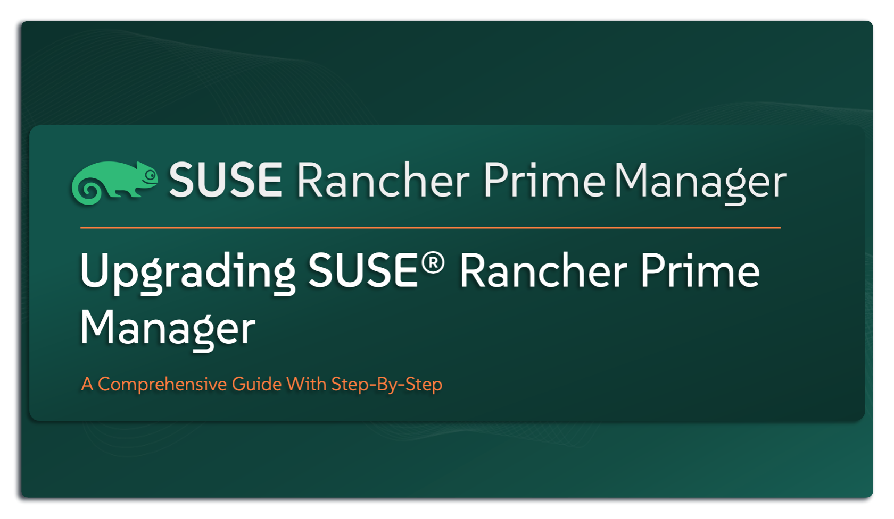

# Upgrading SUSE Rancher Prime Manager

This repository serves as a comprehensive upgrade guide for `SUSE Rancher Prime Manager`, offering clear documentation and tooling to support both online and air-gapped environments. It is designed to help teams execute upgrades with confidence, minimal disruption, and enterprise-grade reliability. This guide is mainly created for SUSE Solution Architects as a reference guide. It is also designed to support Infrastructure, Cloud-Native, and DevOps teams in organizations utilizing `SUSE Rancher` solutions.

---

    

---

> **Note**
>
> This is not an official `SUSE` document. While it is based on practical experience and best practices, it is strongly recommended to refer to the official `SUSE Rancher` documentation for the most accurate and up-to-date guidance: https://documentation.suse.com

---

## About This Repo

Keeping your `SUSE Rancher Prime Manager` deployment up to date is essential to ensure platform stability, enhance security, and benefit from the latest features and enhancements introduced in each release.

`SUSE Rancher Prime` provides a straightforward and reliable upgrade experience through Helm, making it simple for platform teams to maintain and evolve their Kubernetes management infrastructure.

This repository offers all the required resources to perform a smooth and successful upgrade of `SUSE Rancher Prime Manager`. It includes:
- Verifying the upgrade path
- Pre-upgrade checklist
- Prerequisites
- A detailed, step-by-step upgrade guide
- Automation scripts (when applicable)

This repository provides a detailed upgrade guide for SUSE Rancher Prime Manager deployed in two different scenarios:
- Online environments with internet access
- Air-gapped environments with no internet connectivity

It includes validated procedures, required configurations, and helpful tips to ensure a smooth upgrade experience in both cases.

---

## Resources Available In This Repo

This repository provides a complete upgrade framework for SUSE Rancher Prime Manager, covering everything you need to plan and execute the upgrade efficiently. It addresses multiple deployment scenarios, including both online environments with internet access and air-gapped environments with no internet connectivity.

Upgrade Scenarios Covered:
- [Upgrade SUSE Rancher Prime Manager deployed in an Online environment](/4-Upgrade/SUSE-Rancher-Prime-Manager/1-Upgrade-SUSE-Rancher-Prime-Manager-Online/)
- [Upgrade SUSE Rancher Prime Manager deployed in an AirGapped environment](/4-Upgrade/SUSE-Rancher-Prime-Manager/2-Upgrade-SUSE-Rancher-Prime-Manager-AirGapped/)

---

## References

- [SUSE Rancher Prime Support Matrix Link](https://www.suse.com/suse-rancher/support-matrix/all-supported-versions/rancher-v2-10-2/)
- [SUSE Rancher Prime Upgrade Check List](https://www.suse.com/support/kb/doc/?id=000020061)
- [SUSE Rancher Prime Documentation - Upgrade](https://documentation.suse.com/cloudnative/rancher-manager/latest/en/installation-and-upgrade/upgrades.html)

---

**Enjoy** :blush:

