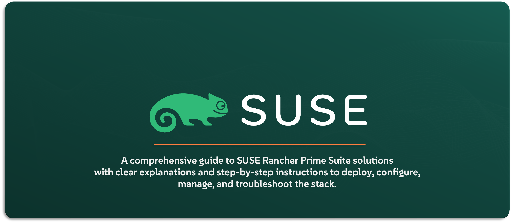

# SUSE Rancher DevSecOps Install & Configure

testing changes

This repo is created to provide the reader all the required information on installing and configuring `SUSE Rancher` DevSecOps solution portfolio for demo, proof-of-concept, testing, and education purposes. The products included in this repo are - but not limited to - `SUSE Rancher RKE2`, `SUSE Rancher K3S`, `SUSE Rancher`, `SUSE Longhorn`, and `SUSE NeuVector`. This repo provide a high-level explanation along with install and configure step-by-step guides and scripts.

---

    

---

> Disclaimer

This repo is build be Taher Shaker how at the time works for SUSE as a solution architect. However, this is a personal efforts done by myself - Taher Shaker - and not an official SUSE documentation. Thus, SUSE is not responsible of any info shared in this repo and it is strongly advised to refer to the official documentation for reference. I will try to add as much references as possible and to be as acuate as possible. 

It is also not advised to used the provided info in this repo for any production environment and reach for SUSE help is strongly advised in such scenario. The purpose of this repo to provide guidance for installing and configuring `SUSE Rancher` DevSecOps solution portfolio for demo, proof-of-concept, testing, and education purposes only.

Thank you and i hope you enjoy it.

---

## About This Repo

This repo is designed and created to provide a documented step-by-step guide and scripts for installing and configuring `SUSE Rancher` DevSecOps solution portfolio. The main purpose for this repo is to have a repository holding all the installation guides and steps along with scripts (if possible) for education and faster deployment and configuration of the solutions in question.

Please note: This repo is a working-progress and is continuously updated, thus, new resources will be added and existing resources will be edited/updated continuously

---

## SUSE Solutions Included

This repo concentrates on `SUSE Rancher` DevSecOps solution portfolio which includes the following solutions:
- `SUSE Rancher RKE2`
- `SUSE Rancher K3S`
- `SUSE Rancher`
- `SUSE Longhorn`
- `SUSE NeuVector`

---

## Resources Available In This Repo

This repo will provide high-level explanation, step-by-step-guides, and scripts for the installation and configuration of the `SUSE Rancher` DevSecOps solution portfolio. Thus the resources available in this repo are as follows:

- Install - _provides solution installation guides and scripts_
  - [RKE2](/1-Install/RKE2/)
  - [K3S](/1-Install/K3S/)
  - [Rancher](/1-Install/Rancher/)
  - [Longhorn](/1-Install/Longhorn/)
  - [NeuVector](/1-Install/NeuVector/)
- Configure _provides solution configuration guides and scripts_
  - [RKE2](/2-Configure/RKE2/)
  - [K3S](/2-Configure/K3S/)
  - [Rancher](/2-Configure/Rancher/)
  - [Longhorn](/2-Configure/Longhorn/)
  - [NeuVector](/2-Configure/NeuVector/)
- Troubleshoot _provides solution installation and configuration troubleshooting guides and scripts_
  - [RKE2](/3-Troubleshoot/RKE2/)
  - [K3S](/3-Troubleshoot/K3S/)
  - [Rancher](/3-Troubleshoot/Rancher/)
  - [Longhorn](/3-Troubleshoot/Longhorn/)
  - [NeuVector](/3-Troubleshoot/NeuVector/)

---

## References:

The below is the official documentation pages for the list of the solutions included in this repo.
- [SUSE Rancher RKE2](https://docs.rke2.io/)
- [SUSE Rancher K3S](https://docs.k3s.io/)
- [SUSE Rancher](https://ranchermanager.docs.rancher.com/)
- [SUSE Longhorn](https://longhorn.io/docs)
- [SUSE NeuVector](https://open-docs.neuvector.com/)

---

**Enjoy** :blush:
