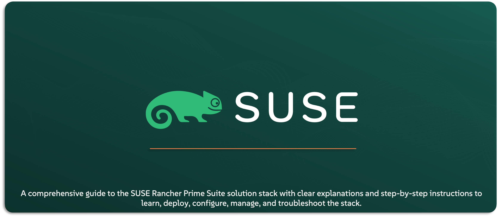

# SUSE Rancher Prime Guide

Welcome to the `SUSE® Rancher Prime` Suite Guide — your go-to resource for understanding, deploying, and managing the entire stack. Whether you’re building a demo, running a PoC, or operating in production, this repo offers clear explanations and step-by-step guides for every solution in the suite. Built for `SUSE` Solution Architects but practical for any DevOps, Cloud-Native, or Infrastructure team, this guide is here to make your experience smooth, simple, and efficient. You’re in the right place to master the `SUSE® Rancher Prime` Suite.

---

    

---

> ⚠️ Disclaimer:
> 
> This is not an official `SUSE` document. While it is based on practical experience and best practices, it is strongly recommended to refer to the official `SUSE` documentation for the most accurate and up-to-date guidance: https://documentation.suse.com

---

## About This Repo

This repository is built to be your easy, go-to guide when deploying, configuring, managing, or troubleshooting the `SUSE® Rancher Prime` Suite stack. It’s designed to simplify your experience — whether you’re setting up a quick lab, running a customer demo, building a PoC, or working in a real-world environment.

Here, you’ll find documented step-by-step guides and supporting scripts (where available) that walk you through each stage of working with the `SUSE® Rancher Prime` Suite stack. The goal is to save you time, reduce complexity, and give you confidence while working with these solutions.

**What’s Covered:**

This repo covers the entire `SUSE® Rancher Prime` Suite, which includes:
- **SUSE® Rancher Prime**: Centralized management for Kubernetes clusters — regardless of where they run (on-prem, cloud, or edge). Rancher simplifies cluster operations, policy enforcement, and multi-tenant environments.
- **SUSE® Rancher Kubernetes Engines (RKE & K3S)**: Two lightweight and production-grade Kubernetes distributions. RKE2 is fully CNCF-compliant and secure by default, while K3s is ideal for edge and small-footprint use cases.
- **SUSE® Storage (formerly Longhorn)**: A cloud-native distributed block storage solution for Kubernetes. It offers snapshots, backups, replication, and easy recovery — making it great for persistent workloads.
- **SUSE® Security (formerly NeuVector)**: A zero-trust, end-to-end container security platform. It provides runtime protection, vulnerability scanning, network segmentation, and compliance for Kubernetes environments.
- **SUSE® Observability (formerly StackState)**: Full-stack observability built for modern applications — enabling intelligent correlation, topology mapping, and faster root cause analysis across your infrastructure.
- **SUSE® Application Collection**: Pre-packaged Helm charts and curated apps to simplify Kubernetes adoption. These tools help users accelerate time-to-value when deploying workloads on SUSE Rancher.
- **SUSE® Private Registry (Based On Open-Source Project Harbor)**: A secure, self-hosted container image registry that supports air-gapped deployments and local image management for tighter control and compliance.
- **SUSE® Rancher Prime - Admission Policy Manager (Based On Open-Source Project Kubewarden)**: An extension to `SUSE® Rancher Prime` that acts as a Kubernetes policy engine. Its goal is to become the universal policy engine for Kubernetes, simplifying the adoption of policy-as-code and enforcing governance and compliance across your clusters.
- **SUSE® Rancher Prime OS Manager (formerly Elemental)**: An extension to `SUSE® Rancher Prime` focused on the cloud-native lifecycle management of the operating system layer of Kubernetes nodes. It enables provisioning, configuring, and managing OS images (based on SLE Micro) across distributed environments
- **SUSE® Rancher Prime ClusterAPI (Turtles)**: An extension to `SUSE® Rancher Prime` that integrates with Cluster API (CAPI) through a Kubernetes Operator, enabling declarative cluster lifecycle management and infrastructure automation directly from Rancher.
- **SUSE® Rancher Prime Fleet (Continuous Delivery | GitOps)**: GitOps-based continuous delivery and lifecycle management for Kubernetes at scale. Fleet enables version-controlled, repeatable deployments across clusters.
- **SUSE® Virtualization (formerly Harvester)**: A modern hyperconverged infrastructure (HCI) solution that combines VMs and containers on a single platform — fully integrated with Rancher.

> **Note:** This repository is a work in progress. New content will be added and existing material refined regularly, so check back often for updates.

---

## Understanding Naming Conventions & Product Editions Explained

**What Does “Prime” Mean?**

In the `SUSE` ecosystem, the word Prime signifies the enterprise-grade edition of a product. Most `SUSE` solutions — especially those in the Rancher portfolio — are available in two editions: a free, open-source community edition and a paid commercial version known as the Prime edition.

Functionally, both editions are often identical in terms of core capabilities. However, the Prime edition is designed for production environments and offers several enterprise advantages. It comes with official support, service-level agreements, and tested integrations with other `SUSE` products. It also includes access to enterprise-only components, such as the `SUSE Application Collection`, which is not part of the open-source offering.

When you see “Prime,” it means you’re working with a version that has been hardened, certified, and backed by `SUSE` for business-critical use. The open-source edition remains ideal for testing, labs, and community use — but Prime is built for scale, security, and support.

A good example is `Rancher` vs. `SUSE Rancher Prime`. The functionality is the same, but the Prime version includes full `SUSE` support, access to additional enterprise features, and seamless integration with the rest of the `SUSE Rancher Prime` Suite.

**Product Naming Changes & Rebranding**

At the start of 2025, `SUSE` announced a major rebranding of its enterprise-grade commercial offerings to better align them under a unified `SUSE Rancher Prime` Suite identity. This rebranding included renaming several key solutions that had originally been introduced as open-source projects. The purpose of this change was to clearly distinguish between the supported, enterprise-ready editions and their open-source community counterparts — while still recognizing and supporting both.

In mid-2024, `SUSE` also acquired StackState, a powerful observability platform purpose-built for modern, dynamic infrastructure. This acquisition was included in the rebranding wave and became part of the `SUSE Rancher Prime` Suite as well.

While the original names are still in use to refer to the community editions, the new names now represent the enterprise versions included in the Prime offering. For example, Longhorn continues to refer to the community edition of the storage solution, while the commercial version is now branded as `SUSE Storage`.

Here’s a summary of the key renaming transitions:
- `SUSE Storage` is the enterprise version of the Longhorn project.
- `SUSE Security` is the enterprise version of the NeuVector project.
- `SUSE Observability` is the rebranded name for StackState following SUSE’s acquisition.
- `SUSE Virtualization` is the enterprise version of the Harvester HCI platform.
- `SUSE Rancher Prime OS Manager` is the enterprise version of the Elemental project.
- `SUSE Rancher Prime Admission Policy Manager` is the enterprise form of the Kubewarden policy engine.

This rebranding initiative was more than just a name change. It signals a clear differentiation between the open innovation of the community projects and the stability, support, and extended features offered through the `Prime` Suite. As a general rule, if the name includes `SUSE` or `Prime`, it refers to the commercial, enterprise-supported edition — while the original name (like Longhorn, Harvester, or Kubewarden) refers to the upstream, open-source community version.

> **Note:** In this repository, whenever you see the term SUSE Rancher Prime used as a standalone product name, it specifically refers to `SUSE Rancher Prime Manager` (also known as the `SUSE Rancher Prime Server`) — the multi-cluster Kubernetes management platform at the core of the suite. Other solutions in the suite are always referred to by their full product names to avoid confusion.

---

## Scope of This Repo - Enterprise Focus, Community Compatible

In this GitHub repo, the focus is primarily on the `SUSE Rancher Prime` offerings and the full solution stack that comes with it. However, because the core functionality between the enterprise and community editions is the same, most guides here are also fully applicable to the open-source versions. In fact, some examples and deployment steps will use the community editions directly, since the `Prime` versions require a commercial subscription — and sharing paid-access materials or links could raise compliance concerns.

This approach ensures you can learn, test, and even build full environments using the same technology stack, whether you’re working with the enterprise suite or the open-source projects.

---

## What You’ll Find in This Repo

This repository is structured to help you learn, deploy, configure, upgrade, and troubleshoot each component of the`SUSE Rancher Prime` Suite — all in one place. Every solution in the suite is covered across five practical categories, with dedicated sections to guide you through each activity step by step.

Whether you’re starting from scratch or just need help with a specific task, you can jump straight to the section that fits your need and get moving quickly and confidently.

**Content overview:**
- [Learn About SUSE Solution](/01-Learn-About-SUSE-Solutions/) - Provides solid understanding of the corresponding solution
  - [1- SUSE Rancher Prime](/01-Learn-About-SUSE-Solutions/01-SUSE-Rancher-Prime/)
  - [2- SUSE Rancher Kubernetes Engine - RKE2](/01-Learn-About-SUSE-Solutions/02-SUSE-Rancher-RKE2/)
  - [3- SUSE Rancher Kubernetes Engine - K3s](/01-Learn-About-SUSE-Solutions/03-SUSE-Rancher-K3S/)
  - [4- SUSE Storage](/01-Learn-About-SUSE-Solutions/04-SUSE-Storage/)
  - [5- SUSE Security](/01-Learn-About-SUSE-Solutions/05-SUSE-Security/)
  - [6- SUSE Observability](/01-Learn-About-SUSE-Solutions/06-SUSE-Observability/)
  - [7- SUSE Application Collection](/01-Learn-About-SUSE-Solutions/07-SUSE-Application-Collection/)
  - [8- SUSE Private Registry](/01-Learn-About-SUSE-Solutions/08-SUSE-Private-Registry/)
  - [9- SUSE Rancher Prime - Admission Policy Manager](/01-Learn-About-SUSE-Solutions/09-SUSE-Rancher-Prime-Admission-Policy-Manager/)
  - [10- SUSE Rancher Prime OS Manager](/01-Learn-About-SUSE-Solutions/10-SUSE-Rancher-Prime-OS-Manager/)
  - [11- SUSE Rancher Prime ClusterAPI](/01-Learn-About-SUSE-Solutions/11-SUSE-Rancher-Prime-ClusterAPI/)
  - [12- SUSE Rancher Prime Fleet](/01-Learn-About-SUSE-Solutions/12-SUSE-Rancher-Prime-Fleet/)
  - [13- SUSE Virtualization](/01-Learn-About-SUSE-Solutions/13-SUSE-Virtualization/)
- [Deploy SUSE Solution](/02-Deploy-SUSE-Solutions/)
  - [1- SUSE Rancher Prime](/02-Deploy-SUSE-Solutions/01-SUSE-Rancher-Prime/)
  - [2- SUSE Rancher Kubernetes Engine - RKE2](/02-Deploy-SUSE-Solutions/02-SUSE-Rancher-RKE2/)
  - [3- SUSE Rancher Kubernetes Engine - K3s](/02-Deploy-SUSE-Solutions/03-SUSE-Rancher-K3S/)
  - [4- SUSE Storage](/02-Deploy-SUSE-Solutions/04-SUSE-Storage/)
  - [5- SUSE Security](/02-Deploy-SUSE-Solutions/05-SUSE-Security/)
  - [6- SUSE Observability](/02-Deploy-SUSE-Solutions/06-SUSE-Observability/)
  - [7- SUSE Application Collection](/02-Deploy-SUSE-Solutions/07-SUSE-Application-Collection/)
  - [8- SUSE Private Registry](/02-Deploy-SUSE-Solutions/08-SUSE-Private-Registry/)
  - [9- SUSE Rancher Prime - Admission Policy Manager](/02-Deploy-SUSE-Solutions/09-SUSE-Rancher-Prime-Admission-Policy-Manager/)
  - [10- SUSE Rancher Prime OS Manager](/02-Deploy-SUSE-Solutions/10-SUSE-Rancher-Prime-OS-Manager/)
  - [11- SUSE Rancher Prime ClusterAPI](/02-Deploy-SUSE-Solutions/11-SUSE-Rancher-Prime-ClusterAPI/)
  - [12- SUSE Rancher Prime Fleet](/02-Deploy-SUSE-Solutions/12-SUSE-Rancher-Prime-Fleet/)
  - [13- SUSE Virtualization](/02-Deploy-SUSE-Solutions/13-SUSE-Virtualization/)
- [Configure SUSE Solution](/03-Configure-SUSE-Solutions/)
  - [1- SUSE Rancher Prime](/03-Configure-SUSE-Solutions/01-SUSE-Rancher-Prime/)
  - [2- SUSE Rancher Kubernetes Engine - RKE2](/03-Configure-SUSE-Solutions/02-SUSE-Rancher-RKE2/)
  - [3- SUSE Rancher Kubernetes Engine - K3s](/03-Configure-SUSE-Solutions/03-SUSE-Rancher-K3S/)
  - [4- SUSE Storage](/03-Configure-SUSE-Solutions/04-SUSE-Storage/)
  - [5- SUSE Security](/03-Configure-SUSE-Solutions/05-SUSE-Security/)
  - [6- SUSE Observability](/03-Configure-SUSE-Solutions/06-SUSE-Observability/)
  - [7- SUSE Application Collection](/03-Configure-SUSE-Solutions/07-SUSE-Application-Collection/)
  - [8- SUSE Private Registry](/03-Configure-SUSE-Solutions/08-SUSE-Private-Registry/)
  - [9- SUSE Rancher Prime - Admission Policy Manager](/03-Configure-SUSE-Solutions/09-SUSE-Rancher-Prime-Admission-Policy-Manager/)
  - [10- SUSE Rancher Prime OS Manager](/03-Configure-SUSE-Solutions/10-SUSE-Rancher-Prime-OS-Manager/)
  - [11- SUSE Rancher Prime ClusterAPI](/03-Configure-SUSE-Solutions/11-SUSE-Rancher-Prime-ClusterAPI/)
  - [12- SUSE Rancher Prime Fleet](/03-Configure-SUSE-Solutions/12-SUSE-Rancher-Prime-Fleet/)
  - [13- SUSE Virtualization](/03-Configure-SUSE-Solutions/13-SUSE-Virtualization/)
- [Upgrade & Rollback SUSE Solution](/04-Upgrade-Rollback-SUSE-Solutions/)
  - [1- SUSE Rancher Prime](/04-Upgrade-Rollback-SUSE-Solutions/01-SUSE-Rancher-Prime/)
  - [2- SUSE Rancher Kubernetes Engine - RKE2](/04-Upgrade-Rollback-SUSE-Solutions/02-SUSE-Rancher-RKE2/)
  - [3- SUSE Rancher Kubernetes Engine - K3s](/04-Upgrade-Rollback-SUSE-Solutions/03-SUSE-Rancher-K3S/)
  - [4- SUSE Storage](/04-Upgrade-Rollback-SUSE-Solutions/04-SUSE-Storage/)
  - [5- SUSE Security](/04-Upgrade-Rollback-SUSE-Solutions/05-SUSE-Security/)
  - [6- SUSE Observability](/04-Upgrade-Rollback-SUSE-Solutions/06-SUSE-Observability/)
  - [7- SUSE Application Collection](/04-Upgrade-Rollback-SUSE-Solutions/07-SUSE-Application-Collection/)
  - [8- SUSE Private Registry](/04-Upgrade-Rollback-SUSE-Solutions/08-SUSE-Private-Registry/)
  - [9- SUSE Rancher Prime - Admission Policy Manager](/04-Upgrade-Rollback-SUSE-Solutions/09-SUSE-Rancher-Prime-Admission-Policy-Manager/)
  - [10- SUSE Rancher Prime OS Manager](/04-Upgrade-Rollback-SUSE-Solutions/10-SUSE-Rancher-Prime-OS-Manager/)
  - [11- SUSE Rancher Prime ClusterAPI](/04-Upgrade-Rollback-SUSE-Solutions/11-SUSE-Rancher-Prime-ClusterAPI/)
  - [12- SUSE Rancher Prime Fleet](/04-Upgrade-Rollback-SUSE-Solutions/12-SUSE-Rancher-Prime-Fleet/)
  - [13- SUSE Virtualization](/04-Upgrade-Rollback-SUSE-Solutions/13-SUSE-Virtualization/)
- [Troubleshoot SUSE Solution](/05-Troubleshoot-SUSE-Solutions/)
  - [1- SUSE Rancher Prime](/05-Troubleshoot-SUSE-Solutions/01-SUSE-Rancher-Prime/)
  - [2- SUSE Rancher Kubernetes Engine - RKE2](/05-Troubleshoot-SUSE-Solutions/02-SUSE-Rancher-RKE2/)
  - [3- SUSE Rancher Kubernetes Engine - K3s](/05-Troubleshoot-SUSE-Solutions/03-SUSE-Rancher-K3S/)
  - [4- SUSE Storage](/05-Troubleshoot-SUSE-Solutions/04-SUSE-Storage/)
  - [5- SUSE Security](/05-Troubleshoot-SUSE-Solutions/05-SUSE-Security/)
  - [6- SUSE Observability](/05-Troubleshoot-SUSE-Solutions/06-SUSE-Observability/)
  - [7- SUSE Application Collection](/05-Troubleshoot-SUSE-Solutions/07-SUSE-Application-Collection/)
  - [8- SUSE Private Registry](/05-Troubleshoot-SUSE-Solutions/08-SUSE-Private-Registry/)
  - [9- SUSE Rancher Prime - Admission Policy Manager](/05-Troubleshoot-SUSE-Solutions/09-SUSE-Rancher-Prime-Admission-Policy-Manager/)
  - [10- SUSE Rancher Prime OS Manager](/05-Troubleshoot-SUSE-Solutions/10-SUSE-Rancher-Prime-OS-Manager/)
  - [11- SUSE Rancher Prime ClusterAPI](/05-Troubleshoot-SUSE-Solutions/11-SUSE-Rancher-Prime-ClusterAPI/)
  - [12- SUSE Rancher Prime Fleet](/05-Troubleshoot-SUSE-Solutions/12-SUSE-Rancher-Prime-Fleet/)
  - [13- SUSE Virtualization](/05-Troubleshoot-SUSE-Solutions/13-SUSE-Virtualization/)

---

## Official References:

- [SUSE Official Documentation](https://documentation.suse.com)
- [SUSE® Rancher Prime Official Documentation](https://documentation.suse.com/cloudnative/rancher-manager/latest/en/about-rancher/what-is-rancher.html)
- [SUSE® Rancher Prime RKE2 Official Documentation](https://documentation.suse.com/cloudnative/rke2/latest/en/introduction.html)
- [SUSE® Rancher Prime K3S Official Documentation](https://documentation.suse.com/cloudnative/k3s/latest/en/introduction.html)
- [SUSE® Storage Official Documentation](https://documentation.suse.com/cloudnative/storage/1.8.0/en/longhorn-documentation.html)
- [SUSE® Security Official Documentation](https://documentation.suse.com/cloudnative/security/5.4/en/overview.html)
- [SUSE® Observability Official Documentation](https://docs.stackstate.com/)
- [SUSE® Application Collection Official Documentation](https://docs.apps.rancher.io/)
- [SUSE® Private Registry Official Documentation](https://documentation.suse.com/cloudnative/suse-private-registry/html/private-registry/)
- [SUSE® Rancher Prime - Continuous Delivery | GitOps Official Documentation](https://documentation.suse.com/cloudnative/continuous-delivery/v0.10/en/index.html)
- [SUSE® Rancher Prime: Admission Policy Manager Official Documentation](https://documentation.suse.com/cloudnative/policy-manager/1.16/en/introduction.html)
- [SUSE® Rancher Prime ClusterAIP Official Documentation](https://documentation.suse.com/cloudnative/cluster-api/v0.17/en/index.html)
- [SUSE® Rancher Prime OS Manager Official Documentation](https://documentation.suse.com/cloudnative/os-manager/1.6/en/index.html)
- [SUSE® Virtualization Official Documentation](https://documentation.suse.com/cloudnative/virtualization/v1.3/en/introduction/overview.html)

---

**Enjoy** :blush:
